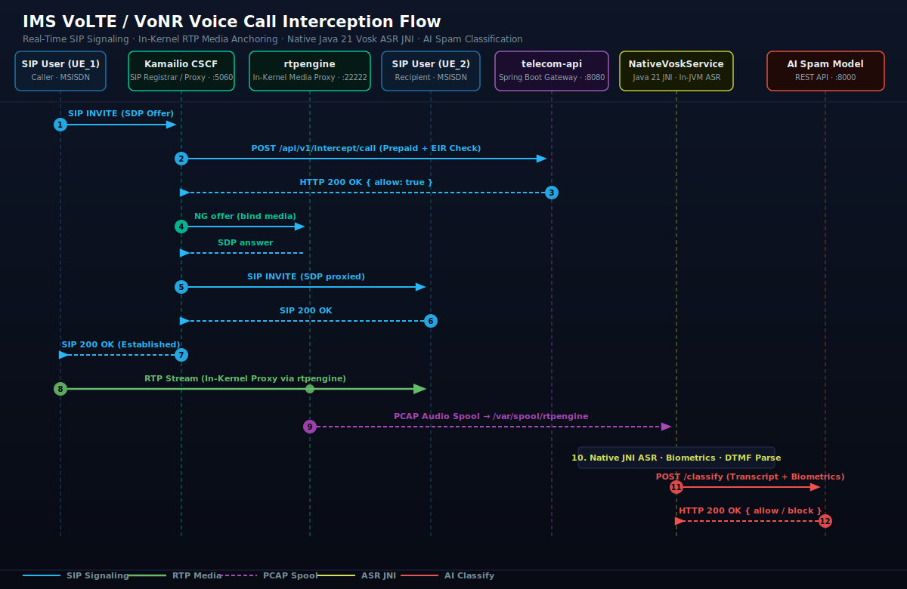
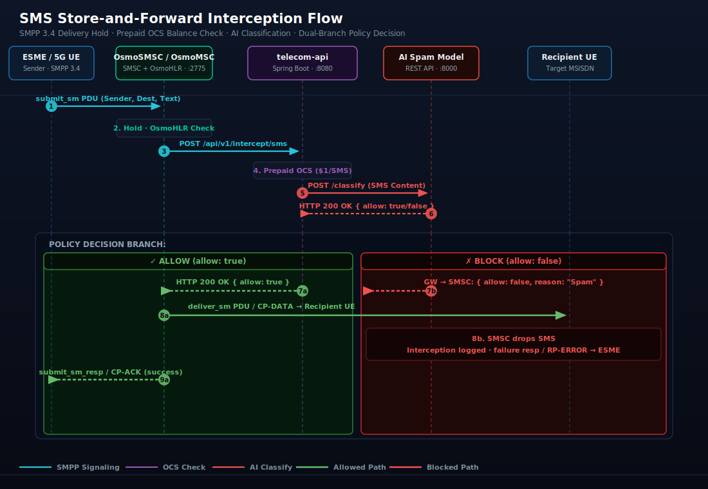

# MVNO Interception & Monitoring Core
### Core Network Interception & Observability for the AI Spam Filter Platform

[](docs/deployment_guide.md)
[](docs/deployment_guide.md)
[](docs/deployment_guide.md)

Simulates an MVNO / Private Mobile Network core for the companion [AI Spam Filter](https://github.com/AI-SpamFilter-PMN/MVNO) platform. Handles SMS routing and SIP/VoIP calling, intercepts payloads in real-time, and enforces allow/block decisions from the AI filter REST API.

---

## 1. System Architecture

The core network operates as an unprivileged, rootless stack that handles real-time SMS routing and SIP/VoIP calling, intercepts the payloads, and requests allow/block decisions from the AI Spam Filter REST APIs.


```
SIP Phone ──▶ Kamailio ──▶ rtpengine ──(Audio Spool)──┐
                │                                    ▼
SMPP Client ──▶ OsmoSMSC ───────────────▶ Spring Boot Gateway (Java 21) ──▶ AI Spam Filter
                │                         (Native Vosk ASR JNI)
5G UE ──▶ Open5GS (AMF) ─────────────────┘
```

Two interception flows — SMS (via OsmoSMSC SMPP) and Voice (via Kamailio SIP). The 5G SA core adds UERANSIM gNB+UE simulation with SMS-over-NAS routed through the same pipeline. All decisions go through the Spring Boot policy gateway.

3 test UEs: **normal** (balance=100), **spam** (EIR trigger), **zero-balance** (OCS block).

---

## 2. Core Functional Transactions

### A. VoIP Voice Call Interception


1. UE_1 sends a `SIP INVITE`. Kamailio checks prepaid balance and EIR via the Spring Boot gateway.
2. If allowed, Kamailio anchors media through `rtpengine` (in-kernel) and forks a PCAP copy to `/var/spool/rtpengine`.
3. After the call, `NativeVoskService.java` transcribes the audio offline via Vosk Java 21 JNI and sends the result to the AI filter.
4. If flagged, the caller's MSISDN is blacklisted for future calls.

### B. SMS Interception


1. ESME submits SMS to `OsmoSMSC` via SMPP 3.4.
2. OsmoSMSC holds delivery and calls `POST /api/v1/intercept/sms` on the Spring Boot gateway.
3. Gateway checks prepaid balance, then forwards content to the AI filter. `allow: true` → delivered. `allow: false` → dropped.

---

## 3. Technology Stack

- **Signaling & Proxy**: Kamailio (SIP Registrar/Proxy) + `rtpengine` (In-kernel media proxy/forker).
- **SMS Control Plane**: Osmocom (`OsmoSMSC` / `OsmoMSC` / `OsmoHLR`).
- **Speech Processing**: Native Vosk Speech-to-Text (In-JVM JNI Java 21 runtime, zero cloud latency).
- **Interception Gateway**: Spring Boot 3.4.3 + Java 21 LTS + Virtual Threads (Tomcat, JdbcTemplate, RestClient).
- **Observability**: VictoriaMetrics (Single-binary TSDB) + `vmagent` (Telemetry scraper) + Grafana (Dashboard).
- **Log Mediators**: Vector.dev (Rust-based log pipeline, zero GC).
- **5G Core**: Open5GS (10 NFs) + UERANSIM (gNB + 3 UEs).

---

## 4. Getting Started

### Method A: Containerized (Podman / Docker Compose)
Recommended for sandbox development. Rootless-compliant out-of-the-box.

```bash
# 1. Prerequisites (pick your distro — no Python needed, Vosk is Java 21 JNI)
sudo pacman -S --needed podman docker-compose sqlite3   # Arch/CachyOS
sudo apt install -y podman docker-compose sqlite3       # Debian/Ubuntu
sudo dnf install -y podman docker-compose sqlite3       # Fedora

# 2. Enable Podman API socket (required for Docker Compose Plugin)
systemctl --user enable --now podman.socket

# 3. Initialize SQLite databases (WAL mode + test subscribers)
make init-db

# 4. Start the stack — offline-first (uses pre-loaded images)
make up

#    To build from source instead (needs internet):
#    podman compose -f docker-compose.yml -f docker-compose.build.yml up -d --build

# 5. Smoke-test the stack (after containers are up)
curl http://localhost:8080/actuator/health/liveness
# Expected: {"status":"UP"}

curl http://localhost:8080/api/v1/intercept/subscriber/15551234567
# Expected: {"msisdn":"15551234567","balance":100}  ← allowed

curl http://localhost:8080/api/v1/intercept/subscriber/15557654321
# Expected: {"msisdn":"15557654321","balance":0}    ← zero-balance blocked

# 6. Test interception
make test-sms    # SMS via SMPP → Spring Boot → AI Filter
make test-call   # SIP call → rtpengine → Vosk STT → Spring Boot
```

### Method B: Native (systemd)
Deploying directly onto a Debian/Ubuntu 22.04 LTS host:

1. **Install dependencies**:
   ```bash
   sudo apt install kamailio kamailio-sqlite-modules ngcp-rtpengine osmo-msc osmo-hlr
   ```
2. **Initialize SQLite databases**:
   ```bash
   make init-native-db
   ```
3. **Start the systemd services**:
   ```bash
   make up-native
   ```

---

## 5. Network Ports & Protocols

| Service | Container Name | Port | Protocol | Purpose |
| :--- | :--- | :--- | :--- | :--- |
| **Spring Boot Gateway** | `mvno-api` | `8080` | HTTP / REST | Interception policy control & subscriber API |
| **Kamailio CSCF** | `mvno-kamailio` | `5060` | UDP / TCP | SIP signaling & registrar proxy |
| **rtpengine NG** | `mvno-rtpengine` | `22222` | UDP | In-kernel media proxy control port |
| **rtpengine Media** | `mvno-rtpengine` | `30000-30100`| UDP | RTP media audio stream relay range |
| **OsmoSMSC / MSC** | `mvno-osmosmsc` | `2775` | TCP / SMPP | Short Message Peer-to-Peer (SMPP 3.4) |
| **VictoriaMetrics** | `mvno-victoriametrics`| `8428` | HTTP | Telemetry TSDB & PromQL query API |
| **Grafana NOC** | `mvno-grafana` | `3000` | HTTP | Real-time telecom NOC dashboard UI |
| **AI Spam Model** | `ai-filter` | `8000` | HTTP / REST | External AI Spam Model Server |

---

## 6. Features

| # | Feature | How |
|---|---------|-----|
| 1 | **Prepaid OCS** | SQLite balance check before every call/SMS. Zero-balance → blocked. |
| 2 | **STIR/SHAKEN** | Kamailio compares SIP `From` header to authenticated username. Mismatch → 407. |
| 3 | **LAC/CellID Geofencing** | Vector parses cell ID from OsmoSMSC logs → Spring Boot → AI filter zone policy. |
| 4 | **EIR SIM-Swap Detection** | In-memory IMEI→MSISDN tracker. >3 swaps in 10 min → blocked. |
| 5 | **DTMF Logging** | rtpengine captures DTMF tones to companion JSON metadata. |
| 6 | **Voice Biometrics** | Silence ratio + spectral flatness via Vosk numpy FFT. Flags robocall/TTS. |
| 7 | **SLA Fallback** | Kamailio HTable whitelist/blacklist used when AI filter is unreachable. |
| 8 | **5G SA Core** | Open5GS 10-NF 5GC + UERANSIM gNB + 3 UE simulation. |
| 9 | **SMS-over-NAS** | 5G UE → AMF → OsmoSMSC → Spring Boot gateway (same pipeline as SMPP). |
| 10 | **MongoDB Seed** | Atomic init script avoids Open5GS WebUI admin hash bug on first boot. |

---

## 7. Documentation

* [docs/API_CONTRACT.md](docs/API_CONTRACT.md): Public AI Spam Filter REST API contract & JSON schemas for teammates.
* [docs/deployment_guide.md](docs/deployment_guide.md): Deployment runbook — ports, configs, commands, troubleshooting. Primary team reference.
* [docs/architecture_flow.svg](docs/architecture_flow.svg): System architecture overview diagram.
* [docs/ims_voice_call_flow.svg](docs/ims_voice_call_flow.svg): IMS VoLTE/VoNR Voice Call Interception sequence diagram.
* [docs/sms_interception_flow.svg](docs/sms_interception_flow.svg): SMS Store-and-Forward Interception sequence diagram.

### Key Environment Variable

| Variable | Default | Purpose |
|---|---|---|
| `AI_FILTER_URL` | `http://ai-filter:8000/api/v1/classify` | External AI Spam Model REST endpoint — set in `docker-compose.yml` environment block |