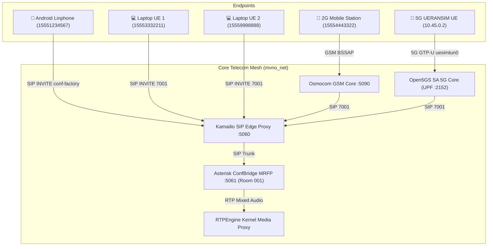

# 🎙️ MVNO Multi-Party Conference & Group Calling Guide (All UEs & Endpoints)

This document is the authoritative operational guide for initiating and joining **3GPP Rel-16 & RFC 4579 Multi-Party Conference Calls** across all network endpoints:
- 📱 **Physical Android Smartphones (Linphone / MizuDroid)**
- 💻 **Laptop UEs (Baresip Softphone Rigs `15553332211` & `15559998888`)**
- 📡 **2G GSM Mobile Stations (`15554443322` & `15557778888` via Osmocom MSC)**
- 📶 **5G SA UERANSIM UEs (`10.45.0.2` – `10.45.0.4` via Open5GS UPF)**

---

## 🏛️ 1. Architecture Overview (RFC 4579 / 3GPP TS 24.147)



---

## 📱 2. How to Conference from Physical Android Mobile (Linphone)

### Method A: Native 3GPP "Merge Calls" Flow (Carrier Standard)
1. **One-Time Configuration**:
   * Open Linphone $\rightarrow$ **Settings $\rightarrow$ Audio / Call $\rightarrow$ Conference Factory URI**.
   * Enter: `sip:conf-factory@<HOST-LAN-IP>:5060` (e.g. `sip:conf-factory@192.168.100.93:5060`).
2. **In-Call Merge Procedure**:
   * Dial Contact A (e.g., `15559998888`) and speak.
   * Tap the **`+` (Add Call)** button on your screen.
   * Dial Contact B (e.g., `15553332211`). Contact A is automatically put on **Hold** (`a=sendonly`).
   * Once Contact B answers, tap the **`Merge Calls` (Conference icon)** button.
   * Linphone dispatches an automated SIP `INVITE` to `conf-factory`, merging all 3 parties into a live mixed conference room!

### Method B: Direct Dial / Shortcode
* Open Linphone dialer and dial any of the following:
  * `7001` (Room 001)
  * `*7` (Quick conference shortcut)
  * `conf` or `conference`

---

## 💻 3. How to Conference from Laptop UEs (Softphone Rigs)

To join from the containerized laptop softphones (`baresip-tx` or `baresip-rx`):

```bash
# Dial into ConfBridge Room 001 from Laptop UE 1 (15553332211)
podman exec -i baresip-tx python3 /cfg/baresip_dial.py --uri sip:7001@10.89.0.23:5060 --duration 30

# Dial into ConfBridge Room 001 from Laptop UE 2 (15559998888)
podman exec -i baresip-rx python3 /cfg/baresip_dial.py --uri sip:7001@10.89.0.23:5060 --duration 30
```

---

## 📡 4. How to Conference from 2G GSM Mobile Stations

The 2G GSM Mobile Stations (`15554443322` and `15557778888`) connect over Osmocom GSM Base Station Subsystem:
1. On the 2G Mobile Station keypad, dial **`7001`** (or **`*7`**).
2. OsmoMSC translates the GSM Setup message to SIP via the internal SIP bridge (`10.89.0.53:5090`).
3. Kamailio routes the call directly to Asterisk `ConfBridge(001)`, mixing the 2G mobile audio with 5G and Android participants!

---

## 📶 5. How to Conference from 5G SA UERANSIM UEs

5G UEs connect over the 3GPP 5G SA User Plane tunnel (`uesimtun0` via Open5GS UPF):
1. Inside the 5G UE container (`mvno-ueransim-ue-1`), SIP traffic routes over `10.45.0.2`:
   ```bash
   podman exec -it mvno-ueransim-ue-1 curl -s http://10.89.0.23:8080/api/v1/subscribers
   ```
2. Any standard SIP softphone running inside the 5G namespace dials `sip:7001@10.89.0.23:5060`.

---

## 🎛️ 6. Real-Time DTMF In-Call Conference Controls

While inside the conference bridge, any participant can press DTMF keys:
* **`*`**: In-Call Conference Menu Audio Prompt.
* **`1`**: Toggle Mute / Unmute your microphone.
* **`2` / `3`**: Decrease / Increase listening volume.
* **`4`**: Announce current participant count.

---

## 🧪 7. Automated Proof & Verification Commands

```bash
# 1. Run 3-Way Multi-Party Live Conference Demo (Android + Laptop UE1 + Laptop UE2)
python3 scripts/testing/conference_3way_demo.py

# 2. Run Call Waiting, Call Hold & Conference Merge Demo
python3 scripts/testing/call_waiting_conference_demo.py

# 3. Query Active ConfBridge Participants in Asterisk
podman exec mvno-asterisk asterisk -rx "confbridge list 001"

# 4. View Live Call Status & Audio VU-Meter
make monitor
```
