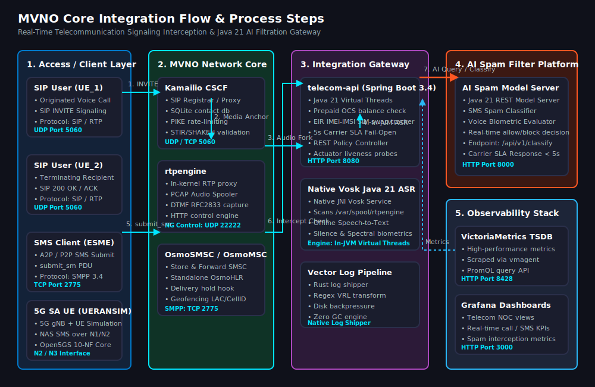

# Deployment and Configuration Guide — MVNO Core

This guide covers the transaction flow, software prerequisites, and complete configuration files for deploying the MVNO Core using both the **Native (systemd)** and **Containerized (Podman Compose)** methods.

---

## 1. Project Transaction Flow & Steps



### Voice Transaction Steps:
1. **SIP Invite**: `UE_1` sends an `INVITE` request to Kamailio.
2. **Media Path Setup**: Kamailio proxies the signaling, registers the call location in the SQLite database, and calls `rtpengine` to bind media ports.
3. **Media Forking**: When the call starts, `rtpengine` forwards the media (RTP streams) between clients in-kernel and forks a raw copy of the audio to the spool directory `/var/spool/rtpengine`.
4. **Offline Translation**: `NativeVoskService.java` inside the Spring Boot Gateway detects the audio capture, transcribes it in-memory using native Java 21 Vosk JNI bindings (`com.alphacephei:vosk`), and extracts voice biometrics.
5. **AI Filtration Check**: The Spring Boot Gateway queries the external AI Filtration System's REST API. If the call contains spam, the number is blacklisted.

### SMS Transaction Steps:
1. **SMS Submit**: The SMS Client sends an SMS via SMPP to `OsmoSMSC`.
2. **Hold & Verification**: `OsmoSMSC` holds delivery and calls the Spring Boot Gateway's `/api/v1/intercept/sms` endpoint.
3. **AI Check & Delivery**: Spring Boot forwards the content to the AI Filtration system. If approved, `allow: true` is returned and `OsmoSMSC` delivers the message. If spam, it is dropped.

---

## 2. Software Prerequisites

### Method A: Native (systemd)
Deploying directly onto a Debian-slim/Ubuntu 22.04 LTS host:

| Component | Package / Source | Command to Install |
| :--- | :--- | :--- |
| **Kamailio** | Debian/Ubuntu packages | `sudo apt install kamailio kamailio-sqlite-modules` |
| **rtpengine** | Packages / Source | `sudo apt install ngcp-rtpengine ngcp-rtpengine-daemon` |
| **Osmocom** | Osmocom OBS repositories | `sudo apt install osmo-msc osmo-hlr` |
| **Vosk STT** | Native Java JNI (`com.alphacephei:vosk`) | Built-in via Maven dependency in `telecom-api` |
| **Spring Boot** | Java 21 LTS + Maven 3.9.9 | `./mvnw spring-boot:run` |
| **Vector** | Vector deb repo | `sudo apt install vector` |
| **VictoriaMetrics**| Pre-compiled binary | Download from GitHub releases |
| **Grafana** | Grafana APT repo | `sudo apt install grafana` |

### Method B: Containerized (Podman Compose + Docker Compose Plugin)
Operating in a daemonless, rootless environment:

| Tool | Version / Source | Why |
| :--- | :--- | :--- |
| **Podman** | `sudo apt install podman` | Daemonless rootless engine |
| **Docker Compose Plugin**| `sudo apt install docker-compose` | Compose orchestration via `podman compose` |
| **Podman API Socket**| `systemctl --user enable --now podman.socket` | Required by Docker Compose Plugin to talk to Podman |
| **Kamailio Image** | `mvno-kamailio:latest` | Custom Alpine build (adds kamailio-utils) from `configs/kamailio/Dockerfile` |
| **rtpengine Image**| `drachtio/rtpengine:latest` | Media engine container |
| **Osmocom Image** | `mvno-osmo-smsc:latest` | Custom Debian build from `configs/osmocom/Dockerfile` |
| **Spring Boot Image** | `mvno-telecom-api:latest` | Custom multi-stage Maven/Temurin build from `telecom-api/Dockerfile` (Java 21 LTS + Native Vosk) |
| **VictoriaMetrics**| `victoriametrics/victoria-metrics` | Single-node database container |
| **Grafana Image** | `grafana/grafana-oss` | Metric UI dashboard container |

---

## 3. Configuration Profiles

### A. Native (systemd) Configuration Profiles

#### 1. Kamailio Systemd Unit (`/etc/systemd/system/kamailio.service`)
```ini
[Unit]
Description=Kamailio SIP Server
After=network.target rtpengine.service

[Service]
Type=forking
User=kamailio
Group=kamailio
PIDFile=/run/kamailio/kamailio.pid
ExecStart=/usr/sbin/kamailio -f /etc/kamailio/kamailio.cfg -P /run/kamailio/kamailio.pid
Restart=no

[Install]
WantedBy=multi-user.target
```

#### 2. rtpengine Systemd Unit (`/etc/systemd/system/rtpengine.service`)
```ini
[Unit]
Description=rtpengine Media Proxy
After=network.target

[Service]
Type=simple
ExecStart=/usr/sbin/rtpengine --config-file=/etc/rtpengine/rtpengine.conf
User=rtpengine
Group=rtpengine
Restart=no

[Install]
WantedBy=multi-user.target
```

---

### B. Containerized (Podman Compose) Configuration Profiles

The stack uses two compose files:

| File | Purpose |
|------|---------|
| `docker-compose.yml` | **Offline-first** — just `image:` references, no build stanzas |
| `docker-compose.build.yml` | Override that adds `build:` stanzas for source compilation |

Default (`podman compose up -d`) uses pre-loaded images. To build from source:
```bash
podman compose -f docker-compose.yml -f docker-compose.build.yml up -d --build
```

The `docker-compose.yml` is configured for **rootless Podman** execution:
- Host port mappings are above `1024` to prevent permission errors.
- SELinux contexts are dynamically modified using `:z` volume flags.
- Databases use strict RAM caps suitable for unprivileged execution.

#### [docker-compose.yml](file:///home/zkhattab/MVNO/docker-compose.yml)

**Phase 1 (SMS + Voice, no 5G)** — core services only. MongoDB and Open5GS NFs are added in Phase 3.

```yaml
networks:
  mvno_net:
    driver: bridge

services:
  # ─── Core (Phase 1) ──────────────────────────────
  rtpengine:
    image: drachtio/rtpengine:latest
    container_name: mvno-rtpengine
    ports:
      - "30000-30100:30000-30100/udp"
    volumes:
      - ./configs/rtpengine/rtpengine.conf:/etc/rtpengine.conf:z
      - ./state/spool:/var/spool/rtpengine:z
    networks:
      - mvno_net
    restart: "no"

  kamailio:
    image: mvno-kamailio:latest
    container_name: mvno-kamailio
    ports:
      - "5060:5060/udp"
      - "5060:5060/tcp"
    volumes:
      - ./configs/kamailio:/etc/kamailio:z
      - ./state/kamailio.db:/etc/kamailio/kamailio.db:z
    depends_on:
      - rtpengine
    networks:
      - mvno_net
    restart: "no"

  osmo-hlr:
    image: mvno-osmo-smsc:latest
    container_name: mvno-osmo-hlr
    command: osmo-hlr -c /etc/osmocom/osmo-hlr.cfg
    volumes:
      - ./configs/osmocom/osmo-hlr.cfg:/etc/osmocom/osmo-hlr.cfg:z
      - ./state/hlr:/var/lib/osmocom:z
    networks:
      - mvno_net
    restart: "no"

  osmo-smsc:
    image: mvno-osmo-smsc:latest
    container_name: mvno-osmo-smsc
    command: osmo-msc -c /etc/osmocom/osmo-smsc.cfg
    ports:
      - "2775:2775"
    volumes:
      - ./configs/osmocom/osmo-smsc.cfg:/etc/osmocom/osmo-smsc.cfg:z
    depends_on:
      - osmo-hlr
    networks:
      - mvno_net
    restart: "no"

  telecom-api:
    image: mvno-telecom-api:latest
    container_name: mvno-api
    ports:
      - "8080:8080"
    volumes:
      - ./state/kamailio.db:/etc/kamailio/kamailio.db:z
    healthcheck:
      test: ["CMD", "curl", "-f", "http://localhost:8080/actuator/health/liveness"]
      interval: 10s
      timeout: 3s
      retries: 5
      start_period: 30s
    networks:
      - mvno_net
    restart: "no"

  vector:
    image: timberio/vector:latest-alpine
    container_name: mvno-vector
    volumes:
      - ./configs/vector/vector.toml:/etc/vector/vector.toml:z
      - /var/log:/var/log:z
    command: ["--config", "/etc/vector/vector.toml"]
    depends_on:
      - telecom-api
    networks:
      - mvno_net
    restart: "no"

  # ─── Observability (Phase 1) ──────────────────────
  victoria-metrics:
    image: victoriametrics/victoria-metrics:latest
    container_name: mvno-victoriametrics
    ports:
      - "8428:8428"
    volumes:
      - ./state/vm-data:/victoria-metrics-data:z
    networks:
      - mvno_net
    restart: "no"

  vmagent:
    image: victoriametrics/vmagent:latest
    container_name: mvno-vmagent
    volumes:
      - ./configs/victoria-metrics/scrape.yml:/etc/prometheus/prometheus.yml:z
    depends_on:
      - victoria-metrics
    networks:
      - mvno_net
    restart: "no"

  grafana:
    image: grafana/grafana-oss:latest
    container_name: mvno-grafana
    ports:
      - "3000:3000"
    volumes:
      - ./state/grafana:/var/lib/grafana:z
    depends_on:
      - victoria-metrics
    networks:
      - mvno_net
    restart: "no"
```

**Phase 3+ additions** (when adding 5G core):
- Add `mongodb` service before Open5GS NFs
- Add 10 Open5GS NFs (nrf, amf, smf, upf, udm, ausf, udr, pcf, nssf, bsf)
- Add `webui` service for subscriber management
- Add `ueransim` for gNB and UE simulation (run natively, not in containers)

---

## 4. Port Binding Summary

| Component | Target Port | Protocol | Usage | Podman Rootless Mode |
| :--- | :--- | :--- | :--- | :--- |
| **Kamailio** | `5060` | UDP / TCP | SIP signaling | Native bind (no changes) |
| **rtpengine** | `30000-30100` | UDP | Media plane (RTP) | Native bind (no changes) |
| **OsmoSMSC** | `2775` | TCP | SMPP SMS delivery | Native bind (no changes) |
| **Spring Boot** | `8080` | TCP | Interception REST API + actuator health | Native bind (no changes) |
| **VictoriaMetrics** | `8428` | TCP | Metrics ingestion | Native bind (no changes) |
| **vmagent** | `8429` | TCP | Metrics scraping agent | Internal (no host port) |
| **Grafana** | `3000` | TCP | NOC dashboard | Native bind (no changes) |
| **MongoDB** (Phase 3+) | `27017` | TCP | Open5GS subscriber metadata | Native bind (no changes) |
| **Open5GS NRF** (Phase 3+) | `7777` | TCP | 5GC service registry | Native bind (no changes) |
| **Vector** | — | — | Log shipper (no exposed ports) | Internal only |

---

## 5. MVNO Core Integration Flow & Steps

This section details the step-by-step runbook to integrate your MVNO core components with each other and connect them to the AI Filtration REST APIs.

### Step 1: Database Setup and SQLite Hardening
Initialize the database files and configure them for high concurrency (WAL Mode) before booting any core services:
1. **Initialize databases**: Use `make init-db` to create the SQLite databases with WAL mode and the subscriber table:
   ```bash
   make init-db
   ```
   This creates `state/kamailio.db` (subscriber registry) and `state/hlr/hlr.db` (OsmoHLR subscriber data) with WAL PRAGMAs applied and test subscribers inserted.

2. **Verify**:
   ```bash
   sqlite3 state/kamailio.db "SELECT username, msisdn, balance FROM subscriber;"
   # Expected: 15551234567 | 15551234567 | 100
   #           15557654321 | 15557654321 | 0
   ```

### Step 2: Establish the Media Plane Connection (Kamailio ↔ rtpengine)
Link the signaling server (Kamailio) with the packet forwarding proxy (rtpengine):
1. **Set rtpengine NG listen port**: In `configs/rtpengine/rtpengine.conf`, the NG control socket listens on port `22223` (UDP, container-internal):
   ```ini
   listen-ng = 0.0.0.0:22223
   ```
2. **Configure Kamailio module**: In `configs/kamailio/kamailio.cfg`, load the module and point it to the rtpengine container:
   ```kamailio
   loadmodule "rtpengine.so"
   modparam("rtpengine", "rtpengine_sock", "udp:rtpengine:22223")
   ```
   Note: In containers, use the service hostname (`rtpengine`), not `127.0.0.1`.

3. **Trigger media redirection**: Within Kamailio's call route, invoke rtpengine to manage the stream:
   ```kamailio
   route[RTPCALL] {
       if (is_method("INVITE") && has_body("application/sdp")) {
           rtpengine_manage("record-call=yes metadata=JSON");
       }
   }
   ```

### Step 3: Link Interception Webhooks (Core ↔ Spring Boot Gateway)
Configure the signaling systems to call the API Gateway for approval before routing traffic:
1. **SMS Interception**: In `osmo-smsc.cfg`, the Spring Boot gateway acts as an SMPP ESME client. Configure the gateway's SMPP connection in the application settings. The gateway connects to `osmo-smsc:2775` and issues `SUBSCRIBE_SM` for delivery reports. The actual SMS routing happens via the gateway's `/api/v1/intercept/sms` REST endpoint, called by a Kamailio HTTP POST.

2. **Call Interception**: In `kamailio.cfg`, the gateway is queried via HTTP POST during the INVITE handling:
   ```kamailio
   # http_client.so is NOT available in the Alpine image.
   # Instead, use exec + curl (or build mvno-kamailio:latest with kamailio-utils).
   # The gateway URL uses the container hostname:
   #   http://telecom-api:8080/api/v1/intercept/call
   ```
   See `configs/kamailio/kamailio.cfg` `route[INTERCEPT]` for the full implementation.

### Step 4: Configure the Speech Translation Pipeline (rtpengine ↔ Vosk ↔ AI Filter)
Set up the automated loop that records media, transcribes it, and routes it to the AI filter:
1. **Set shared spool**: Point rtpengine's recording path to the shared volume mount in `rtpengine.conf`:
   ```ini
   recording-dir = /var/spool/rtpengine
   recording-method = pcap
   recording-format = eth
   ```
   **Note:** rtpengine only supports PCAP recording formats (`eth`, `eth0`, `raw`). WAV is not supported. The `eth` format captures full Ethernet frames. The Vosk worker must convert PCAP → WAV using ffmpeg/sox before transcription.

2. **Launch Translation Worker**: The `vosk-worker` container polls `/var/spool/rtpengine` via volume mount:
   - When a PCAP file is finalized, the worker converts it to WAV using ffmpeg, then transcribes it using the offline Vosk model (`vosk-model-small-en-us-0.15`).
   - It performs a `POST` request with the transcript to the Spring Boot Gateway (`http://telecom-api:8080/api/v1/transcriptions`).
   - The gateway routes the result to the AI Filtration REST API for allow/block decisions.

### Step 5: Observability Aggregation (vmagent ↔ VictoriaMetrics)
Connect the lightweight time-series stack to scrape metrics:
1. **Define target profiles**: In `configs/victoria-metrics/scrape.yml`, configure scraping parameters. All targets use container hostnames, not `127.0.0.1`:
   ```yaml
   scrape_configs:
     - job_name: 'telecom-api'
       static_configs:
         - targets: ['telecom-api:8080']
     - job_name: 'kamailio'
       static_configs:
         - targets: ['kamailio:5060']
     - job_name: 'rtpengine'
       static_configs:
         - targets: ['rtpengine:22223']
   ```
2. **Set ingestion write-path**: Point `vmagent` to push all aggregated telemetry to the VictoriaMetrics TSDB single-binary database at `victoria-metrics:8428`.

