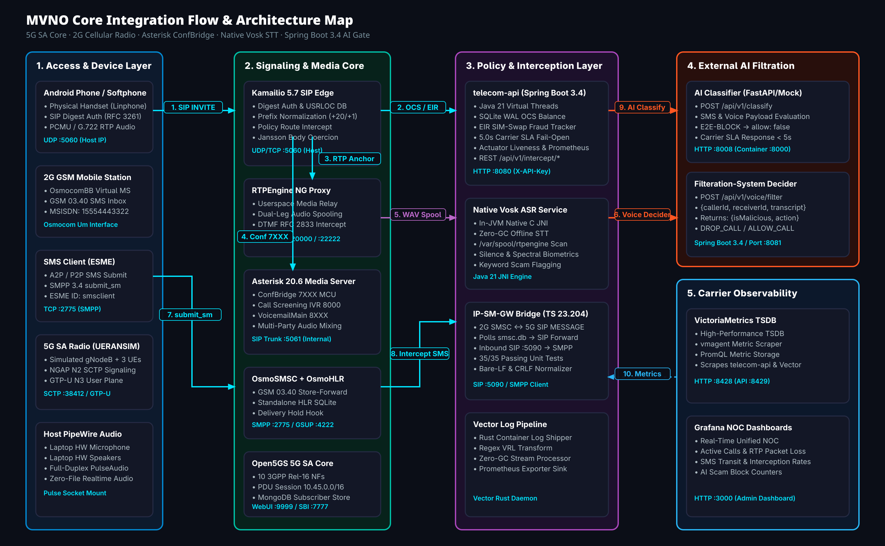
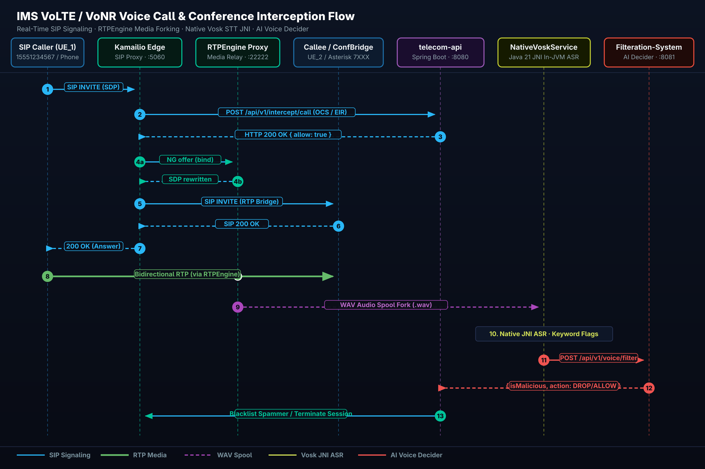
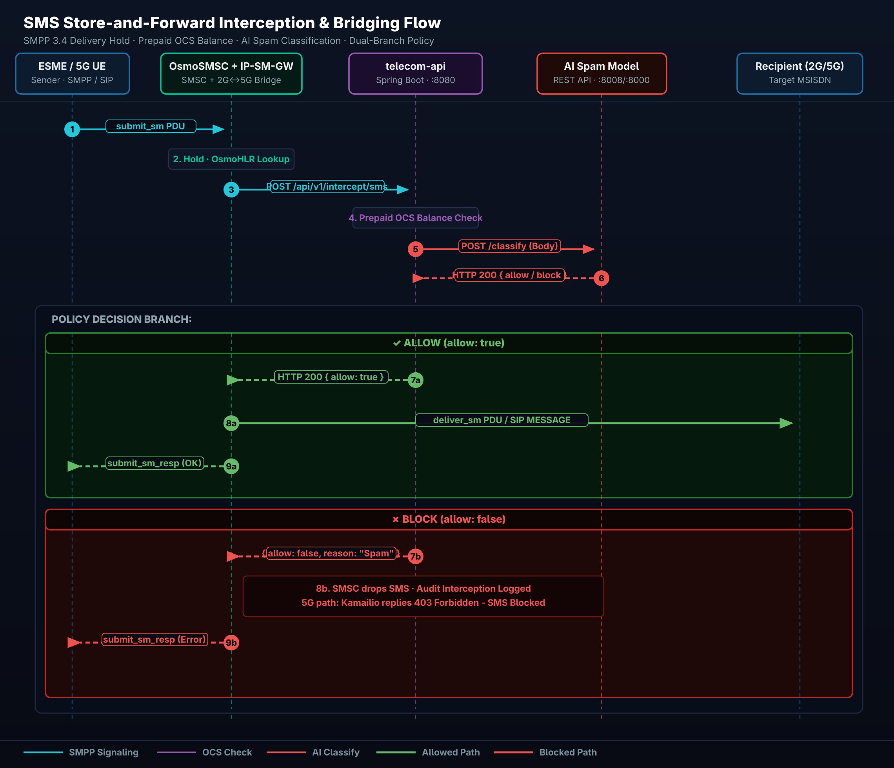

# Deployment and Configuration Guide — MVNO Core

> Abbreviations: **docs/GLOSSARY.md** — single source of truth
This guide covers the transaction flow, software prerequisites, and complete configuration files for deploying the MVNO Core using both the **Native (systemd)** and **Containerized (Podman Compose)** methods.

---

## 1. Project Transaction Flow & Steps

[](architecture_flow.svg)

### IMS VoLTE / VoNR Voice Call Signaling Flow

[](ims_voice_call_flow.svg)

### SMS Store-and-Forward Interception Signaling Flow

[](sms_interception_flow.svg)

### Voice Transaction Steps:
1. **SIP Invite**: `UE_1` sends an `INVITE` request to Kamailio.
2. **Media Path Setup**: Kamailio proxies the signaling, registers the call location in the SQLite database, and calls `rtpengine` to bind media ports.
3. **Media Forking**: When the call starts, `rtpengine` forwards the media (RTP streams) between clients in-kernel and forks a raw copy of the audio to the spool directory `/var/spool/rtpengine`.
4. **Offline Translation**: `NativeVoskService.java` inside the Spring Boot Gateway detects the audio capture, transcribes it in-memory using native Java 21 Vosk JNI bindings (`com.alphacephei:vosk`), and extracts voice biometrics.
5. **AI Filtration Check**: The Spring Boot Gateway queries the external AI Filtration System's REST API. If the call contains spam, the number is blacklisted.

### SMS Transaction Steps:
1. **SMS Submit**: The SMS Client sends an SMS via SMPP to `OsmoSMSC`.
2. **Hold & Verification**: `OsmoSMSC` holds delivery and calls the Spring Boot Gateway's `/api/v1/intercept/sms` endpoint.
3. **AI Check & Delivery**: Spring Boot forwards the content to the AI Filtration system. If approved, `allow: true` is returned and `OsmoSMSC` delivers the message. If spam, it is dropped.

---

## 2. Software Prerequisites

> Portability contract: see [ENVIRONMENT_MATRIX.md](ENVIRONMENT_MATRIX.md) for
> supported OS/arch/runtime/kernel requirements and run `./scripts/preflight.sh`
> to auto-verify them on your host. The tables below cover the install commands.

### Method A: Native (systemd)
Deploying directly onto a Debian-slim/Ubuntu 22.04 LTS host:

| Component | Package / Source | Command to Install |
| :--- | :--- | :--- |
| **Kamailio** | Debian/Ubuntu packages | `sudo apt install kamailio kamailio-sqlite-modules` |
| **rtpengine** | Packages / Source | `sudo apt install ngcp-rtpengine ngcp-rtpengine-daemon` |
| **Osmocom** | Osmocom OBS repositories | `sudo apt install osmo-msc osmo-hlr` |
| **Vosk STT** | Native Java JNI (`com.alphacephei:vosk`) | Built-in via Maven dependency in `telecom-api` |
| **Spring Boot** | Java 21 LTS + Maven 3.9.9 | `./mvnw spring-boot:run` |
| **Vector** | Vector deb repo | `sudo apt install vector` |
| **VictoriaMetrics**| Pre-compiled binary | Download from GitHub releases |
| **Grafana** | Grafana APT repo | `sudo apt install grafana` |

### Method B: Containerized (Podman Compose + Docker Compose Plugin)
Operating in a daemonless, rootless environment:

| Tool | Version / Source | Why |
| :--- | :--- | :--- |
| **Podman** | `sudo apt install podman` | Daemonless rootless engine |
| **Docker Compose Plugin**| `sudo apt install docker-compose` | Compose orchestration via `podman compose` |

**Ubuntu host-tool one-liner** (everything `preflight.sh` + `make bootstrap` need on a
fresh Ubuntu box — run once, then `./scripts/preflight.sh` should be ALL CLEAR):

```bash
sudo apt update && sudo apt install -y \
  podman docker-compose sqlite3 netcat-openbsd curl python3 \
  tshark ffmpeg espeak-ng alsa-utils xxd \
  linux-modules-extra-$(uname -r)   # SCTP module (5G NGAP + 2G M3UA)
# Kernel features (5G UPF/UERANSIM + 2G virtual-Um):
sudo modprobe sctp
sudo modprobe tun
# UFW (Ubuntu default firewall) — allow SIP + RTP media or calls ring with no audio:
sudo ufw allow 5060/udp && sudo ufw allow 10000:20000/udp
```

> **UFW landmine (Ubuntu-specific):** with UFW active, SIP (5060) passes but the
> phone's RTP media (UDP 10000-20000) is silently dropped — calls ring but carry
> no audio. `preflight.sh` now detects this and warns. The two `ufw allow` lines
> above are the fix.

**Custom images (no local cache, internet available):** the 8 project-built images
(`mvno-*`) are published **publicly** to Docker Hub under
`docker.io/5attab007/mvno-*:<tag>` (kamailio 5.7.2, 2g-ms/2g-core/osmo-smsc/telecom-api
1.0.0, ueransim 3.2.6, open5gs + open5gs-webui 2.8.0). A fresh machine can pull and
retag them in one step, then launch the stack offline:

```bash
./scripts/pull-images.sh     # pulls 5attab007/mvno-* and re-tags to the bare names compose expects
./scripts/up.sh
```

One-command path (≡ pull-images + init-db + up + seed-mongo, with preflight and self-heal):
`./scripts/deploy.sh` — see Section 2B. (seed-mongo runs **after** launch — it
`exec`s into the running mongodb container; without it the 5G UEs cannot register.)

Vendor images (`mongo:7.0`, `grafana/grafana-oss:11.6.0`, `timberio/vector`,
`victoriametrics/*`, `drachtio/rtpengine`, `percona/mongodb_exporter`, `python:3.11-alpine`)
pull from their own public Docker Hub namespaces as usual.

**Compose file layout (why 3 files — do NOT merge them):** the stack uses standard Compose
*override layering*, so each file has one distinct purpose:
- `docker-compose.yml` — the canonical, offline-first base (36 services: 34 core + the
  `baresip-rx`/`baresip-tx` live-demo rig, statically pinned IPs).
- `docker-compose.build.yml` — opt-in **source-build** override for online rebuilds
  (`podman compose -f docker-compose.yml -f docker-compose.build.yml up -d --build`); keeps the
  base file free of `build:` stanzas.

(Historical `docker-compose.5060.yml` — the redundant host-180 override that published
Kamailio on 5060 in addition to 5066 — was removed in the 5060 consolidation. Kamailio now
publishes directly on the canonical port **5060:5060/udp** in `docker-compose.yml`, so no
override file is needed. See `docs/ENVIRONMENT_MATRIX.md` Section 3.)

### Live-Demo Rig (baresip) — Compose-Managed

The live-mic SIP rig is now **fully containerized** (cold-start fragmentation fix):

- `baresip-rx` (callee `15559998888`, auto-answer) and `baresip-tx` (caller
  `15553332211`) are real services in `docker-compose.yml` — `make up` brings
  them up, `make clean` removes them. No more stale registrations or orphaned
  rig containers.
- Configs/accounts are written by `scripts/testing/demo_call.sh setup` into
  `./state/baresip/{rx,tx}` (mounted at `/cfg`); the script then runs
  `podman compose up -d baresip-rx baresip-tx` to apply them. It no longer
  creates containers via raw `podman run`.
- Image: `mvno-baresip:1.1.0` (one of the 9 `mvno-*` custom images).

**Host Pulse/PipeWire requirement (live-mic legs):** the rig captures the real
laptop mic via the host Pulse daemon. `pipewire-pulse` (or `pulseaudio`) must be
running and `$XDG_RUNTIME_DIR/pulse/native` must exist. The compose services
default to uid-1000 paths (`/run/user/1000/...`, `/home/zkhattab/.config/pulse/cookie`);
operators with a different UID/username **must** export `PULSE_SOCK`, `PULSE_DIR`,
and `PULSE_COOKIE` before `demo_call.sh setup` (the script re-exports them from
your own runtime dir automatically).

**UFW (Ubuntu-specific, the #1 silent phone-media killer):** with UFW active,
SIP (5060) passes but the phone's RTP media (UDP 10000-20000) is silently
dropped — calls ring but carry no audio. `preflight.sh` detects this. Fix:

```bash
sudo ufw allow 5060/udp && sudo ufw allow 10000:20000/udp
```

### Kernel Prerequisites (5G NGAP Signaling)

5G N2 interface signaling between UERANSIM gNB (`mvno-ueransim-gnb`) and Open5GS AMF (`mvno-amf`) over TCP/SCTP port 38412 requires the **SCTP kernel module** enabled on the host operating system:

```bash
# 1. Load SCTP kernel module
sudo modprobe sctp

# 2. Verify SCTP module state
lsmod | grep sctp

# 3. Install SCTP development headers & tools (pick your distro)
sudo apt install -y lksctp-tools      # Debian/Ubuntu
sudo dnf install -y lksctp-tools      # Fedora/RHEL
sudo pacman -S --needed lksctp-tools  # Arch/CachyOS
```
| **Podman API Socket**| `systemctl --user enable --now podman.socket` | Required by Docker Compose Plugin to talk to Podman |
| **Kamailio Image** | `mvno-kamailio:5.7.2` | Custom Alpine build (adds kamailio-utils) from `configs/kamailio/Dockerfile` |
| **rtpengine Image**| `drachtio/rtpengine:mr9.4.0.0` | Media engine container |
| **Osmocom Image** | `mvno-osmo-smsc:1.0.0` | Custom Debian build from `configs/osmocom/Dockerfile` |
| **Spring Boot Image** | `mvno-telecom-api:1.0.0` | Custom multi-stage Maven/Temurin build from `telecom-api/Dockerfile` (Java 21 LTS + Native Vosk) |
| **VictoriaMetrics**| `victoriametrics/victoria-metrics` | Single-node database container |
| **Grafana Image** | `grafana/grafana-oss` | Metric UI dashboard container |

---

## 3. Configuration Profiles

### A. Native (systemd) Configuration Profiles

#### 1. Kamailio Systemd Unit (`/etc/systemd/system/kamailio.service`)
```ini
[Unit]
Description=Kamailio SIP Server
After=network.target rtpengine.service

[Service]
Type=forking
User=kamailio
Group=kamailio
PIDFile=/run/kamailio/kamailio.pid
ExecStart=/usr/sbin/kamailio -f /etc/kamailio/kamailio.cfg -P /run/kamailio/kamailio.pid
Restart=no

[Install]
WantedBy=multi-user.target
```

#### 2. rtpengine Systemd Unit (`/etc/systemd/system/rtpengine.service`)
```ini
[Unit]
Description=rtpengine Media Proxy
After=network.target

[Service]
Type=simple
ExecStart=/usr/sbin/rtpengine --config-file=/etc/rtpengine/rtpengine.conf
User=rtpengine
Group=rtpengine
Restart=no

[Install]
WantedBy=multi-user.target
```

---

### B. Containerized (Podman Compose) Configuration Profiles

The stack uses two compose files:

| File | Purpose |
|------|---------|
| `docker-compose.yml` | **Offline-first** — just `image:` references, no build stanzas |
| `docker-compose.build.yml` | Override that adds `build:` stanzas for source compilation |

Default (`podman compose up -d`) uses pre-loaded images. To build from source:
```bash
podman compose -f docker-compose.yml -f docker-compose.build.yml up -d --build
```

The `docker-compose.yml` is configured for **rootless Podman** execution:
- Host port mappings are above `1024` to prevent permission errors.
- SELinux contexts are dynamically modified using `:z` volume flags.
- Databases use strict RAM caps suitable for unprivileged execution.

#### [docker-compose.yml](docker-compose.yml)

```yaml
networks:
  mvno_net:
    driver: bridge
    ipam:
      config:
        - subnet: 10.89.0.0/24

services:
  mongodb:
    image: mongo:7.0
    container_name: mvno-mongodb
    command: mongod --wiredTigerCacheSizeGB 0.25
    ports:
      - "127.0.0.1:27017:27017"
    volumes:
      - ./state/mongodb:/data/db:z
    healthcheck:
      test: mongosh --eval 'db.runCommand({ping:1})' --quiet
      interval: 10s
      timeout: 5s
      retries: 3
    networks:
      - mvno_net
    restart: unless-stopped

  open5gs-webui:
    image: mvno-open5gs-webui:2.8.0
    container_name: mvno-open5gs-webui
    ports:
      - "9999:3000"
    environment:
      - DB_URI=mongodb://mongodb:27017/open5gs
      - HOST=0.0.0.0
      - PORT=3000
      - NODE_PATH=src
    depends_on:
      mongodb:
        condition: service_healthy
    networks:
      - mvno_net
    restart: unless-stopped

  nrf:
    image: mvno-open5gs:2.8.0
    container_name: mvno-nrf
    environment:
      COMPONENT_NAME: nrf
      DB_URI: mongodb://mongodb/open5gs
    volumes:
      - ./configs/open5gs/nrf.yaml:/etc/open5gs/nrf.yaml:z
    depends_on:
      mongodb:
        condition: service_healthy
    networks:
      - mvno_net
    restart: unless-stopped

  amf:
    image: mvno-open5gs:2.8.0
    container_name: mvno-amf
    environment:
      COMPONENT_NAME: amf
      DB_URI: mongodb://mongodb/open5gs
    volumes:
      - ./configs/open5gs/amf.yaml:/etc/open5gs/amf.yaml:z
    depends_on:
      nrf:
        condition: service_started
    networks:
      - mvno_net
    restart: unless-stopped

  smf:
    image: mvno-open5gs:2.8.0
    container_name: mvno-smf
    environment:
      COMPONENT_NAME: smf
      DB_URI: mongodb://mongodb/open5gs
    volumes:
      - ./configs/open5gs/smf.yaml:/etc/open5gs/smf.yaml:z
    depends_on:
      nrf:
        condition: service_started
      upf:
        condition: service_started
    networks:
      - mvno_net
    restart: unless-stopped

  upf:
    image: mvno-open5gs:2.8.0
    container_name: mvno-upf
    environment:
      COMPONENT_NAME: upf
      DB_URI: mongodb://mongodb/open5gs
    volumes:
      - ./configs/open5gs/upf.yaml:/etc/open5gs/upf.yaml:z
    cap_add:
      - NET_ADMIN
    devices:
      - /dev/net/tun:/dev/net/tun
    depends_on:
      nrf:
        condition: service_started
    networks:
      - mvno_net
    restart: unless-stopped

  ausf:
    image: mvno-open5gs:2.8.0
    container_name: mvno-ausf
    environment:
      COMPONENT_NAME: ausf
      DB_URI: mongodb://mongodb/open5gs
    volumes:
      - ./configs/open5gs/ausf.yaml:/etc/open5gs/ausf.yaml:z
    depends_on:
      nrf:
        condition: service_started
    networks:
      - mvno_net
    restart: unless-stopped

  bsf:
    image: mvno-open5gs:2.8.0
    container_name: mvno-bsf
    environment:
      COMPONENT_NAME: bsf
      DB_URI: mongodb://mongodb/open5gs
    volumes:
      - ./configs/open5gs/bsf.yaml:/etc/open5gs/bsf.yaml:z
    depends_on:
      nrf:
        condition: service_started
    networks:
      - mvno_net
    restart: unless-stopped

  udm:
    image: mvno-open5gs:2.8.0
    container_name: mvno-udm
    environment:
      COMPONENT_NAME: udm
      DB_URI: mongodb://mongodb/open5gs
    volumes:
      - ./configs/open5gs/udm.yaml:/etc/open5gs/udm.yaml:z
    depends_on:
      nrf:
        condition: service_started
    networks:
      - mvno_net
    restart: unless-stopped

  udr:
    image: mvno-open5gs:2.8.0
    container_name: mvno-udr
    environment:
      COMPONENT_NAME: udr
      DB_URI: mongodb://mongodb/open5gs
    volumes:
      - ./configs/open5gs/udr.yaml:/etc/open5gs/udr.yaml:z
    depends_on:
      nrf:
        condition: service_started
    networks:
      - mvno_net
    restart: unless-stopped

  pcf:
    image: mvno-open5gs:2.8.0
    container_name: mvno-pcf
    environment:
      COMPONENT_NAME: pcf
      DB_URI: mongodb://mongodb/open5gs
    volumes:
      - ./configs/open5gs/pcf.yaml:/etc/open5gs/pcf.yaml:z
    depends_on:
      nrf:
        condition: service_started
    networks:
      - mvno_net
    restart: unless-stopped

  nssf:
    image: mvno-open5gs:2.8.0
    container_name: mvno-nssf
    environment:
      COMPONENT_NAME: nssf
      DB_URI: mongodb://mongodb/open5gs
    volumes:
      - ./configs/open5gs/nssf.yaml:/etc/open5gs/nssf.yaml:z
    depends_on:
      nrf:
        condition: service_started
    networks:
      - mvno_net
    restart: unless-stopped

  ueransim-gnb:
    image: mvno-ueransim:3.2.6
    container_name: mvno-ueransim-gnb
    command: ["nr-gnb", "-c", "/etc/ueransim/gnb.yaml"]
    volumes:
      - ./configs/ueransim/gnb.yaml:/etc/ueransim/gnb.yaml:z
    cap_add:
      - NET_ADMIN
      - SYS_PTRACE
    depends_on:
      amf:
        condition: service_started
    healthcheck:
      test: ["CMD-SHELL", "cat /proc/net/sctp/assocs 2>/dev/null | grep -q 38412"]
      interval: 30s
      timeout: 5s
      retries: 3
      start_period: 15s
    networks:
      - mvno_net
    restart: unless-stopped

  ueransim-ue-1:
    image: mvno-ueransim:3.2.6
    container_name: mvno-ueransim-ue-1
    command: ["nr-ue", "-c", "/etc/ueransim/ue.yaml"]
    volumes:
      - ./configs/ueransim/ue.yaml:/etc/ueransim/ue.yaml:z
    cap_add:
      - NET_ADMIN
      - SYS_PTRACE
    depends_on:
      ueransim-gnb:
        condition: service_started
    networks:
      - mvno_net
    restart: unless-stopped

  ueransim-ue-2:
    image: mvno-ueransim:3.2.6
    container_name: mvno-ueransim-ue-2
    command: ["nr-ue", "-c", "/etc/ueransim/ue.yaml"]
    volumes:
      - ./configs/ueransim/ue-spam.yaml:/etc/ueransim/ue.yaml:z
    cap_add:
      - NET_ADMIN
      - SYS_PTRACE
    depends_on:
      ueransim-gnb:
        condition: service_started
    networks:
      - mvno_net
    restart: unless-stopped

  ueransim-ue-3:
    image: mvno-ueransim:3.2.6
    container_name: mvno-ueransim-ue-3
    command: ["nr-ue", "-c", "/etc/ueransim/ue.yaml"]
    volumes:
      - ./configs/ueransim/ue-zero.yaml:/etc/ueransim/ue.yaml:z
    cap_add:
      - NET_ADMIN
      - SYS_PTRACE
    depends_on:
      ueransim-gnb:
        condition: service_started
    networks:
      - mvno_net
    restart: unless-stopped

  rtpengine:
    image: drachtio/rtpengine:mr9.4.0.0
    container_name: mvno-rtpengine
    command:
      - rtpengine
      - --config-file=/etc/rtpengine/rtpengine.conf
      - --listen-http=9900
    ports:
      - "10000-20000:10000-20000/udp"
      - "9900:9900"
    volumes:
      - ./configs/rtpengine:/etc/rtpengine:z
      - ./state/spool:/var/spool/rtpengine:z
    networks:
      - mvno_net
    restart: unless-stopped

  kamailio:
    image: mvno-kamailio:5.7.2
    container_name: mvno-kamailio
    ports:
      - "5060:5060/udp"
    volumes:
      - ./configs/kamailio:/etc/kamailio:z
      - ./state/kamailio/kamailio.db:/etc/kamailio/kamailio.db:z
    depends_on:
      rtpengine:
        condition: service_started
    networks:
      - mvno_net
    restart: unless-stopped

  osmo-hlr:
    image: mvno-osmo-smsc:1.0.0
    container_name: mvno-osmo-hlr
    command: osmo-hlr -c /etc/osmocom/osmo-hlr.cfg
    volumes:
      - ./configs/osmocom:/etc/osmocom:z
      - ./state/hlr:/var/lib/osmocom:z
    healthcheck:
      test: ["CMD-SHELL", "timeout 3 bash -c 'echo > /dev/tcp/localhost/4222' 2>/dev/null || exit 1"]
      interval: 30s
      timeout: 5s
      retries: 3
      start_period: 30s
    networks:
      mvno_net:
        ipv4_address: 10.89.0.45
    restart: unless-stopped

  osmo-smsc:
    image: mvno-osmo-smsc:1.0.0
    container_name: mvno-osmosmsc
    ports:
      - "2775:2775"
    volumes:
      - ./configs/osmocom:/etc/osmocom:z
      - ./state/hlr:/var/lib/osmocom:z
    depends_on:
      - osmo-hlr
    healthcheck:
      test: ["CMD-SHELL", "timeout 3 bash -c 'echo > /dev/tcp/localhost/2775' 2>/dev/null || exit 1"]
      interval: 30s
      timeout: 5s
      retries: 3
      start_period: 30s
    networks:
      - mvno_net
    restart: unless-stopped

  telecom-api:
    image: mvno-telecom-api:1.0.0
    container_name: mvno-api
    ports:
      - "8080:8080"
    volumes:
      - ./state/kamailio:/etc/kamailio:z
      - ./state/spool:/var/spool/rtpengine:z
    healthcheck:
      test: ["CMD-SHELL", "timeout 3 bash -c 'echo > /dev/tcp/localhost/8080' 2>/dev/null || exit 1"]
      interval: 30s
      timeout: 5s
      retries: 3
      start_period: 30s
    networks:
      - mvno_net
    restart: unless-stopped

  ai-filter:
    image: python:3.11-alpine
    container_name: mvno-ai-filter
    ports:
      - "8008:8000"
    command:
      - python3
      - -c
      - |
        from http.server import HTTPServer, BaseHTTPRequestHandler
        class H(BaseHTTPRequestHandler):
            def do_POST(self):
                length = int(self.headers.get('Content-Length', 0))
                if length > 0: self.rfile.read(length)
                self.send_response(200)
                self.send_header('Content-Type', 'application/json')
                self.end_headers()
                self.wfile.write(b'{"allow":true,"reason":"Clean content"}')
            def do_GET(self):
                self.send_response(200)
                self.end_headers()
                self.wfile.write(b'OK')
        HTTPServer(('0.0.0.0', 8000), H).serve_forever()
    networks:
      - mvno_net
    restart: unless-stopped

  vector:
    image: timberio/vector:0.44.0-alpine
    container_name: mvno-vector
    volumes:
      - ./configs/vector/vector.toml:/etc/vector/vector.toml:z
      - /run/user/${UID:-1000}/podman/podman.sock:/var/run/docker.sock:ro,z
    networks:
      - mvno_net
    restart: unless-stopped

  victoria-metrics:
    image: victoriametrics/victoria-metrics:v1.147.0
    container_name: mvno-victoriametrics
    ports:
      - "8428:8428"
    volumes:
      - ./state/vm-data:/victoria-metrics-data:z
    networks:
      - mvno_net
    restart: unless-stopped

  vmagent:
    image: victoriametrics/vmagent:v1.147.0
    container_name: mvno-vmagent
    ports:
      - "8429:8429"
    command:
      - "-remoteWrite.url=http://victoria-metrics:8428/api/v1/write"
      - "-promscrape.config=/etc/prometheus/prometheus.yml"
    volumes:
      - ./configs/victoria-metrics/scrape.yml:/etc/prometheus/prometheus.yml:z
    depends_on:
      victoria-metrics:
        condition: service_started
    networks:
      - mvno_net
    restart: unless-stopped

  grafana:
    image: grafana/grafana-oss:11.6.0
    container_name: mvno-grafana
    ports:
      - "3000:3000"
    environment:
      - GF_SECURITY_ADMIN_USER=admin
      - GF_SECURITY_ADMIN_PASSWORD=admin
      - GF_USERS_ALLOW_SIGN_UP=false
    volumes:
      - ./configs/grafana/provisioning:/etc/grafana/provisioning:z
      - ./state/grafana:/var/lib/grafana:z
    depends_on:
      victoria-metrics:
        condition: service_started
    networks:
      - mvno_net
    restart: unless-stopped
```


**Integrated 5G SA Core & RAN Simulation Services**:
- Includes `mongodb` service (`mongo:7.0`) and 10 Open5GS NFs (`nrf`, `amf`, `smf`, `upf`, `udm`, `ausf`, `udr`, `pcf`, `nssf`, `bsf`)
- Includes `mvno-open5gs-webui` service for web subscriber management
- Includes containerized `ueransim` base image (`mvno-ueransim:3.2.6`) running `mvno-ueransim-gnb` and 3 simulated UEs (`mvno-ueransim-ue-1..3`)

---

## 4. Port Binding Summary

| Component | Target Port | Protocol | Usage | Podman Rootless Mode |
| :--- | :--- | :--- | :--- | :--- |
| **Kamailio** | `5060 (host) → 5060 (container)` | UDP / TCP | SIP signaling | Host port 5060 mapped to container port 5060 |
| **rtpengine** | `10000-20000` | UDP | Media plane (RTP) | Native bind (no changes) |
| **OsmoSMSC** | `2775` | TCP | SMPP SMS delivery | Native bind (no changes) |
| **Spring Boot** | `8080` | TCP | Interception REST API + actuator health | Native bind (no changes) |
| **VictoriaMetrics** | `8428` | TCP | Metrics ingestion | Native bind (no changes) |
| **vmagent** | `8429` | TCP | Metrics scraping agent target API | Mapped to host port `8429` for target inspection |
| **Grafana** | `3000` | TCP | NOC dashboard | Native bind (no changes) |
| **MongoDB** (Phase 3+) | `27017` | TCP | Open5GS subscriber metadata | Loopback-only publish (`127.0.0.1:27017`), container-internal auth-off |
| **Open5GS NRF** (Phase 3+) | `7777` | TCP | 5GC service registry | Native bind (no changes) |
| **Vector** | — | — | Log shipper (no exposed ports) | Internal only |
| **Open5GS WebUI** | `9999` | TCP | Subscriber & SIM Management WebUI | Native bind (`9999:3000`) |

---

## 5. Web Dashboards & Admin Access Credentials

### 📊 Grafana Real-Time Telecom NOC Dashboard
- **Web UI URL:** `http://localhost:3000`
- **Username:** `admin`
- **Password:** `admin`
- **Provisioned NOC Dashboards** (auto-provisioned from `configs/grafana/provisioning/dashboards/`, hot-reload ~10s):
  1. `MVNO NOC — Unified` (`uid: mvno-unified-noc`) — KPIs, interception traffic, EIR, rtpengine, topology
  2. `MVNO VictoriaMetrics System NOC` (`uid: mvno-victoriametrics-noc`) — observability-of-observability: ingestion rate, disk, remoteWrite pipeline
- **Provisioned Alert Rules** (folder `MVNO NOC`, 4 rules): Scrape Targets Down (critical), Media Ports Free Low, EIR SIM-Swap Blocks, AI Fail-Open SLA Rate
- **Verification Status:** Validated via HTTP `POST /login` (`HTTP 200 OK`, `grafana_session` cookie issued).

### 📱 Open5GS 5G SA Subscriber Management WebUI
- **Web UI URL:** `http://localhost:9999`
- **Username:** `admin`
- **Password:** `1423`
- **Database Binding:** `mongodb://mvno-mongodb:27017/open5gs`
- **Admin Account Hashing:** Account document seeded in MongoDB collection `open5gs.accounts`:
  ```json
  {
    "username": "admin",
    "password": "$2b$12$L6PO5GJQfMmHt6Uall2OxODicgdosZohXDvwS1HPt/Q.WXUD92Y7S",
    "roles": ["admin"]
  }
  ```
- **Verification Status:** Validated bcrypt cost 12 hash salt for password `1423` seeded directly into MongoDB `open5gs` database.

---

## 6. MVNO Core Integration Flow & Steps

This section details the step-by-step runbook to integrate your MVNO core components with each other and connect them to the AI Filtration REST APIs.

### Step 1: Database Setup and SQLite Hardening
Initialize the database files and configure them for high concurrency (WAL Mode) before booting any core services:
1. **Initialize databases**: Use `make init-db` to create the SQLite databases with WAL mode and the subscriber table:
   ```bash
   make init-db
   ```
   This creates `state/kamailio/kamailio.db` (subscriber registry) and `state/hlr/hlr.db` (OsmoHLR subscriber data) with WAL PRAGMAs applied and test subscribers inserted.

2. **Verify**:
   ```bash
   sqlite3 state/kamailio/kamailio.db "SELECT username, msisdn, balance FROM subscriber;"
   # Expected: 15551234567 | 15551234567 | 100
   #           15557654321 | 15557654321 | 0
   ```

### Step 2: Establish the Media Plane Connection (Kamailio ↔ rtpengine)
Link the signaling server (Kamailio) with the packet forwarding proxy (rtpengine):
1. **Set rtpengine NG listen port**: In `configs/rtpengine/rtpengine.conf`, the NG control socket listens on port `22222` (UDP, container-internal):
   ```ini
   listen-ng = 0.0.0.0:22222
   ```
   > **Media Plane Performance Note**: RTPEngine operates in userspace daemon mode under unprivileged rootless Podman execution (`--foreground`). For kernel-bypass hardware acceleration (`xt_RTPENGINE`), mount `/dev/rtpengine` character device with root privileges.
2. **Configure Kamailio module**: In `configs/kamailio/kamailio.cfg`, load the module and point it to the rtpengine container:
   ```kamailio
   loadmodule "rtpengine.so"
   modparam("rtpengine", "rtpengine_sock", "udp:rtpengine:22222")
   ```
   Note: In containers, use the service hostname (`rtpengine`), not `127.0.0.1`.

3. **Trigger media redirection**: Within Kamailio's call route, invoke rtpengine to manage the stream:
   ```kamailio
   route[RTPCALL] {
       if (is_method("INVITE") && has_body("application/sdp")) {
           rtpengine_manage("record-call=yes metadata=JSON");
       }
   }
   ```

### Step 3: Link Interception Webhooks (Core ↔ Spring Boot Gateway)
Configure the signaling systems to call the API Gateway for approval before routing traffic. **All `/api/v1/intercept/**` calls require the `X-API-Key: mvno-demo-key-2026` header** (missing/mismatched key → `401 Unauthorized`; demo default from `intercept.api-key`, env override `X_API_KEY`).
1. **SMS Interception**: `osmo-smsc` holds delivery and calls the gateway's `POST /api/v1/intercept/sms` REST endpoint (the gateway is a pure REST consumer — it does **not** act as an SMPP ESME client and issues no `SUBSCRIBE_SM`). The ESME routing is configured in `osmo-smsc.cfg`; the outbound HTTP callout carries the `X-API-Key` header.

2. **Call Interception**: In `kamailio.cfg`, `route[INTERCEPT]` queries the gateway via HTTP **GET** with query parameters and an explicit `X-API-Key` header during INVITE handling (4-arg `http_client_query` form — empty post-data means GET):
   ```kamailio
   # http_client.so is loaded and used in kamailio.cfg for HTTP REST callouts.
   # The gateway URL uses the container hostname:
   #   http://mvno-api:8080/api/v1/intercept/call?caller=<fU>&callee=<rU>
   # with header: X-API-Key: mvno-demo-key-2026
   ```
   See `configs/kamailio/kamailio.cfg` `route[INTERCEPT]` for the full implementation.

### Step 4: Speech Translation Pipeline (rtpengine ↔ NativeVoskService ↔ AI Filter)
The ASR pipeline runs **entirely inside the Spring Boot JVM** via `NativeVoskService.java` — there is no external Python worker.

1. **Set shared spool**: Point rtpengine's recording path to the shared volume mount in `rtpengine.conf`:
   ```ini
   recording-dir = /var/spool/rtpengine
   recording-method = fork
   recording-format = wav
   ```
   > **Note:** rtpengine streams audio captures via fork recording mode to `/var/spool/rtpengine`.

2. **Native Java 21 Vosk ASR** (`NativeVoskService.java` inside `mvno-api`):
   - Uses a `@Scheduled(fixedDelay = 3000)` virtual-thread task that polls `/var/spool/rtpengine` every 3 seconds.
   - When a `.wav` file is ready, it is decoded in-memory using native JNI bindings (`com.alphacephei:vosk:0.3.45`) — zero Python, zero cloud.
   - The transcript text is then routed **in-process** to the AI Spam Model via `POST /api/v1/classify` with
     `event_type: "TRANSCRIPT"` (see `AiFilterService.classifyTranscript`); the returned `{allow, reason}` verdict is
     logged and exported as `mvno_vosk_classified_total` / `mvno_vosk_blocked_total`. Failures fail-open (post-call
     analytics never stall the spool loop) and share the `mvno.ai.failopen` SLA counters.
   - rtpengine spool files carry no SIP Call-ID in the filename (`call-<epoch>%<host>-<hash>.wav`); the filename
     stem is used as the recording identifier (`call_id`) in the classify payload.
   - `POST /api/v1/transcriptions` remains an inbound REST receiver for external post-call analytics payloads
     (transcript + acoustic biometrics + DTMF) pushed by third-party clients; it does not feed the AI classifier.
   - **No separate `vosk-worker` container is needed** — this is handled entirely by `mvno-api`.

### Step 5: Observability Aggregation (vmagent ↔ VictoriaMetrics)
Connect the lightweight time-series stack to scrape metrics:
1. **Define target profiles**: In `configs/victoria-metrics/scrape.yml`, configure scraping parameters. All targets use container hostnames, not `127.0.0.1`:
   ```yaml
   scrape_configs:
     - job_name: 'telecom-api'
       static_configs:
         - targets: ['mvno-api:8080']
     - job_name: 'rtpengine'
       static_configs:
         - targets: ['rtpengine:9900']
     - job_name: 'vmagent'
       static_configs:
         - targets: ['vmagent:8429']
   ```
 2. **Set ingestion write-path**: Point `vmagent` to push all aggregated telemetry to the VictoriaMetrics TSDB single-binary database at `victoria-metrics:8428`.

### Step 6: 5G SA Radio Access & User-Plane Data Path (UERANSIM ↔ Open5GS)

This step brings up the 5G SA access network (UERANSIM gNB + UEs) against the Open5GS core and verifies a **live user-plane data path** end-to-end (UE tun → N3 GTP-U → UPF → N6 ogstun, and the reverse DL direction).

1. **Addressing plan** (fixed static IPs in `docker-compose.yml`):

   | Role | Container | Address / Port |
   |---|---|---|
   | N2/NGAP (gNB ↔ AMF) | `mvno-ueransim-gnb` | `10.89.0.30:38412` ↔ `mvno-amf:38412` (SCTP) |
   | N3 GTP-U (gNB ↔ UPF) | `mvno-ueransim-gnb` | `gtpIp: 10.89.0.30` ↔ `mvno-upf` `gtpu: 10.89.0.14:2152` |
   | N6 (UPF ↔ UE network) | `mvno-upf` | `ogstun 10.45.0.1/16` (gateway) |
   | UE address pool | SMF | `10.45.0.0/16` subnet, **pool `10.45.0.2-10.45.0.254`** (`gateway: 10.45.0.1`) — see Issue 5.7 |

2. **ogstun gateway (required)**: Open5GS' `ogs_tun_set_ip()` is a deliberate **no-op on Linux** (Issue 5.5). The UPF entrypoint (`configs/open5gs/entrypoint.sh`) polls for `ogstun` then configures:
   ```bash
   ip addr replace 10.45.0.1/16 dev ogstun
   ip -6 addr replace 2001:db8:cafe::1/48 dev ogstun
   ip link set ogstun up
   ```
   Verify: `podman exec mvno-upf ip addr show ogstun` → `inet 10.45.0.1/16`, `UP`.

3. **UE default route (required after every UE recreate)**: The SMF `gateway` key does **not** install a default route in the UE. After each UERANSIM UE (re)create, add it from inside the UE container:
   ```bash
   podman exec mvno-ueransim-ue-1 sh -c 'ip route add 10.45.0.1 dev uesimtun0'
   # repeat for ue-2 / ue-3 with their tun interfaces
   ```

4. **UERANSIM recreate rule (critical)**: Always recreate the **whole UERANSIM trio atomically** — never a single container:
   ```bash
   podman compose up -d --force-recreate ueransim-gnb ueransim-ue-1 ueransim-ue-2 ueransim-ue-3
   ```
   A partial (gNB-only) recreate leaves stale NGAP contexts that make the gNB silently swallow PDU Session Resource Setup requests (no RRC Reconfiguration → no DRB → dead UL path). See Issue 7.4; the one-off "second PDU session request → SMF 400" quirk on the first UE after a recreate is Issue 7.3 (recreate the affected UE).

5. **Image layering constraint**: `configs/open5gs/Dockerfile` is layered on the known-good `mvno-open5gs:latest` (adds only `iproute2` + `iptables` + entrypoint). **Do not rebuild Open5GS from source** — fresh v2.8.0 source builds regress the SBI HTTP/2 client (heartbeat death loop, Issue 5.6).

6. **N6 forwarding & SNAT (automatic)**: the UPF entrypoint also installs an idempotent NAT rule so UE traffic can reach the bridge network (and get replies back):
   ```bash
   iptables -t nat -A POSTROUTING -s 10.45.0.0/16 ! -o ogstun -j MASQUERADE
   ```
   Rootless Podman keeps `10.89.0.0/24` inside its user netns (the host has no route to it), so a host-side route is **impossible**; the SNAT keeps the whole round-trip inside the UPF netns. Note: with SNAT, services on the bridge see the UE's traffic with source IP `10.89.0.14` (the UPF), not the UE's `10.45.0.x`.

7. **Data-plane gate verification** (production log levels — traces are only visible when the temporary `logger.level: trace` blocks are re-added to `smf.yaml`/`upf.yaml`):
   - **UL**: 5 UDP probes from ue-1 tun → `10.45.0.1:9`. Expected: ogstun RX counter +165 bytes (`podman exec mvno-upf ip -s link show ogstun`) and UPF trace `[RECV] GPU-U Type [255] from [10.89.0.30] : TEID[0x9fa2]`.
   - **DL**: UDP probes from the UPF netns (`10.45.0.1`) → the UE's tun IP (`podman exec mvno-ueransim-ue-1 ping -c1 10.45.0.2` after adding the route, or raw UDP via the UPF netns). Expected: ue tun RX counter increments. No reply is expected on a probe port with no responder.

### Step 7: Flexible SIP Transport Paths (2G/IMS Direct vs 5G SA User Plane)

The same SIP simulator drives **both** transport paths — nothing is hardcoded to one path, and both can be used simultaneously by different clients:

| Path | Invocation | SIP source seen by Kamailio | Transport |
|---|---|---|---|
| **2G/IMS direct** (default) | `python3 scripts/testing/sip_traffic_sim.py` (host, `127.0.0.1:5060`) | `127.0.0.1` (host) | Loopback → Kamailio host-mapped port |
| **5G SA user plane** | From inside a UE container: `python3 /sim.py --host 10.89.0.23 --port 5060` | `10.89.0.14` (UPF, SNAT'd) | UE tun → N3 GTP-U → UPF ogstun → bridge → Kamailio |

Simulator options (defaults preserve the 2G/IMS behavior exactly): `--host`, `--port`, `--caller`, `--callee`, `--password`.

To run the 5G SA path:
1. **Per-UE route** (required after every UE recreate — the SMF `gateway` key does not install UE routes): point the Kamailio IP through the 5G tun so SIP leaves via the user plane instead of the UE's bridge NIC:
   ```bash
   podman exec mvno-ueransim-ue-1 sh -c 'ip route add 10.89.0.23/32 dev uesimtun0'
   ```
   A `/32` (not `/16`) is deliberate: the UE's `10.89.0.0/24 dev eth0` route must keep serving the gNB/control traffic; only Kamailio SIP is steered onto 5G.
2. **Copy + run the simulator inside the UE** (`python3` is baked into the UERANSIM image):
   ```bash
   podman cp scripts/testing/sip_traffic_sim.py mvno-ueransim-ue-1:/tmp/sip_traffic_sim.py
   podman exec mvno-ueransim-ue-1 python3 /tmp/sip_traffic_sim.py \
     --host 10.89.0.23 --port 5060 --callee 15559998888 --caller 15551234567
   ```
   Expected: `SIP REGISTER 200 OK` (callee registered via 5G) then `SIP INVITE Response ... 100 trying` (407 digest challenge → 200/100 via 5G).
3. **Warm-up note**: the first packet of a session (after a UPF/bridge restart) may race neighbor resolution and time out — simply re-run the simulator; subsequent exchanges are immediate. Live evidence: `ogstun` counters grow (~10 KB RX / ~15 KB TX per dialog pair), `mvno_call_requests_total` increments (Kamailio's INTERCEPT callout fires for 5G-originated calls), and Kamailio logs `contact for [15559998888] found`.

---

## 7. Makefile Targets

All developer lifecycle operations are in the `Makefile`:

| Target | Command | Purpose |
|---|---|---|
| `make init-db` | `sqlite3 state/kamailio/kamailio.db ...` | Initialize SQLite WAL databases + seed test subscribers |
| `make up` | `podman compose up -d --build` | Start the full stack |
| `make down` | `podman compose down` | Stop all containers |
| `make ps` | `podman ps` | List running containers |
| `make logs` | `podman compose logs -f` | Stream all container logs |
| `make test-api` | `curl /actuator/health/liveness` | Verify gateway health |
| `make test-vty` | VTY socket assertions (`scripts/vty.sh`) | Verify OsmoHLR/SMSC VTY control sockets + subscriber + ESMEs |
| `make test-sms` | `curl -X POST /api/v1/intercept/sms` (JSON body + `X-API-Key` header) | End-to-end SMS intercept test |
| `make test-call` | `curl -X POST /api/v1/intercept/call` (JSON body + `X-API-Key` header) | Call intercept test |
| `make test` | `test-vty` + `test-api` + `test-sms` + `test-call` | Runs all 4 test suites sequentially |
| `make seed-mongo` | `scripts/seed-mongo.sh` | Upsert 3 5G SA subscriber records into Open5GS MongoDB |
| `make init-native-db` | Alias for `init-db` | SQLite init for native systemd deployments |
| `make up-native` | `init-db` + systemd services | Native (non-containerized) deployment |
| `make clean` | `rm -rf state/*` | Wipe all state data |
| `make rebuild` | `clean + init-db + up --build` | Full teardown and rebuild |
| `make bootstrap` | `init-db → up → seed-mongo` | One-command cold start (fresh box / after `make clean`) |


---

## 8. Air-Gapped Deployment (No Internet)

For networks that cannot reach Docker Hub (or any registry), ship the
**vendor bundle** produced on an online machine over USB/exchange media.

### 8.1 What the bundle contains

| Item | Location (after ship) | Purpose |
|---|---|---|
| Versioned image tarballs (21) | `vendor/docker/*.tar` | All 16 compose pins + build deps (maven/temurin/alpine/node/debian), exact tags |
| Integrity manifest | `vendor/checksums/sha256sums.txt` | sha256 of every vendored file, **paths relative to the repo root** (portable across machines) |
| Vosk model + UERANSIM source + wheels | `vendor/vosk/`, `vendor/ueransim/`, `vendor/pip/` | Offline ASR/UE sources |

### 8.2 Producer side (ONLINE machine — one command)

```bash
./scripts/vendor-bundle.sh        # offline re-bundle from the local image store
tar czf mvno-offline.tar.gz vendor/   # ~5 GB — the ship artifact
```

`vendor-bundle.sh` is **surgical and needs no network**: it re-saves the
already-present local images with the exact `bootstrap.sh` SAVE_IMAGES tags,
removes stale unversioned tars (`mongo-8.0.tar`, `grafana-oss-latest.tar`, …),
and regenerates the checksums. Gates inside: 23 tars present (incl. the
containerized `mvno-baresip:1.1.0` rig image), `sha256sum -c` all OK. Exit 0
means ship-ready.

### 8.3 Consumer side (AIR-GAPPED machine)

> Out-of-scope assumption: **OS packages** (podman, docker-compose plugin,
> baresip, espeak-ng, tshark, ffmpeg, sqlite3, python3) must come from the
> machine's own package media/mirror — the repo cannot bundle them. Preflight
> verifies everything else.

```bash
tar xzf mvno-offline.tar.gz          # unpack vendor/ into the repo root
./scripts/preflight.sh               # host checks (rootless podman, tun, tools)
./scripts/load-offline.sh --verify-tags   # 16 compose pins found in the tars
./scripts/load-offline.sh            # verify checksums + load all 22 images
./scripts/up.sh                      # init-db/seed + compose up (offline-first)
make test                            # 4 gate suites green
```

Behavior guarantees of `load-offline.sh` on the air-gapped host:
- `--verify-tags` parses each tar's `manifest.json` **read-only** (never loads
  images just to check) and exits non-zero if any compose pin is missing.
- Checksum mismatch → loud WARN listing `vendor/logs/checksum_verify.log`;
  loading continues (the failed image is only ever detected at load time).
- **Any image that actually fails to load → hard stop (exit 1) with remediation**
  ("re-transfer the bundle", or "run ./scripts/deploy.sh if this machine has
  internet"). No partial stack.

### 8.4 Re-vendoring after a change (online machine)

After a new compose pin or image rebuild, regenerate the bundle:

```bash
./scripts/bootstrap.sh          # full online vendor (deps, model, sources)
# or surgically, if only images changed:
./scripts/vendor-bundle.sh
```

Then re-ship `tar czf mvno-offline.tar.gz vendor/`.
