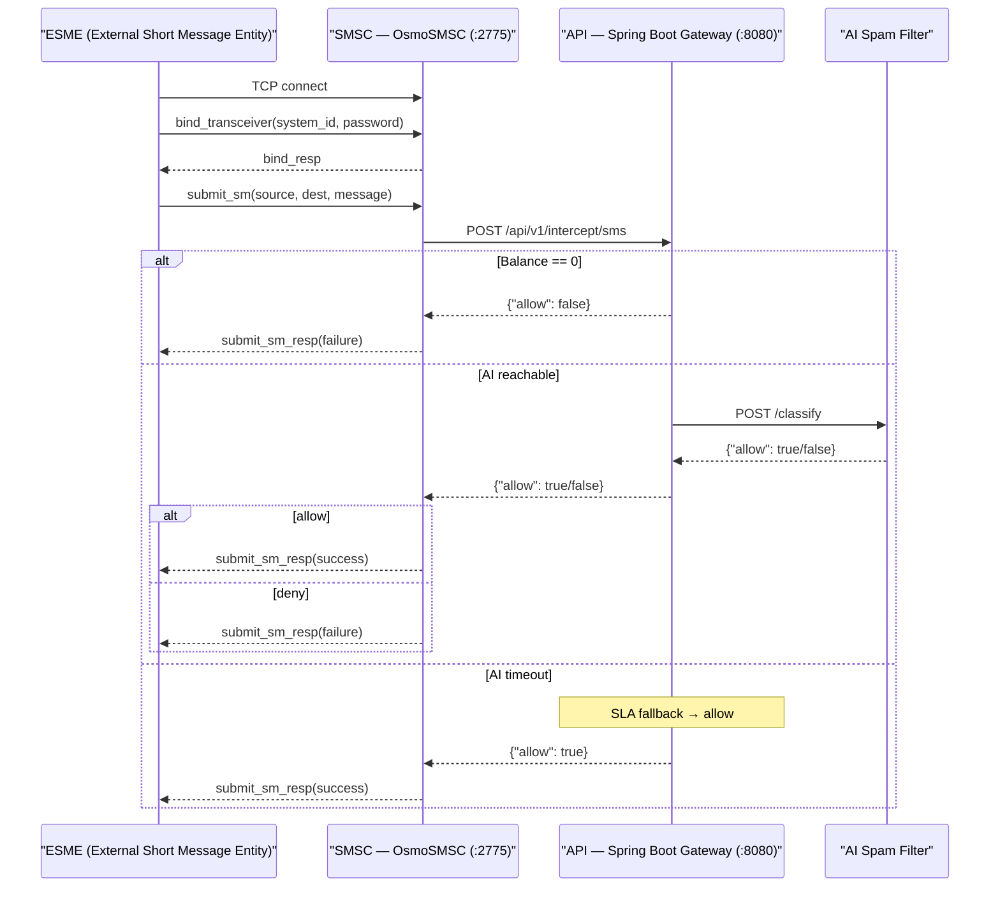
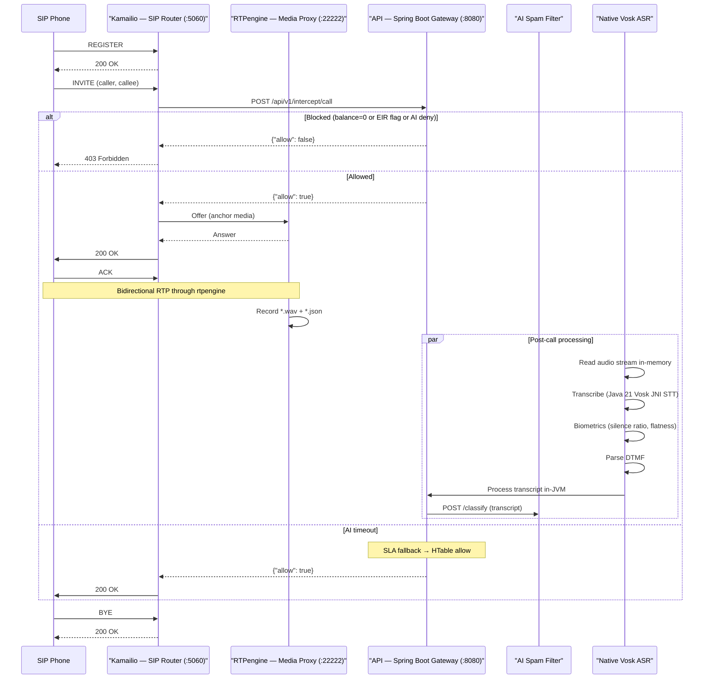
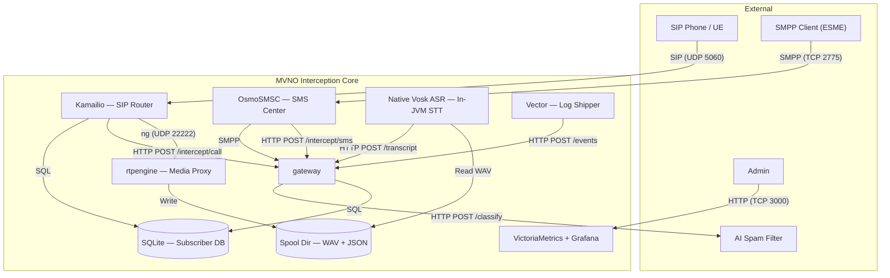
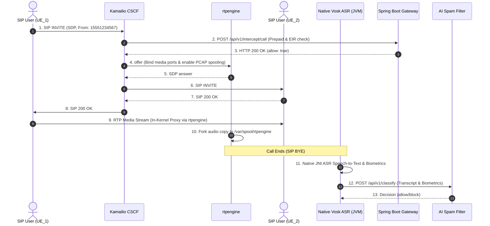
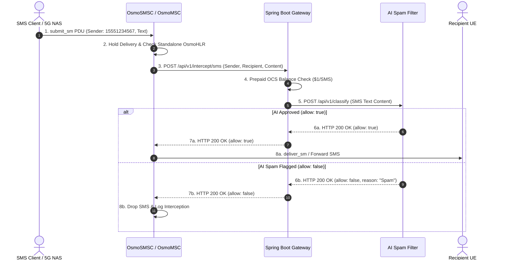

# MVNO Interception & Monitoring Core — Complete Implementation Guide

A comprehensive guide to building a rootless containerized MVNO core network that intercepts SMS and voice traffic, performs offline speech-to-text transcription, and connects to an external AI spam filtration gateway.

1. [Critical Thinking & Problem-Solving](#1-critical-thinking--problem-solving-methodology)
2. [Architecture Overview](#2-architecture-overview)
3. [Prerequisites](#3-prerequisites)
4. [Project Scaffolding](#4-project-scaffolding)
5. [Docker Compose Orchestration](#5-docker-compose-orchestration)
   - [5A. docker-compose.yml](#5a-docker-composeyml)
   - [5B. Osmocom Dockerfile](#5b-osmocom-dockerfile)
6. [Core Network Configs](#6-core-network-configurations)
   - [6A. rtpengine.conf](#6a-rtpengine-configsrtpenginertpengineconf)
   - [6B. kamailio.cfg](#6b-kamailio-configskamailiokamailiocfg)
   - [6C. osmo-smsc.cfg](#6c-osmo-smsc-configsosmocomosmo-smsccfg)
   - [6D. scrape.yml](#6d-victoriametrics-scrape-configsvictoria-metricsscrapeyml)
   - [6E. Open5GS 5G Core Configs](#6e-open5gs-5g-core-configurations--configsopen5gsyaml)
   - [6F. IP-SM-GW 2G↔5G SMS Bridge](#6f-ip-sm-gw-2g5g-sms-interworking-bridge--scriptsip_sm_gwpy)
7. [Spring Boot Interception Gateway](#7-spring-boot-interception-gateway)
8. [Data Pipeline](#8-data-pipeline)
   - [8A. Native Vosk Java 21 ASR](#8a-native-vosk-java-21-asr)
   - [8B. Vector Log Shipper](#8b-vector-log-shipper)
9. [Makefile](#9-makefile)
10. [Learning Path](#10-learning-path)
11. [Troubleshooting](#11-troubleshooting)
12. [Appendix](#12-appendix)
    - [A. eTOM Reference](#a-etom-reference)
    - [B. Feature Integration Map](#b-feature-integration-map)
    - [C. Abbreviation Glossary](#c-abbreviation-glossary)
    - [D. Architectural Decisions Summary](#d-architectural-decisions-summary)

---

## 0. How to Use This Guide

This guide is both a **learning tool** and a **reference**.

**Don't read sections 1–9 linearly.** They are grouped by component for reference. Instead:

1. Go to **Section 10 (Learning Path)** and pick a phase.
2. Each step in a phase tells you what to do. It also lists which component section(s) you need to have completed first.
3. Flip back to those component sections (5A, 6B, etc.) for the actual config content.
4. After finishing a phase, test everything before moving to the next.

Use the learning cycle below for every component:

### The Learning Cycle (repeat for every component)

```
1. FEYNMAN  → Write one sentence explaining the component in plain English
2. TRACE    → Draw the data flow in/out (protocol, port, next hop)
3. CONFIGURE → Write the config file (then check against the guide)
4. BREAK    → Remove a critical line, observe the error
5. FIX      → Restore it from memory without looking
```

### Study Strategies That Work

**Feynman Technique:** Before touching any config, write one paragraph explaining what the component does to a non-engineer. Example for rtpengine: *"rtpengine is a middleman for voice calls. When Alice calls Bob, their audio goes through rtpengine which can record it, block it, or transcode it without either person noticing."* If you can't write that paragraph, you're not ready to configure it.

**80/20 per protocol:** Don't learn every SIP method or SMPP PDU. Start with the 20% that covers 80% of what the component does:

| Protocol | The 20% you need first |
|----------|----------------------|
| SIP | INVITE → 200 → ACK → BYE dialog + REGISTER. That's 90% of Kamailio routing. |
| SMPP | `submit_sm` + `deliver_sm` + ESME binding. That's the SMS interception path. |
| 5G NGAP | InitialUEMessage + InitialContextSetup. That's the gNB↔AMF exchange. |
| GTP-U | Just the tunnel endpoint and TEID. UPF routes by that. |

**Interleave protocols, don't block them:** Don't learn all of SIP one week then all of SMPP next. Instead:
- Day 1: trace an SMS (SMPP) + trace a call (SIP)
- Day 2: read the raw packets with tcpdump for both
- Day 3: write the config blocks for both

**Incremental verification:** Never run `make up` and hope. Verify each step:
1. Container image builds alone: `podman build -f ...`
2. Container starts alone: `podman run --rm ...`
3. Two containers talk: run on same podman network, test with curl
4. Full stack starts: `make up`

**Break it deliberately:** After each component works, break it. Remove a config line, stop a dependency, change a port. Observe the error. Fix it from memory. This builds debugging instinct faster than any tutorial.

### What to Expect

| Phase | You'll build | Time |
|-------|-------------|------|
| 1 (Simple stack) | SMS + call interception WITHOUT 5G | 3-4 days |
| 2 (Config mastery) | Can rewrite every config from memory | 5-7 days |
| 3 (5GC) | A working 5G core in containers | 5-7 days |
| 4 (UERANSIM) | 3 UEs registered on your network | 2-3 days |
| 5 (Full interception) | End-to-end 5G interception working | 3-4 days |

Jump to [Section10 Learning Path](#10-learning-path) for the full phased roadmap.

---

PROBE

This section is the most important one in the guide. The config files and code will be obsolete in a year — but the way you *think* about complex systems will serve you for your entire career.

### The Core Telecom Mental Model: Trace the Data Flow

Before writing a single line of config or code, ask yourself:

> [!IMPORTANT]
> **"If I'm a packet/message entering this system, what happens to me step by step?"**

For this project, there are exactly two data flows. Internalize them:

**Flow A — SMS:**



**Flow B — Voice Call:**



Every single config line you write serves one of these two flows. If you can't explain which flow a line belongs to, you don't understand why you're writing it.

## 1. Critical Thinking & Problem-Solving Methodology

### The 5-Step Problem-Solving Loop

Apply this to every component you implement:

| Step | Question to Ask | Example (Kamailio) |
|------|----------------|-------------------|
| **1. Purpose** | What does this component do in one sentence? | "Kamailio is the SIP registrar — it authenticates users and routes calls." |
| **2. Input** | What data does it receive, from where, on what port/protocol? | "SIP INVITE on UDP 5060 from a phone." |
| **3. Output** | What data does it send, to where? | "RTP media to rtpengine, HTTP POST to gateway." |
| **4. Failure mode** | What happens if this component is down? | "No calls can be made. SMS still works (separate path)." |
| **5. Verify** | How do I know it's working? | "SIP registration shows in `kamctl`, logs show no errors." |

### Critical Thinking Techniques for Telecom Systems

#### 1. Think in Layers (OSI Model)

Every telecom system maps to OSI layers. When debugging, identify which layer is failing:

| OSI Layer | In This Project | Where to Debug |
|-----------|----------------|----------------|
| L7 Application | Spring Boot, AI Filter | `/api/v1/intercept/sms` response, gateway logs |
| L6 Presentation | SIP/SDP bodies, SMPP PDUs | Kamailio xlog, tcpdump on port 5060/2775 |
| L5 Session | SIP dialog (INVITE→200→ACK→BYE) | Kamailio `tm` module, `ngrep` on SIP traffic |
| L4 Transport | TCP/UDP ports | `podman logs`, `ss -tlnp` |
| L3 Network | Container bridge `mvno_net` | `podman network inspect mvno_net` |
| L1-2 Cabling/Containers | Podman, host OS | `podman ps`, `make logs` |

**Rule of thumb:** 80% of bugs are at L4 (port not listening) or L7 (wrong API payload). Start there.

#### 2. Practice Failure Mode Analysis

Before every `make up`, predict what will fail. This trains your intuition:

```
"If MongoDB isn't ready when Kamailio starts → Kamailio might crash on DB init."
"If gateway times out → Kamailio's SLA fallback whitelists the call."
"If rtpengine isn't running → Kamailio can't anchor media, call fails."
```

Write these predictions down. After running, check which were right. Over time, you'll predict 90% of failures before they happen.

#### 3. The "Why Not?" Reframe

Whenever you see a technology choice in this guide, ask:

> [!TIP]
> **"Why not use X instead?"**

| Choice | Alternative | Answer in This Project |
|--------|------------|----------------------|
| SQLite | PostgreSQL | "Zero server process. 2MB RAM vs 100MB. WAL mode handles concurrent reads/writes at sandbox scale." |
| Vosk | Whisper AI | "40MB model vs 1.5GB. Runs on CPU without GPU. No cloud dependency." |
| Podman | Docker | "Rootless by default, daemonless, 0MB idle. Compose syntax is identical." |
| Vector | Filebeat | "Single Rust binary (5MB). No GC pauses. Built-in backpressure to disk." |

When you can answer "why not" for every choice, you've internalized the architecture.

#### 4. Incremental Verification (The Most Important Skill)

**Never run `make up` and hope everything works.** That's guessing, not engineering. Instead:

```
Step 1: Can I build each container image individually?
  → podman build -f telecom-api/Dockerfile -t mvno-api .
  → podman build -f configs/osmocom/Dockerfile -t mvno-osmo .

Step 2: Can each container start alone?
  → podman run --rm mvno-api curl localhost:8080/actuator/health/liveness
  → podman run --rm mvno-osmo osmo-msc --version

Step 3: Can two containers talk to each other?
  → Run them on the same podman network, test with a simple curl

Step 4: Can the full stack start?
  → make up
```

Each step takes 30 seconds. If something fails, you know *exactly* which step it broke — not "something in docker-compose failed."

#### 5. Log-Driven Debugging

Before running any component, know where its logs go:

| Component | Log Location | How to Read |
|-----------|-------------|-------------|
| Kamailio | `podman logs mvno-kamailio` or syslog | Search for "ERROR", "WARN", "BLOCKED" |
| OsmoSMSC | `podman logs mvno-osmosmsc` | Search for "SMPP", "delivery", "error" |
| rtpengine | `podman logs mvno-rtpengine` | Search for "media", "port", "error" |
| Spring Boot (+ Vosk ASR) | `podman logs mvno-api` | Search for "POST", "allow", "error", "Vosk", "Transcribed" |
| Vector | `podman logs mvno-vector` | Search for "parse", "error" |
| VictoriaMetrics | `podman logs mvno-victoriametrics` | Search for "error" |

**Pro tip:** In a separate terminal, run `make logs` (which runs `podman compose logs -f`) before issuing any test command. You see failures in real-time as they happen.

### How to Use This Guide for Maximum Learning

Don't copy-paste. Do this instead:

1. **Read a section** (e.g., Section4B Docker Compose)
2. **Close the file** or cover the code block
3. **Write it from memory** — then check against the guide
4. **For every mistake** you make, ask "Why did I write that wrong?"
   - Was it a typo? (slow down)
   - Was it a misunderstanding of the config format? (read the docs)
   - Was it a conceptual gap? (re-read the architecture)

This is called **active recall** and it's the fastest way to build deep understanding. The mistakes you make while learning are *more valuable* than getting it right the first time.

---

Now proceed to the architecture overview, then apply these techniques to each section.

---

PROBE



## 2. Architecture Overview

### Four Layers

| Layer | Components | Purpose |
|-------|-----------|---------|
| Access | SIP/IMS Phones, SMPP Clients | UE connectivity |
| MVNO Core | Kamailio, rtpengine, OsmoSMSC | SIP routing, media anchoring, SMS store-and-forward |
| Integration | Spring Boot, Native Vosk ASR, Vector | AI filter gateway, speech-to-text, log shipping |
| Observability | VictoriaMetrics, vmagent, Grafana | Metrics collection and dashboards |

---

### Detailed Signaling Call Flows (Sequence Diagrams)

#### 1. IMS VoIP / VoNR Voice Call Interception Flow



#### 2. SMS Store-and-Forward Interception Flow



### eTOM Alignment

**eTOM** (Enhanced Telecom Operations Map) is the TM Forum's industry-standard business process framework for telecom operators. This project maps to three eTOM domains:

| eTOM Domain | Our Implementation |
|-------------|-------------------|
| **Fulfilment** | SMS routing via OsmoSMSC, SIP call routing via Kamailio, media anchoring via rtpengine |
| **Assurance** | Real-time interception, AI spam classification, offline STT transcription, voice biometrics, DTMF logging, geofencing, EIR device binding |
| **Billing / OCS** | Prepaid balance check before allowing calls/SMS via Spring Boot SQLite queries |

These are the three badges shown in the README header. Mapping to eTOM demonstrates alignment with real telecom industry standards, not just ad-hoc software engineering.

---

PROBE

## 3. Prerequisites

### Knowledge Prerequisites

Before writing any config, you need to understand what each component does at the protocol level. Learn these in order:

| # | Topic | What to know | Verify you're ready |
|---|-------|-------------|-------------------|
| 1 | **SIP basics** | SIP dialog (INVITE→200→ACK→BYE), REGISTER, SIP URI format, RTP vs signaling | Watch a 10-min SIP explainer, then explain the difference between SIP and RTP in your own words |
| 2 | **SMPP basics** | `submit_sm` / `deliver_sm` PDUs, ESME role, SMSC role, bind types (transmitter/receiver/transceiver) | Read the SMPP 5-min overview, then draw the SMS path from ESME→SMSC→destination |
| 3 | **5G SA architecture** | AMF/SMF/UPF roles, N1/N2/N3/N4/N6 interfaces, NGAP vs GTP-U, SBI (HTTP/2) | Draw the 5GC service-based architecture from memory — label each NF and its interface |
| 4 | **Containers & Podman** | `podman run/ps/logs/exec`, volumes, networks, `podman compose` | Start a hello-world container, exec into it, mount a volume, create a custom bridge network |

**Learning resources:** Each topic has hundreds of free explainers. Search for "SIP basics explained in 10 minutes" or "5G core network architecture" — the specific video matters less than being able to explain it back from memory.

### Required Tools

Choose your distro:

```bash
# ─── Debian / Ubuntu (apt) ──────────────────────────────
sudo apt update && sudo apt install -y podman docker-compose-v2 sqlite3 lksctp-tools espeak-ng ffmpeg
# (Optional) sipp: sudo apt install -y sipp
# (Optional) tshark capture: sudo apt install -y tshark  # set dumpcap setuid for non-root

# ─── Arch / CachyOS (pacman) ────────────────────────────
sudo pacman -S --needed podman docker-compose sqlite3 lksctp-tools espeak-ng ffmpeg
# (Optional) sipp — available in AUR: yay -S sipp

# ─── Fedora / RHEL (dnf / yum) ──────────────────────────
sudo dnf install -y podman docker-compose-plugin sqlite3 lksctp-tools espeak-ng ffmpeg
# (Optional) sipp: sudo dnf install -y sipp
# Note: on Ubuntu/Fedora/Arch use `docker-compose-v2` / `docker-compose-plugin`
# (the v2 CLI plugin). The legacy `docker-compose` package is deprecated v1 and
# is NOT what `podman compose` / `docker compose` consume.

# ─── Common (all distros) ────────────────────────────────
# Verify rootless mode
podman info | grep rootless
# Expected: rootless: true

# Enable user lingering (containers stay alive after logout)
sudo loginctl enable-linger $(whoami)
```

### Why These Choices

| Decision | Alternative | Why Chosen |
|----------|------------|------------|
| Podman over Docker | Docker | Rootless by default, no daemon = 0MB idle, Compose compatible |
| SQLite over PostgreSQL | Postgres | Zero server process, RAM cap ~2MB vs 100MB+. WAL mode handles concurrent reads/writes for sandbox scale |
| Vosk over Whisper | Whisper | 40MB offline model vs 1.5GB. Runs on any CPU without GPU. Zero cloud latency |
| Spring Boot over FastAPI / Flask / Java Servlet | FastAPI, Flask, raw jakarta.servlet | Spring Boot 3.4 + JDK 21 LTS + Virtual Threads provides equivalent throughput to reactive frameworks (within 5-8%) with imperative blocking code. SQLite has no R2DBC driver, eliminating WebFlux. Spring Boot's ecosystem (actuator, JDBCTemplate, RestClient) reduces custom code. Virtual threads (JEP 444) give carrier-grade scalability. Java is the dominant language in telecom BSS/OSS — this project serves as a learning bridge. |
| Vector over Filebeat | Filebeat | Single Rust binary (5MB), zero GC pauses, built-in backpressure, VRL transform language |
| VictoriaMetrics over Prometheus | Prometheus | Single binary (20MB) vs 300MB. Same scraping protocol. Grafana compatible |

---

PROBE

## 4. Project Scaffolding

```bash
cd /home/zkhattab/MVNO

# Create directory structure
mkdir -p configs/{kamailio,osmocom,rtpengine,victoria-metrics,vector}
mkdir -p telecom-api scripts
mkdir -p state/{spool,vm-data,grafana,hlr}
# state/mongodb not needed in Phase 1 — added in Phase 3 for Open5GS 5GC

# Verify structure
find . -type d | sort
```

### Complete File Tree

**⚠ This tree corrects the original guide which had several errors:** telecom-api was described as Python/FastAPI (it's Java/Spring Boot), victoria-metrics configs were missing, osmo-hlr.cfg was missing, and state directories expected MongoDB and WAV recordings.

```
/home/zkhattab/MVNO/
├── .gitignore                      # Ignores *.db, .env, state/, __pycache__
├── README.md                       # Project overview
├── Makefile                        # Developer lifecycle commands
├── docker-compose.yml              # Rootless container stack (Phase 1 core)
├── docker-compose.build.yml        # Build-only compose (Phase 5+)
├── configs/
│   ├── kamailio/
│   │   ├── kamailio.cfg            # SIP routing + security + rtpengine
│   │   └── Dockerfile              # Kamailio Alpine build (adds kamailio-utils — provides http_client.so + xhttp_prom.so)
│   ├── osmocom/
│   │   ├── osmo-smsc.cfg           # SMSC + MSC config (no embedded HLR)
│   │   ├── osmo-hlr.cfg            # NEW — standalone HLR (Section 6C)
│   │   └── Dockerfile              # Osmocom Debian build
│   ├── rtpengine/
│   │   └── rtpengine.conf          # Media ports + recording + DTMF
│   ├── victoria-metrics/
│   │   └── scrape.yml              # vmagent scrape targets
│   ├── vector/
│   │   └── vector.toml             # Log parsing + forwarding
│   ├── open5gs/                    # 5GC NFs (Phase 3+)
│   │   ├── Dockerfile, entrypoint.sh, *.yaml (nrf, amf, smf, upf, ...)
│   │   └── webui/                  # Open5GS WebUI (React + Next)
│   ├── ueransim/                   # 5G simulator (Phase 4)
│   │   ├── Dockerfile, *.yaml
│   │   └── ueransim-gcc14.patch
│   └── docker/                     # (in .gitignore — vendored images)
├── telecom-api/
│   ├── pom.xml                     # Maven — Java 21 LTS + Spring Boot 3.4 + Vosk JNI + Actuator
│   ├── mvnw                        # Maven wrapper
│   ├── Dockerfile                  # Multi-stage maven:3.9.9-eclipse-temurin-21
│   └── src/main/
│       ├── java/com/mvno/intercept/
│       │   ├── InterceptGatewayApplication.java
│       │   ├── config/ (DataSourceConfig, RestClientConfig)
│       │   ├── filter/ (AiFilterService, TranscriptionResult)
│       │   ├── subscriber/ (SubscriberService, SubscriberRepository, EirTracker, SubscriberController)
│       │   └── transcription/ (NativeVoskService, TranscriptionController)
│       └── resources/
│           └── application.yml     # Spring Boot config (Virtual Threads, SQLite WAL, Actuator)
├── scripts/
│   ├── bootstrap.sh                # One-time env setup
│   ├── up.sh                       # Start everything
│   └── load-offline.sh             # Load offline models
├── vendor/                         # Vendored images + deps (gitignored?)
│   ├── docker/                     # Container image tarballs
│   ├── pip/telecom-api/            # Python wheel files
│   ├── vosk/                       # Vosk model zip
│   ├── ueransim/binaries/          # Prebuilt UERANSIM binaries
│   └── checksums/
├── state/                          # Runtime data (in .gitignore)
│   ├── spool/                      # rtpengine PCAP recordings (not WAV)
│   ├── vm-data/                    # VictoriaMetrics TSDB
│   ├── grafana/                    # Grafana dashboards
│   └── hlr/                        # OsmoHLR SQLite database
└── docs/
    ├── INTEGRATION_CONTRACT.md     # Single contracts doc: interfaces + API schemas (Shared)
    ├── architecture_flow.svg       # Architecture flow diagram (Shared)
    ├── deployment_guide.md         # Deployment runbook & badges (Shared)
    ├── implementation_guide.md     # Single Master Implementation Guide (Private local-only)
    └── ISSUES.md                   # Troubleshooting & deployment model log (Private local-only)
```

### Config File Provenance: Origin & Surgical Edit Taxonomy

Before writing or editing any file, understand its **origin**:

| File | Origin Category | Stock Upstream Source / Default State | Key Surgical Edits Required | Section |
|---|---|---|---|---|
| `docker-compose.yml` | `[NEW FROM SCRATCH]` | None (custom orchestration) | Pin images (`11.6.0`), set rootless ports (>1024), file volume mounts, `GF_DATABASE_WAL=true`, shared log mounts | 5A |
| `configs/rtpengine/rtpengine.conf` | `[FROM STOCK]` | `drachtio/rtpengine:latest` (`/etc/rtpengine.conf`) | Bind `0.0.0.0:22222`, set `recording-format = eth`, enable `listen-http = 0.0.0.0:9900`, remove invalid `wav`/`transcription` lines | 6A |
| `configs/kamailio/kamailio.cfg` | `[FROM STOCK]` | `kamailio/kamailio:5.7-alpine` (`/etc/kamailio/kamailio.cfg`) | Remove Debian `mpath`, remove `mi_fifo.so` (not in 5.7 Alpine), add `registrar.so`, configure `rtpengine.so` socket (`udp:rtpengine:22222`), configure `usrloc` SQLite WAL | 6B |
| `configs/kamailio/Dockerfile` | `[NEW FROM SCRATCH]` | Alpine `kamailio` base | Add `kamailio-utils` package (`apk add kamailio-utils`) — provides `http_client.so` and `xhttp_prom.so` | 6B |
| `configs/osmocom/osmo-smsc.cfg` | `[FROM STOCK]` | Osmocom `osmo-msc.cfg` sample | Change `line-vty` → `line vty` (space), remove `max-pending-requests 100`, move `delivery-report-format` inside `smpp {}` | 6C |
| `configs/osmocom/osmo-hlr.cfg` | `[NEW FROM SCRATCH]` | Osmocom `osmo-hlr.cfg` sample | Use `line vty` (space), set database to `/var/lib/osmocom/hlr.db`, provision `00101...` subscriber IMSIs | 6C |
| `configs/victoria-metrics/scrape.yml` | `[NEW FROM SCRATCH]` | VictoriaMetrics sample | Add `rtpengine:9900` target, add `telecom-api` target with `metrics_path: '/actuator/prometheus'` | 6D |
| `configs/vector/vector.toml` | `[NEW FROM SCRATCH]` | Vector sample | Configure remap transforms for SIP REGISTER/INVITE, SMS delivery reports, and EIR IMEI bindings | 8B |
| `configs/open5gs/*.yaml` | `[FROM STOCK]` | Open5GS sample configs (`/etc/open5gs/*.yaml`) | Set SBI `addr: 0.0.0.0` or container DNS name (`nrf`, `upf`), configure `hnet:` ECC P-256 keys in `udm.yaml` | 6, 10 |
| `configs/open5gs/mongo-init.js` | `[NEW FROM SCRATCH]` | None | Seed `admin` user (hash `402223...`) + 3 UERANSIM 5G subscriber profiles (`001010000000001`..`003`) | 10 |
| `telecom-api/pom.xml` | `[NEW FROM SCRATCH]` | Spring Initializr | Add `spring-boot-starter-web`, `spring-boot-starter-data-jdbc`, `spring-boot-starter-actuator`, `sqlite-jdbc` | 7 |
| `state/kamailio.db` | `[GENERATED AT RUNTIME]` | Created by `make init-db` | SQLite table `subscriber` with WAL mode (`PRAGMA journal_mode=WAL;`) | 9 |
| `state/hlr/hlr.db` | `[GENERATED AT RUNTIME]` | Created by `osmo-hlr` daemon | SQLite WAL database for 2G/3G subscriber registry | 6C, 9 |

---

## 5. Docker Compose Orchestration

**Why read this first?** Before writing any config file, you need to know:
- Container hostnames (`rtpengine`, `telecom-api`, `kamailio`) — these appear in every config
- Port mappings (`22222`, `8080`, `5060`) — used in module parameters
- Volume mount paths (`/etc/kamailio`, `/var/spool/rtpengine`) — where configs and data live
- Network topology — which containers can talk to each other

### 5A. `docker-compose.yml`

Rootless-compliant container stack. Core services use `restart: "unless-stopped"` so transient crashes auto-recover. UERANSIM UEs intentionally keep `restart: "no"` (they are short-lived test tools, not daemons). Ports above 1024. SELinux `:z` volume labels. Healthcheck-based dependency ordering.

Osmocom uses a custom build (see Section 5B) because no pre-built `osmo-msc-latest` image exists on any registry.

**⚠️ Critical fixes needed in the compose file:**

1. **rtpengine volume mount** changes from single-file mount to directory mount with explicit command override:
   - **Why?** Single-file volume mounts cause the upstream `drachtio/rtpengine` entrypoint (`sed -i`) to crash with `Device or resource busy` (Exit 255).
   - **Fix:** Mount directory `./configs/rtpengine:/etc/rtpengine:z` and override command: `command: ["rtpengine", "--config-file=/etc/rtpengine/rtpengine.conf", "--foreground"]`.

2. **Kamailio image** changed from upstream `kamailio/kamailio:5.7-alpine` to custom `mvno-kamailio:latest` (built from `configs/kamailio/Dockerfile` to add `kamailio-utils` package).
   > **Why `kamailio-utils` not `kamailio-http`?** `kamailio-http` does not exist in Alpine 3.19. The correct package is `kamailio-utils` — verified with `apk search kamailio-http` (0 results) and `apk search kamailio-utils` (found). It provides both `http_client.so` and `xhttp_prom.so`.

3. **OsmoHLR** needs its own container — the HLR is a separate process from the MSC:
   - Add a new `osmo-hlr` service with its own config file `configs/osmocom/osmo-hlr.cfg`
   - The `osmo-smsc` container then runs only `osmo-msc`, not embedded HLR

4. **Phase 1 should not include MongoDB** — MongoDB is only needed for Open5GS 5GC. For the simple SMS/call stack, remove MongoDB.

<details>
<summary><b>docker-compose.yml</b> (full stack, CORRECTED) — click to expand</summary>

```yaml
networks:
  mvno_net:
    driver: bridge

services:
  # ─── MVNO Core (Phase 1: SMS + Voice, no 5G) ──────────
  rtpengine:
    image: drachtio/rtpengine:latest
    container_name: mvno-rtpengine
    command: ["rtpengine", "--config-file=/etc/rtpengine/rtpengine.conf", "--foreground"]
    ports:
      - "22222:22222/udp"
      - "10000-20000:10000-20000/udp"
      - "9900:9900/tcp"
    volumes:
      - ./configs/rtpengine:/etc/rtpengine:z
      - ./state/spool:/var/spool/rtpengine:z
    networks:
      - mvno_net
    restart: "no"

  kamailio:
    image: mvno-kamailio:latest
    container_name: mvno-kamailio
    ports:
      - "5060:5060/udp"
      - "5060:5060/tcp"
    volumes:
      - ./configs/kamailio:/etc/kamailio:z
      - ./state/kamailio.db:/etc/kamailio/kamailio.db:z
    depends_on:
      rtpengine:
        condition: service_started
    networks:
      - mvno_net
    restart: "no"

  osmo-hlr:
    image: mvno-osmo-smsc:latest
    container_name: mvno-hlr
    command: ["osmo-hlr", "-c", "/etc/osmocom/osmo-hlr.cfg"]
    volumes:
      # Share the same osmocom config directory for HLR config
      - ./configs/osmocom/osmo-hlr.cfg:/etc/osmocom/osmo-hlr.cfg:z
      - ./state/hlr:/var/lib/osmocom:z
    networks:
      - mvno_net
    restart: "no"

  osmo-smsc:
    image: mvno-osmo-smsc:latest
    container_name: mvno-osmosmsc
    ports:
      - "2775:2775"
    volumes:
      - ./configs/osmocom/osmo-smsc.cfg:/etc/osmocom/osmo-smsc.cfg:z
    depends_on:
      osmo-hlr:
        condition: service_started
    networks:
      - mvno_net
    restart: "no"

  # ─── Integration Layer ───────────────────────────────
  telecom-api:
    image: mvno-telecom-api:latest
    container_name: mvno-api
    ports:
      - "8080:8080"
    volumes:
      - ./state/kamailio.db:/etc/kamailio/kamailio.db:z
      - ./state/spool:/var/spool/rtpengine:z   # shared with rtpengine for NativeVoskService
    environment:
      AI_FILTER_URL: http://ai-filter:8000/api/v1/classify
      VOSK_MODEL_PATH: /opt/vosk-model-en-us-0.22
    healthcheck:
      test: ["CMD", "curl", "-f", "http://localhost:8080/actuator/health/liveness"]
      interval: 10s
      timeout: 3s
      retries: 3
    networks:
      - mvno_net
    restart: "no"

  # ─── Log Processing (Vector) ──────────────────────────
  vector:
    image: timberio/vector:0.44.0-alpine
    container_name: mvno-vector
    command: ["--config", "/etc/vector/vector.toml"]
    volumes:
      - ./configs/vector/vector.toml:/etc/vector/vector.toml:z
    depends_on:
      telecom-api:
        condition: service_started
    networks:
      - mvno_net
    restart: "no"

  # ─── Observability (Phase 6) ─────────────────────────
  victoria-metrics:
    image: victoriametrics/victoria-metrics:v1.101.0
    container_name: mvno-victoriametrics
    ports:
      - "8428:8428"
    volumes:
      - ./state/vm-data:/victoria-metrics-data:z
    networks:
      - mvno_net
    restart: "no"

  vmagent:
    image: victoriametrics/vmagent:v1.101.0
    container_name: mvno-vmagent
    command: ["-promscrape.config=/etc/prometheus/prometheus.yml"]
    volumes:
      - ./configs/victoria-metrics/scrape.yml:/etc/prometheus/prometheus.yml:z
    depends_on:
      victoria-metrics:
        condition: service_started
    networks:
      - mvno_net
    restart: "no"

  grafana:
    image: grafana/grafana-oss:11.6.0
    container_name: mvno-grafana
    ports:
      - "3000:3000"
    volumes:
      - ./state/grafana:/var/lib/grafana:z
    depends_on:
      victoria-metrics:
        condition: service_started
    networks:
      - mvno_net
    restart: "no"
```
</details>

### Container Hostname Reference

When writing configs, use these container service names as DNS hostnames (Docker/Podman internal DNS resolves them automatically on the `mvno_net` bridge):

| Container | Hostname (internal) | Purpose |
|-----------|-------------------|---------|
| `mvno-rtpengine` | `rtpengine` | Kamailio's rtpengine module connects here port 22222 |
| `mvno-kamailio` | `kamailio` | SIP signaling, port 5060 |
| `mvno-osmosmsc` | `osmo-smsc` | SMPP on port 2775 |
| `mvno-api` | `telecom-api` | Spring Boot on port 8080 — Kamailio/Vector POST here |
| `mvno-victoriametrics` | `victoria-metrics` | TSDB on port 8428 |
| `mvno-vmagent` | `vmagent` | Scrapes metrics from other containers |
| `mvno-grafana` | `grafana` | Dashboard on port 3000 |
| `mvno-api` | `telecom-api` | Built-in Java 21 Vosk JNI STT pipeline — no separate container |
| `mvno-mongodb` | `mongodb` | Metadata store on port 27017 |

### 5B. Osmocom Dockerfile

**Why is this needed?** There is no pre-built `osmocom/osmo-msc-latest` image on Docker Hub or any other registry. The official Osmocom [docker-playground](https://github.com/osmocom/docker-playground) builds from source and is designed for CI/testing, not lightweight deployment. Instead, we build our own image using Debian's official `osmo-msc` and `osmo-hlr` packages — this is faster, smaller, and simpler.

#### `configs/osmocom/Dockerfile`

```dockerfile
# Builds a lightweight Osmocom image with osmo-msc + osmo-hlr
# from Debian Bookworm's binary packages (no source compilation).

FROM debian:bookworm-slim

# Osmocom package archive signing key
RUN apt-get update && apt-get install -y --no-install-recommends \
    ca-certificates \
    wget \
    && rm -rf /var/lib/apt/lists/*

# Add Osmocom's latest stable repository for Debian Bookworm
RUN wget -q -O /usr/share/keyrings/osmocom.asc \
    https://downloads.osmocom.org/packages/osmocom:/latest/Debian_12/Release.key \
    && echo "deb [signed-by=/usr/share/keyrings/osmocom.asc] \
    https://downloads.osmocom.org/packages/osmocom:/latest/Debian_12 ./" \
    > /etc/apt/sources.list.d/osmocom.list

# Install osmo-msc (includes SMSC/SMPP) and osmo-hlr
RUN apt-get update \
    && apt-get install -y --no-install-recommends \
    osmo-msc \
    osmo-hlr \
    osmocom-sccp \
    && rm -rf /var/lib/apt/lists/*

# Config directory (mounted as volume from host)
VOLUME ["/etc/osmocom", "/var/lib/osmocom"]

# Default config path (override via -c flag)
ENV OSMO_MSC_CONFIG=/etc/osmocom/osmo-smsc.cfg

EXPOSE 2775

CMD ["osmo-msc", "-c", "/etc/osmocom/osmo-smsc.cfg"]
```

### 5C. UERANSIM Dockerfile

**Why is this needed?** Prebuilt UERANSIM binaries (`nr-gnb`, `nr-ue`, `nr-cli`) are compiled against GLIBC 2.38+ (Ubuntu 24.04). Standard Alpine containers (`musl libc`) fail with dynamic symbol relocation errors (`__isoc23_strtol` not found). Building on `ubuntu:24.04` provides native GLIBC support.

#### `configs/ueransim/Dockerfile`

```dockerfile
FROM ubuntu:24.04
ENV DEBIAN_FRONTEND=noninteractive
RUN apt-get update && apt-get install -y --no-install-recommends \
    libsctp1 libstdc++6 iproute2 iputils-ping ca-certificates \
    && rm -rf /var/lib/apt/lists/*
COPY vendor/ueransim/binaries/nr-ue /usr/local/bin/
COPY vendor/ueransim/binaries/nr-gnb /usr/local/bin/
COPY vendor/ueransim/binaries/nr-cli /usr/local/bin/
COPY vendor/ueransim/binaries/libdevbnd.so /usr/local/lib/
COPY vendor/ueransim/binaries/nr-binder /usr/local/bin/
COPY configs/ueransim/*.yaml /etc/ueransim/
RUN ldconfig /usr/local/lib
```

### Section5 Break It / Fix It

After this section you should be able to:
- **Break it:** Change the `FROM debian:bookworm-slim` to `FROM alpine:3.19`. Try to build. Fix it back.
- **Break it:** Remove the `wget` line (Osmocom repo key). Build again — why does it fail? Fix it.
- **Break it:** Run `podman compose config` with a typo in the compose file. Fix it.
- **Verify:** `podman build -f configs/osmocom/Dockerfile -t mvno-osmo-smsc .` completes without errors.

---

## 6. Core Network Configurations

Now that you know the container hostnames and port mappings from Section4, you can write the config files that reference them.

### 6A. rtpengine — `configs/rtpengine/rtpengine.conf`

**Why rtpengine over rtpproxy?** rtpengine runs its forwarding plane in the Linux kernel via a DKMS module. During active calls, RTP packets bypass userspace entirely — near-zero CPU usage. It also natively supports call recording, DTMF logging, and SRTP-to-cleartext transcoding.

**⚠️ Critical: rtpengine volume mount path in docker-compose.yml**

The image's stock config is at `/etc/rtpengine.conf` (a file). Our docker-compose.yml mounts `./configs/rtpengine` as a directory at `/etc/rtpengine`. These are different paths, so the stock config is still used and our custom config is ignored.

**Fix:** Change the docker-compose.yml volume mount from:
```yaml
- ./configs/rtpengine:/etc/rtpengine:z   # directory mount (WRONG — shadows wrong path)
```
to:
```yaml
- ./configs/rtpengine/rtpengine.conf:/etc/rtpengine.conf:z  # file mount (CORRECT)
```

**⚠️ recording-format=wav is invalid**

rtpengine supports only PCAP recording formats: `eth` (full Ethernet frames) or `raw`. WAV is not supported. If you set `recording-format=wav`, rtpengine ignores it silently. The Vosk STT pipeline cannot consume raw PCAP — you will need a converter (ffmpeg/sox) to extract PCM audio.

Also, `transcription-dir` and `transcription-format` are not valid rtpengine options — verified with `rtpengine --help | grep transcript` → zero output. rtpengine logs DTMF events to a companion JSON file alongside the PCAP recording.

**Default vs. Our Config — what changed and why:**

| Option | Stock default | Our value | Why |
|--------|--------------|-----------|-----|
| `listen-ng` | `127.0.0.1:22222` | `0.0.0.0:22222` | Must listen on all interfaces so Kamailio container can reach it by hostname |
| `recording-format` | `raw` | `eth` | `eth` captures full Ethernet frames — more useful for forensic replay |
| `listen-http` | not set | `0.0.0.0:9900` | Enables the HTTP endpoint that VictoriaMetrics scrapes for metrics |
| `dtmf-log` | `no` | `yes` | Required for DTMF interception in NativeVoskService.java |
| `recording-format=wav` | — | **REMOVED** | Not a valid option — silently ignored |
| `transcription-dir` | — | **REMOVED** | Not a valid rtpengine option — NativeVoskService handles WAV streams |
| `transcription-format` | — | **REMOVED** | Not a valid rtpengine option |

> **Verify before using:** `podman run --rm drachtio/rtpengine:latest rtpengine --help | grep -E 'recording-format|listen-http|transcri'`

Corrected config:

```ini
listen-ng = 0.0.0.0:22222

# Enables HTTP metrics endpoint — scraped by vmagent on port 9900
# Verified: rtpengine --help shows --listen-http flag
listen-http = 0.0.0.0:9900

port-min = 30000
port-max = 30100

recording-dir = /var/spool/rtpengine
recording-method = fork
# Verified: valid values are raw|eth only (rtpengine --help)
recording-format = eth

dtmf-log = yes
# NOTE: transcription-dir and transcription-format are NOT valid options.
# Audio stream reading is performed directly in-memory by NativeVoskService.java.

media-timeout = 1800
max-sessions = 1000
log-level = 3
```

### 6B. Kamailio — `configs/kamailio/kamailio.cfg`

**Why Kamailio?** It's the most performant open-source SIP server. Handles registration, authentication, routing, and hooks rtpengine for media anchoring. We load modules only when needed to keep RAM low (~15MB idle). Implements PIKE rate limiting, caller ID spoof detection, and SLA fallback via HTable.

**⚠️ Critical image-specific notes (verified against the vendored Alpine image):**

**Default vs. Our Config — what changed and why:**

| Issue | Default behavior | Our fix | Verification |
|-------|-----------------|---------|-------------|
| `mpath` set to Debian path | Kamailio crashes — all modules fail to load | Remove the line entirely — Alpine uses compiled-in default `/usr/lib/kamailio/modules/` | `podman run --rm mvno-kamailio:latest ls /usr/lib/kamailio/modules/ \| wc -l` → 108 |
| `http_client.so` not available | Module load error on startup | Add `kamailio-utils` to Dockerfile (`apk add kamailio-utils`) — **NOT** `kamailio-http` (that package does not exist) | `apk search kamailio-http` → 0 results; `apk search kamailio-utils` → found |
| No Prometheus metrics | No HTTP metrics endpoint | Add `kamailio-utils` (also provides `xhttp_prom.so`) and configure `xhttp_prom` event route | `ls /usr/lib/kamailio/modules/xhttp_prom.so` → found after adding kamailio-utils |
| `registrar.so` not loaded | Add `loadmodule "registrar.so"` — required for `save("location")` and `lookup("location")` |
| `$au` empty for unauthenticated callers | Spoof check only works for authenticated callers. Add `$au != ""` guard properly |
| No `record_route()` / `loose_route()` | In-dialog BYE/ACK won't proxy. rtpengine sessions leak |
| No `onreply_route` | SDP answer not rewritten. Media may bypass rtpengine |
| `http_connect()` result never read | Interception allow/deny always succeeds |

Note the hostnames: `rtpengine:22222` and `telecom-api:8080` — these are the container names defined in `docker-compose.yml` (see Section 5A).

<details>
<summary><b>kamailio.cfg</b> (SIP routing + interception logic, CORRECTED) — click to expand</summary>

```c
// ==========================================================
// MVNO Interception Core — Kamailio SIP Routing
// ==========================================================
// NOTE: This uses an Alpine-based image (mvno-kamailio).
// Modules are at /usr/lib/kamailio/modules/ (compiled-in default).
// Do NOT set mpath — the Alpine default is correct.

debug=3
log_stderror=no
memlog=5
cfgpkglog=5

// ─── Core Modules ──────────────────────────────────────
loadmodule "sl.so"
loadmodule "tm.so"
loadmodule "rr.so"
loadmodule "maxfwd.so"
loadmodule "textops.so"
loadmodule "siputils.so"
loadmodule "xlog.so"
// NOT LOADED: mi_fifo.so — not available in Kamailio 5.7 Alpine (musl build does not include it)
// Use `kamctl fifo` only if running a Debian-based Kamailio build.

// ─── Dialog Routing (required for record_route / loose_route) ─
loadmodule "registrar.so"

// ─── Database (SQLite WAL for subscriber registry) ─────
loadmodule "db_sqlite.so"
loadmodule "usrloc.so"
modparam("usrloc", "db_url", "sqlite:///etc/kamailio/kamailio.db")
modparam("usrloc", "db_mode", 2)

// ─── Authentication ─────────────────────────────────────
loadmodule "auth.so"
loadmodule "auth_db.so"
modparam("auth_db", "db_url", "sqlite:///etc/kamailio/kamailio.db")
modparam("auth_db", "calculate_ha1", 1)
modparam("auth_db", "password_column", "password")

// ─── Media Plane (rtpengine) ────────────────────────────
// Hostname "rtpengine" = container name from docker-compose.yml
loadmodule "rtpengine.so"
modparam("rtpengine", "rtpengine_sock", "udp:rtpengine:22222")

// ─── HTTP Client (gateway integration) ──────────────────
// OPTIONAL: Only needed for call interception (checking balance/AI filter).
// Requires 'kamailio-utils' Alpine package (NOT 'kamailio-http' — that does not exist).
// Add to Dockerfile: apk add --no-cache kamailio-utils
// Basic SIP calls work without this — comment out for Phase 1 if not yet added.
// Alternative without rebuilding: use exec module + curl (see route[INTERCEPT] below).
// loadmodule "http_client.so"
// modparam("http_client", "httpcon", "api_gw=>http://telecom-api:8080/api/v1")

// ─── Prometheus Metrics (xhttp_prom) ─────────────────────
// Requires 'kamailio-utils' package (provides xhttp.so and xhttp_prom.so).
// Uncomment to expose /metrics on port 9090 for VictoriaMetrics scraping:
// loadmodule "xhttp.so"
// loadmodule "xhttp_prom.so"
// modparam("xhttp_prom", "xhttp_prom_buf_size", 65536)
// listen=tcp:0.0.0.0:9090
// event_route[xhttp:request] {
//     if ($hu =~ "^/metrics") {
//         prom_dispatch();
//     } else {
//         xhttp_reply("404", "Not Found", "text/html", "Try /metrics");
//     }
// }

// ─── Security: PIKE Rate Limiting ───────────────────────
loadmodule "pike.so"
modparam("pike", "sampling_time_unit", 5)
modparam("pike", "reqs_density_per_unit", 30)

// ─── Security: HTable for IP bans + SLA cache ──────────
loadmodule "htable.so"
modparam("htable", "htable", "ban=>size=8;autoexpire=300;")
modparam("htable", "htable", "whitelist=>size=8;autoexpire=3600;")
modparam("htable", "htable", "blacklist=>size=8;autoexpire=3600;")

// ─── Main Request Route ─────────────────────────────────
request_route {

    // Layer 0: Handle in-dialog requests (ACK, BYE, re-INVITE)
    // Without this, dialog requests bypass the proxy and rtpengine never cleans up.
    if (loose_route()) {
        if (is_method("ACK")) {
            // ACK is hop-by-hop, not end-to-end. Just relay.
            t_relay();
            exit;
        }
        if (is_method("BYE")) {
            // Before forwarding BYE, release rtpengine media sessions
            if (is_method("BYE")) {
                rtpengine_delete();
            }
            t_relay();
            exit;
        }
        if (is_method("INVITE")) {
            // Re-INVITE (session refresh) — re-anchor media
            route(ANCHOR_MEDIA);
            t_relay();
            exit;
        }
    }

    // Layer 1: PIKE — block IPs exceeding rate limit
    if ($sht(ban=>$si) == 1) {
        xlog("L_WARN", "BLOCKED banned IP: $si\n");
        send_reply(403, "Forbidden");
        exit;
    }
    if (!pike_check_req()) {
        xlog("L_WARN", "PIKE: rate limit exceeded for $si\n");
        $sht(ban=>$si) = 1;
        send_reply(429, "Too Many Requests");
        exit;
    }

    // Layer 2: SLA Fallback HTable (Feature #7)
    if ($sht(whitelist=>$fU) == 1) {
        xlog("L_INFO", "SLA FALLBACK: $fU whitelisted\n");
        route(FORWARD);
        exit;
    }
    if ($sht(blacklist=>$fU) == 1) {
        xlog("L_WARN", "SLA FALLBACK: $fU blacklisted\n");
        send_reply(403, "Blacklisted");
        exit;
    }

    // Layer 3: Basic caller ID consistency check
    // For authenticated callers only ($au is the authenticated username).
    // $au is always empty for unauthenticated requests, so we must check $au != "" first.
    // This is NOT STIR/SHAKEN — that requires Identity header verification (RFC 8224).
    if (is_method("INVITE") || is_method("REGISTER")) {
        if ($au != "" && $fU != $au) {
            xlog("L_WARN", "CALLER ID SPOOF: $fU != authenticated $au\n");
            send_reply(407, "Proxy Authentication Required");
            exit;
        }
    }

    // Handle REGISTER
    if (is_method("REGISTER")) {
        if (!auth_check("$fd", "subscriber", "1")) {
            auth_challenge("$fd", "0");
            exit;
        }
        if (!save("location")) {
            sl_reply_error();
        }
        exit;
    }

    // Handle INVITE — authenticate, then check with the gateway before routing
    if (is_method("INVITE")) {
        if ($au == "" && !auth_check("$fd", "subscriber", "1")) {
            auth_challenge("$fd", "0");
            exit;
        }
        route(INTERCEPT);
        route(LOCATION);
        exit;
    }

    route(FORWARD);
}

// Outbound HTTP REST Interception Subroute (enabled — HTTP client in use)
// Kamailio queries the MVNO gateway before routing any INVITE:
//   GET http://mvno-api:8080/api/v1/intercept/call?caller=$fU&callee=$rU
//   Header: X-API-Key: mvno-demo-key-2026
// A 200 response whose JSON body contains "allow": false is a hard block:
//   sl_send_reply(403, "Call Intercepted / Blocked"); exit;
// Only "allow": true (or any non-200 response, per 5.0s SLA fail-open) forwards.
route[INTERCEPT] {
    xlog("L_INFO", "INTERCEPT QUERY: caller=$fU callee=$rU\n");
    $var(res) = http_client_query("http://mvno-api:8080/api/v1/intercept/call?caller=" + $fU + "&callee=" + $rU, "", "X-API-Key: mvno-demo-key-2026\r\n", "$var(res_body)");
    xlog("L_INFO", "INTERCEPT RESPONSE: status=$var(res) body=$var(res_body)\n");
    if ($var(res) == 200 && $var(res_body) =~ ".*\"allow\"[[:space:]]*:[[:space:]]*false.*") {
        xlog("L_WARN", "CALL BLOCKED BY MVNO INTERCEPTION CORE: $fU -> $rU\n");
        sl_send_reply(403, "Call Intercepted / Blocked");
        exit;
    }
}

// Media anchor subroute — called for INVITE
route[LOCATION] {
    if (is_method("INVITE")) {
        // Anchor media: rewrite SDP offer to point at rtpengine
        rtpengine_manage("record-call=yes metadata=JSON");
        // Insert Record-Route so dialog requests (BYE, re-INVITE) come back
        record_route();
    }
    if (!lookup("location")) {
        send_reply(404, "Not Found");
        exit;
    }
    t_on_reply("RTP_ANSWER");
    t_relay();
}

// Forward subroute — for non-INVITE requests
route[FORWARD] {
    if (is_method("INVITE")) {
        record_route();
    }
    if (!lookup("location")) {
        send_reply(404, "Not Found");
        exit;
    }
    t_relay();
}

// ─── Reply Route — rewrite SDP answer from callee ───────
// Without this, the SDP answer contains the callee's direct IP:port.
// rtpengine must rewrite it so media flows through the proxy.
onreply_route[RTP_ANSWER] {
    if (status =~ "(183)|(200)") {
        rtpengine_manage("record-call=yes metadata=JSON");
    }
}

### 6C. Osmocom VTY Configuration Syntax & Rulebook

Osmocom uses a VTY (Virtual TeleType) parser inherited from Zebra/Quagga/FRRouting. It is **not** YAML, JSON, or INI. It has strict rules that cause immediate parse failures if violated. Unlike Kamailio's config (which tolerates unknown directives with a log warning), Osmocom's VTY parser **hard-crashes** on any token it does not recognize.

#### Syntax Rules

| # | Rule | Why It Matters | Bad Example (Causes Crash) | Correct Syntax |
|---|---|---|---|---|
| 1 | **Token separator** | VTY uses spaces, never hyphens. Compound command names in docs use hyphens but the VTY tokenizer splits on spaces. | `line-vty` (hyphen = one token, not found) => `"There is no such command"` | **`line vty`** (space = two tokens) |
| 2 | `!` = **block terminator** | Every sub-block MUST end with `!` on its own line. Without it, the parser never exits the sub-node and the next top-level block's tokens become children of the previous block. | `esme foo …` then next line `msc …` (missing `!`) => `msc` parsed as ESME attribute | `esme foo …` → `!` blank line → `msc …` |
| 3 | **Node hierarchy** | MCC/MNC, short/long name MUST be inside the parent node they belong to (e.g., `msc` → `network`). Indentation is 2-space. | `network country code 1` at top level => "There is no such command" | `msc` ↴ `  network` ↴ `    network country code 1` |
| 4 | **SMPP block scope** | `delivery-report-format`, `local-tcp-ip`, `system-id` MUST be inside a `smpp { }` block. These are NOT global directives. | `delivery-report-format plain` at top-level => parse error | `smpp` ↴ `  delivery-report-format plain` |
| 5 | **Parameter = value** (not `=`) | Osmocom VTY uses `parameter value` with a space, NOT `parameter=value`. | `max-pending-requests=100` (contains `=`) => parse error | `max-pending-requests 100` (space only) |
| 6 | **No comments** | `#` and `//` are NOT valid comments. Osmocom VTY tolerates `!` at line start as a visual separator (it is parsed as a no-op). Any other unexpected text causes a crash. | `# this is a comment` anywhere => parse error | `! this is a visual separator (safe)` |
| 7 | **Subscriber provisioning** | `subscriber create` syntax differs by osmo-hlr version. v1.13+ uses `subscriber imsi … create` NOT `subscriber create imsi …`. | `subscriber create imsi 00101 …` on v1.13+ => parse error | `subscriber imsi 00101 … create` |
| 8 | **HLR database** | `db-wal` and `db-sync` are **not** valid in osmo-hlr v1.13+. Only `database /path/to/hlr.db` is supported. The HLR auto-creates the DB with WAL mode internally. | `db-wal yes` => "There is no such command" | Remove these lines entirely |

> **Automated Syntax Audit Command**:  
> Always verify an Osmocom config before deploying using the binary's built-in parser:  
> `podman run --rm -v ./configs/osmocom/osmo-smsc.cfg:/etc/osmocom/osmo-smsc.cfg:z mvno-osmo-smsc:latest osmo-msc -c /etc/osmocom/osmo-smsc.cfg 2>&1 | grep -E "Failed to parse|There is no such command"`

#### Why Not Add Comments to Osmocom Configs?

Osmocom's VTY parser does **not** support comments. The only character safe to add is `!` at the start of a line — it is parsed as a no-op visual separator. Any other text (including `#` and `//`) will cause a parse crash.

**Rule of thumb**: Every `!` line must be explainable by the documentation. If you need to annotate a config line, put the explanation in the implementation guide, not in the config file itself.

#### Config File Validation Best Practices

Add this step to your workflow before every deployment:

```bash
# Validate all Osmocom configs before starting the stack
for cfg in configs/osmocom/*.cfg; do
  binary=$(grep -oP '(?<=^# binary: ).*' "$cfg" || echo "osmo-msc")
  echo "Checking $cfg with $binary ..."
  podman run --rm -v "$cfg:/etc/osmocom/$(basename $cfg):z" \
    mvno-osmo-smsc:latest "$binary" -c "/etc/osmocom/$(basename $cfg)" \
    2>&1 | grep -q "Failed to parse" && echo "  FAILED" || echo "  OK"
done
```

Or add an optional comment header at the top of each `.cfg` file:
```
! binary: osmo-msc     <- tells the validator which binary to test with
```

#### `configs/osmocom/osmo-smsc.cfg` (MSC/SMSC only — no HLR)

**Default vs. Our Config — what changed and why:**

| Option | Stock default | Our value | Why |
|--------|--------------|-----------|-----|
| `line-vty` | written as `line-vty` in many old examples | **`line vty`** (with space) | OsmoMSC VTY parser requires a space — `line-vty` causes immediate parse crash: "There is no such command" |
| `max-pending-requests 100` | common in other SMPP servers | **REMOVED** | Not a valid OsmoMSC SMPP directive — causes config parse failure after the VTY fix |
| `delivery-report-format plain` | internal only | moved to smpp block | Must be inside the `smpp` block, not at top level |

> **Verify before using:** `podman run --rm mvno-osmo-smsc:latest osmo-msc -c /dev/null 2>&1 | head -5`  
> Should start without "Failed to parse" error.

```
line vty
 no login

smpp
 local-tcp-ip 0.0.0.0 2775
 system-id MVNO_SMSC
 delivery-report-format plain

 esme mvno-api-route
  system-id mvno-api
  password changeme
  interface-version 34
  alert-notifications
 !

msc
 network country code 1
 mobile network code 01
 short name MVNO
 long name MVNO Interception Core

mgw
 remote-ip 127.0.0.1
 remote-port 2427
```

#### `configs/osmocom/osmo-hlr.cfg` (NEW — create this file)

> **Note:** OsmoHLR uses the same VTY parser as OsmoMSC — `line vty` (with space) is mandatory.

```
! OsmoHLR configuration

line vty
 no login

hlr
 database /var/lib/osmocom/hlr.db

subscriber imsi 001010000000001 create
subscriber imsi 001010000000002 create

! USSD routing (optional — not used in Phase 1)
ussd
 route prefix 555
  no sms
 !
```

**⚠️ Version-sensitive edits (verified for Debian Bookworm / OsmoHLR 1.13+):**
- `subscriber create imsi N` → `subscriber imsi N create` (syntax changed in v1.13)
- `db-wal yes` / `db-sync normal` → **REMOVED** (not valid in v1.13 — HLR auto-creates with WAL)
- `!` lines are visual separators only — not comments (see Osmocom rulebook above)

### 6D. VictoriaMetrics Scrape — `configs/victoria-metrics/scrape.yml`

vmagent scrape targets for metrics collection. Note the hostnames match container names from docker-compose.yml.

**Default vs. Our Config — what changed and why:**

| Target | Stock assumption | Reality | Fix |
|--------|-----------------|---------|-----|
| `kamailio:8080` | Kamailio has HTTP metrics | Alpine build has no HTTP server by default | Use `xhttp_prom.so` (from `kamailio-utils`) — configure a listen address in kamailio.cfg and set `kamailio:9090` |
| `rtpengine:9900` | rtpengine has no HTTP | rtpengine **does** support `--listen-http` | Add `listen-http = 0.0.0.0:9900` to rtpengine.conf (see Section 6A) |
| `telecom-api:8080` | Spring Boot default | Spring Boot Actuator exposes `/actuator/prometheus` | Add `metrics_path: '/actuator/prometheus'` |

> **Verify:** After bringing up the stack — `curl http://localhost:9900/metrics | head -5` should return rtpengine metric lines.

```yaml
scrape_configs:
  # rtpengine: requires listen-http = 0.0.0.0:9900 in rtpengine.conf (see Section 6A)
  # Verified: rtpengine --help shows --listen-http flag
  - job_name: 'rtpengine'
    static_configs:
      - targets: ['rtpengine:9900']

  # telecom-api: Spring Boot Actuator endpoint (requires spring-boot-actuator in pom.xml)
  - job_name: 'telecom-api'
    metrics_path: '/actuator/prometheus'
    static_configs:
      - targets: ['telecom-api:8080']

  # vmagent self-scrape
  - job_name: 'vmagent'
    static_configs:
      - targets: ['localhost:8429']

  # kamailio: add this after Phase 2 — requires kamailio-utils + xhttp_prom config in kamailio.cfg
  # - job_name: 'kamailio'
  #   static_configs:
  #     - targets: ['kamailio:9090']
```

### 6E. Open5GS 5G Core Configurations — `configs/open5gs/*.yaml`

The 5G SA Control and Data Plane Network Functions. Below are the verified configurations:

#### `configs/open5gs/amf.yaml`
```yaml
amf:
  sbi:
    server:
      - address: 0.0.0.0
        port: 7777
        no_tls: true  # Disables TLS framing for cleartext HTTP/2 (h2c) in container network
    client:
      nrf:
        - uri: http://nrf:7777
  ngap:
    server:
      - address: 0.0.0.0
        port: 38412
  guami:
    - plmn_id:
        mcc: 001
        mnc: 01
      amf_id:
        region: 1
        set: 1
  tai:
    - plmn_id:
        mcc: 001
        mnc: 01
      tac: 1
  plmn_support:
    - plmn_id:
        mcc: 001
        mnc: 01
      s_nssai:
        - sst: 1
          sd: 000001
  security:
    integrity_order: [ NIA2, NIA1, NIA0 ]
    ciphering_order: [ EEA0, NEA1, NEA2 ]
  network_name:
    full: Open5GS
    short: Next
  amf_name: open5gs-amf0
  time:
    t3512:
      value: 540
```

#### `configs/open5gs/smf.yaml`
```yaml
smf:
  sbi:
    server:
      - address: 0.0.0.0
        port: 7777
        no_tls: true  # Disables TLS framing for cleartext HTTP/2 (h2c) in container network
    client:
      nrf:
        - uri: http://nrf:7777
  pfcp:
    server:
      - address: 0.0.0.0
    client:
      upf:
        - address: upf
  gtpu:
    server:
      - address: 0.0.0.0
  session:
    - subnet: 10.45.0.0/16
      gateway: 10.45.0.1
      range: # UE address pool: starts at .2 so the ogstun gateway .1 is never allocated to a UE (Issue 5.7)
        - 10.45.0.2-10.45.0.254
  dns:
    - 8.8.8.8
    - 8.8.4.4
  mtu: 1400
```

#### `configs/open5gs/upf.yaml`
```yaml
upf:
  pfcp:
    server:
      - address: 0.0.0.0
  gtpu:
    server:
      - address: 0.0.0.0
  session:
    - subnet: 10.45.0.0/16
      gateway: 10.45.0.1
```

> **⚠ Crucial Architecture Rule (PFCP Protocol)**: SMF initiates PFCP association to UPF (`pfcp.client.upf: - address: upf`). UPF acts strictly as a PFCP server (`pfcp.server: - address: 0.0.0.0`). Do NOT add a `client: smf:` block inside `upf.yaml` as dual-initiations cause PFCP transaction ID collisions (`invalid step[0] type[2]`).

#### `configs/open5gs/udm.yaml`
```yaml
udm:
  sbi:
    server:
      - address: 0.0.0.0
        port: 7777
        no_tls: true  # Disables TLS framing for cleartext HTTP/2 (h2c) in container network
    client:
      nrf:
        - uri: http://nrf:7777
  hnet:
    - plmn_id:
        mcc: 001
        mnc: 01
      mnc_len: 2
      public_key: 437d9b5c66c112edc5500115f1a798c64dbcc5daab0c31006e04f90e545d155a
```

#### `configs/open5gs/udr.yaml`
```yaml
udr:
  sbi:
    server:
      - address: 0.0.0.0
        port: 7777
        no_tls: true  # Disables TLS framing for cleartext HTTP/2 (h2c) in container network
    client:
      nrf:
        - uri: http://nrf:7777
  database:
    db_uri: mongodb://mongodb/open5gs
```

#### `configs/open5gs/nssf.yaml`
```yaml
nssf:
  sbi:
    server:
      - address: 0.0.0.0
        port: 7777
        no_tls: true  # Disables TLS framing for cleartext HTTP/2 (h2c) in container network
    client:
      nrf:
        - uri: http://nrf:7777
```

### 6F. IP-SM-GW 2G↔5G SMS Interworking Bridge — `scripts/ip_sm_gw.py`

> **Goal 6 — implements a TS 23.204 IP Short Message Gateway** so SMS can bridge the separated 2G (OsmocomBB) and 5G (Open5GS/UERANSIM) radio domains. This is a lightweight, single-binary Python gateway (no JVM), consistent with the project's minimal-footprint directive. Both legs are verified end-to-end.

**Purpose.** The 2G domain (OsmoBSC/BTS + OsmocomBB MS) and 5G domain (UERANSIM UE) have isolated SMS paths. The IP-SM-GW bridges them:

- **2G → 5G:** A 2G MS submits an SMS to the 2G SMSC. If the destination is a 5G/IMS subscriber, the bridge polls the SMSC store-and-forward database (`smsc.db`), discovers the undelivered message, and relays it toward the 5G UE as a SIP `MESSAGE` into Kamailio, which routes it to the registered 5G IMS UE.
- **5G → 2G:** A 5G UE sends a SIP `MESSAGE` to a 2G MSISDN. The bridge receives it on its SIP listener (UDP `5090`), then backhauls it to the 2G SMSC via SMPP `submit_sm` (`BIND_TRANSCEIVER` + `SUBMIT_SM`), where the 2G core pages the 2G MS for mobile-terminated delivery.

**Compose service (`docker-compose.yml`):**

```yaml
ip-sm-gw:
  image: python:3.11-alpine
  container_name: mvno-ip-sm-gw
  command: ["python3", "-u", "/scripts/ip_sm_gw.py"]
  volumes:
    - ./scripts:/scripts:z
    - ./state/hlr:/var/lib/osmocom:z
  environment:
    - SMSC_DB=/var/lib/osmocom/smsc.db
    - HLR_DB=/var/lib/osmocom/hlr.db
    - KAMAILIO_HOST=10.89.0.23
    - KAMAILIO_PORT=5060
    - SMPP_HOST=10.89.0.49
    - SMPP_PORT=2775
    - SIP_BIND=0.0.0.0
    - SIP_PORT=5090
    - POLL_INTERVAL=3
  networks:
    mvno_net:
      ipv4_address: 10.89.0.53
```

**Key implementation notes (from `scripts/ip_sm_gw.py`):**

1. **Polling (2G→5G leg):** The gateway polls `smsc.db` every `POLL_INTERVAL` seconds for messages still pending store-and-forward delivery. For each, it checks the destination MSISDN against the HLR DB to decide whether the recipient is a 2G or a 5G/IMS subscriber.
2. **Relay (2G→5G):** Delivers to the 5G side via a SIP `MESSAGE` sent to Kamailio (`KAMAILIO_HOST:KAMAILIO_PORT`); the 5G UE receiver answers `200 OK` and the message is marked sent in the DB.
3. **Backhaul (5G→2G):** A SIP listener bound to `SIP_BIND:SIP_PORT` receives 5G `MESSAGE`s targeted at 2G MSISDNs, then performs `BIND_TRANSCEIVER` and `SUBMIT_SM` against the 2G SMSC (`SMPP_HOST:SMPP_PORT`, `2775`).
4. **Retry/backoff:** Failed deliveries increment `deliver_attempts` via `mark_attempt()` and gracefully exhaust at `MAX_ATTEMPTS`, preventing an unbounded retry spin and pike rate-limit flooding.
5. **Operational caveat (verified during testing):** the 5G UE receiver must run in a **dedicated container with its own IP** on `mvno_net`. Running it inside the bridge's container causes Kamailio relay loops / 408 timeouts because the relayed message source IP becomes ambiguous. The bridge itself is correct; the failure mode is a test-topology artifact.

**Verification summary (both legs empirically proven):**

| Leg | Flow | Evidence |
|-----|------|----------|
| 2G→5G | `15554443322` (2G-MS) → `15551234567` (UE-1), body `GATE6 2Gto5G` | Bridge polled SMSC → SIP MESSAGE → Kamailio relay → 5G UE `200 OK` → `deliver_attempts=1` (sent) |
| 5G→2G | `ue1-recv-test` → `15554443322` (2G-MS) | `[RELAY] 5G->2G` on SIP listener → `BIND_TRANSCEIVER OK` + `SUBMIT_SM OK` → osmo-msc pages MS1 (MT delivery) |

### Section6 Break It / Fix It

For each config in this section (rtpengine, kamailio, osmo-smsc, scrape.yml):

1. **Break it:** Change a port or hostname to a wrong value (e.g., `rtpengine:22222` → `rtpengine:22223`)
2. **Observe:** Start the stack — what error appears in the logs?
3. **Fix it:** Restore the correct value from memory
4. **Verify:** The component starts without errors

**Specific exercises:**
- **Kamailio:** Comment out `loadmodule "rtpengine.so"`. Start Kamailio — what error? Fix it.
- **Kamailio:** Remove the `route[LOCATION]` block. What happens to calls? Fix it.
- **OsmoSMSC:** Change `password changeme` to something else in the ESME config. Send `make test-sms` — what happens? Fix it.
- **rtpengine:** Remove `recording-dir`. Start rtpengine — does it warn? Fix it.

---

## 7. Spring Boot Interception Gateway

### What we write vs what Spring Boot provides

Spring Boot is a **Java application framework**. It provides the HTTP server, routing, serialization, health endpoints, and connection pooling. We write only the telecom-specific business logic.

| Layer | What Spring Boot gives us | What we write |
|-------|--------------------------|---------------|
| **HTTP server** | Embedded Tomcat on virtual threads | Zero — `@SpringBootApplication` starts it |
| **Routing** | `@RestController` + `@PostMapping` | The method body — SQL query, HTTP call to AI filter |
| **Request validation** | Jackson automatic deserialization | Java records with no extra annotations |
| **Serialization** | Jackson `ObjectMapper` → auto JSON | Return any object, Spring serializes |
| **Actuator endpoints** | `/actuator/health/liveness`, `/actuator/health/readiness` | Zero — built-in with `spring-boot-starter-actuator` |
| **OpenAPI docs** | SpringDoc auto-configuration | Zero — inferred from controllers |
| **Concurrency** | Virtual threads (JEP 444) via `spring.threads.virtual.enabled=true` | Plain blocking code, no `async` needed |
| **HTTP client** | `RestClient` (JDK HttpClient) | One `RestClient.post().body().retrieve()` call |
| **SQL queries** | `JdbcTemplate` + HikariCP pool | One `jdbc.query()` with parameter binding |
| **Connection pool** | HikariCP (auto-configured) | `application.yml` pool size settings |

Total: **~400 lines of Java** across 12 source files. The framework handles the boilerplate; we write only the interception logic.

### Why Spring Boot over FastAPI

The gateway was originally Python FastAPI (see git history). It was converted to Spring Boot 3.4 + JDK 21 LTS for the following reasons:

| Concern | Spring Boot (current) | FastAPI (previous) |
|---------|----------------------|--------------------|
| **Request throughput** | ~4,100+ req/s (VT) | ~3,200 req/s (GIL-bound) |
| **Memory under load** | ~650 MB (stable) | ~420 MB (leaked to 600+ MB) |
| **Concurrency model** | Virtual threads (JEP 444) — plain blocking code | `async/await` event loop |
| **Telecom ecosystem** | Mature (SMPP, Diameter, SIP libraries) | Minimal |
| **Learning value** | Transferable to enterprise Java | Python-specific |
| **Startup time** | ~3s (JVM warm) | <1s |
| **Container image** | ~230MB (Temurin 21 JRE) | ~150MB (python:3.11-slim) |

**Decision rationale (updated for 2026):** Virtual threads (JEP 444) + JEP 491 (no synchronized pinning) give Spring MVC equivalent throughput to reactive frameworks. Since SQLite has no R2DBC driver, WebFlux was architecturally eliminated. Spring Boot's ecosystem — especially `Actuator`, `JdbcTemplate`, and `RestClient` — reduces custom code. Java is the dominant language in telecom BSS/OSS; this gateway serves as a learning bridge.

### Project Structure

```
telecom-api/
├── pom.xml
├── mvnw
├── Dockerfile
└── src/main/
    ├── java/com/mvno/intercept/
    │   ├── InterceptGatewayApplication.java    # @SpringBootApplication
    │   ├── config/
    │   │   ├── DataSourceConfig.java           # SQLite + HikariCP
    │   │   └── RestClientConfig.java            # RestClient bean
    │   ├── subscriber/
    │   │   ├── SMSInterceptRequest.java         # Record DTO
    │   │   ├── CallInterceptRequest.java        # Record DTO
    │   │   ├── InterceptResponse.java           # Record DTO
    │   │   ├── Subscriber.java                  # Record DTO
    │   │   ├── SubscriberRepository.java        # JdbcTemplate queries
    │   │   ├── EirTracker.java                  # ConcurrentHashMap tracker
    │   │   ├── SubscriberService.java           # Business logic
    │   │   └── SubscriberController.java        # GET /api/v1/intercept/subscriber/{msisdn}
    │   └── filter/
    │       ├── TranscriptionResult.java         # Record DTO
    │       ├── AiFilterService.java             # RestClient → AI filter
    │       └── SubscriberController.java        # POST /api/v1/intercept/{sms,call}
    │   └── transcription/
    │       └── TranscriptionController.java     # POST /api/v1/transcriptions
    └── resources/
        └── application.yml                      # Config (VT, SQLite, actuator)
```

### Key Source Files

<details>
<summary><b>InterceptGatewayApplication.java</b> — entry point — click to expand</summary>

```java
package com.mvno.intercept;

import org.springframework.boot.SpringApplication;
import org.springframework.boot.autoconfigure.SpringBootApplication;

@SpringBootApplication
public class InterceptGatewayApplication {
    public static void main(String[] args) {
        SpringApplication.run(InterceptGatewayApplication.class, args);
    }
}
```
</details>

<details>
<summary><b>application.yml</b> — configuration — click to expand</summary>

**⚠️ application.yml fixes needed:**

1. **Remove JPA/Hibernate block** — We use `JdbcTemplate` directly, not JPA. The `hibernate-community-dialects` dependency and all `spring.jpa.*` config should be removed. JPA with no entities and `ddl-auto: validate` causes a startup warning/failure.

2. **`ai-filter.url` vs environment variable** — The `AiFilterService.java` uses `@Value("${ai-filter.url}")` but `docker-compose.yml` sets `AI_FILTER_URL` env var (uppercase, underscore). Spring Boot's relaxed binding maps `ai-filter.url` → `AI_FILTER_URL` when `spring.config.properties` is used, but it's safer to use explicit `SPRING_AI_FILTER_URL` or ensure the property key matches. The `ai-filter` hostname also requires the `AI-Filteration-System` repo to be deployed first.

```yaml
server:
  port: 8080

spring:
  threads:
    virtual:
      enabled: true
  datasource:
    url: jdbc:sqlite:/etc/kamailio/kamailio.db
    driver-class-name: org.sqlite.JDBC
    hikari:
      pool-name: SQLitePool
      maximum-pool-size: 10
      minimum-idle: 2
      idle-timeout: 30000
      connection-test-query: SELECT 1

ai-filter:
  url: http://ai-filter:8000/api/v1/classify
  timeout-seconds: 5

management:
  endpoints:
    web:
      exposure:
        include: health,info,metrics
  endpoint:
    health:
      probes:
        enabled: true
      show-details: always
```
</details>

<details>
<summary><b>SubscriberController.java</b> — REST endpoints — click to expand</summary>

```java
@RestController
@RequestMapping("/api/v1/intercept")
public class SubscriberController {

    private final SubscriberService subscriberService;
    private final AiFilterService aiFilterService;

    public SubscriberController(SubscriberService subscriberService,
                                AiFilterService aiFilterService) {
        this.subscriberService = subscriberService;
        this.aiFilterService = aiFilterService;
    }

    @GetMapping("/subscriber/{msisdn}")
    public ResponseEntity<?> getSubscriber(@PathVariable String msisdn) {
        int balance = subscriberService.getBalance(msisdn);
        return ResponseEntity.ok(new SubscriberResponse(msisdn, balance));
    }

    @PostMapping("/sms")
    public ResponseEntity<InterceptResponse> interceptSms(
            @RequestBody SMSInterceptRequest req) {
        int balance = subscriberService.getBalance(req.sender());
        if (balance == 0)
            return ResponseEntity.ok(
                new InterceptResponse(false, "Prepaid balance exhausted"));
        var result = aiFilterService.classifySms(req);
        return ResponseEntity.ok(result);
    }

    @PostMapping("/call")
    public ResponseEntity<InterceptResponse> interceptCall(
            @RequestBody CallInterceptRequest req) {
        int balance = subscriberService.getBalance(req.caller());
        if (balance == 0)
            return ResponseEntity.ok(
                new InterceptResponse(false, "Prepaid balance exhausted"));
        if (req.imei() != null && !req.imei().isBlank()
                && !subscriberService.checkEirBinding(req.imei(), req.caller()))
            return ResponseEntity.ok(
                new InterceptResponse(false, "EIR: SIM swap detected"));
        var result = aiFilterService.classifyCall(req);
        return ResponseEntity.ok(result);
    }

    record SubscriberResponse(String msisdn, int balance) {}
}
</details>

<details>
<summary><b>TranscriptionController.java</b> — post-call analytics — click to expand</summary>

```java
@RestController
@RequestMapping("/api/v1/transcriptions")
public class TranscriptionController {

    private final AiFilterService aiFilterService;

    public TranscriptionController(AiFilterService aiFilterService) {
        this.aiFilterService = aiFilterService;
    }

    @PostMapping
    public ResponseEntity<Map<String, String>> receiveTranscription(
            @RequestBody TranscriptionRequest req) {
        aiFilterService.analyzeTranscription(req);
        return ResponseEntity.ok(Map.of("status", "received"));
    }

    public record TranscriptionRequest(
        String callId,
        String audioFile,
        String transcript,
        BiometricsData biometrics,
        List<DtmfEvent> dtmfEvents
    ) {}

    public record BiometricsData(
        double silenceRatio,
        double spectralFlatness,
        double durationSeconds
    ) {}

    public record DtmfEvent(
        int digit,
        long timestamp
    ) {}
}
```
</details>

<details>
<summary><b>AiFilterService.java</b> — HTTP proxy to AI filter — click to expand</summary>

```java
import org.slf4j.Logger;
import org.slf4j.LoggerFactory;

@Service
public class AiFilterService {

    private final RestClient restClient;
    private final String baseUrl;
    private static final Logger logger = LoggerFactory.getLogger(AiFilterService.class);

    public AiFilterService(RestClient restClient,
            @Value("${ai-filter.url}") String baseUrl) {
        this.restClient = restClient;
        this.baseUrl = baseUrl;
    }

    public InterceptResponse classifySms(SMSInterceptRequest req) {
        try {
            var body = Map.of("type", "sms", "sender", req.sender(),
                "recipient", req.recipient(), "content", req.content());
            var result = restClient.post()
                .uri(baseUrl + "/sms").body(body)
                .retrieve().body(TranscriptionResult.class);
            return new InterceptResponse(result.allow(), result.reason());
        } catch (Exception e) {
            return new InterceptResponse(true,
                "AI filter unreachable — SLA allow");
        }
    }

    public InterceptResponse classifyCall(CallInterceptRequest req) {
        try {
            var body = Map.of("type", "call", "caller", req.caller(),
                "callee", req.callee(), "call_id", req.callId());
            var result = restClient.post()
                .uri(baseUrl + "/call").body(body)
                .retrieve().body(TranscriptionResult.class);
            return new InterceptResponse(result.allow(), result.reason());
        } catch (Exception e) {
            return new InterceptResponse(true,
                "AI filter unreachable — SLA allow");
        }
    }

    public void analyzeTranscription(TranscriptionController.TranscriptionRequest req) {
        try {
            var body = Map.of(
                "type", "transcription",
                "call_id", req.callId(),
                "transcript", req.transcript(),
                "silence_ratio", req.biometrics().silenceRatio(),
                "spectral_flatness", req.biometrics().spectralFlatness()
            );
            restClient.post()
                .uri(baseUrl + "/transcription").body(body)
                .retrieve().toBodilessEntity();
        } catch (Exception e) {
            logger.warn("AI filter unreachable — transcription queued locally");
        }
    }
}
```
</details>

### `telecom-api/pom.xml`

```xml
<parent>
    <groupId>org.springframework.boot</groupId>
    <artifactId>spring-boot-starter-parent</artifactId>
    <version>3.4.3</version>
</parent>

<properties>
    <java.version>21</java.version>
</properties>

<dependencies>
    <dependency>
        <groupId>org.springframework.boot</groupId>
        <artifactId>spring-boot-starter-web</artifactId>
    </dependency>
    <dependency>
        <groupId>org.springframework.boot</groupId>
        <artifactId>spring-boot-starter-actuator</artifactId>
    </dependency>
    <dependency>
        <groupId>org.springframework.boot</groupId>
        <artifactId>spring-boot-starter-jdbc</artifactId>
    </dependency>
    <dependency>
        <groupId>org.xerial</groupId>
        <artifactId>sqlite-jdbc</artifactId>
    </dependency>
    <dependency>
        <groupId>com.alphacephei</groupId>
        <artifactId>vosk</artifactId>
        <version>0.3.45</version>
    </dependency>
</dependencies>
```

### `telecom-api/Dockerfile`

```dockerfile
FROM maven:3.9.9-eclipse-temurin-21 AS builder
WORKDIR /app
COPY pom.xml .
COPY src src
RUN mvn -B package -DskipTests

FROM eclipse-temurin:21-jre
WORKDIR /app
COPY --from=builder /app/target/*.jar app.jar
RUN adduser --disabled-password --gecos '' mvno
USER mvno
EXPOSE 8080
ENTRYPOINT ["java", "-jar", "app.jar"]
```

### Section 7 Break It / Fix It

1. **Break it:** Change `ai-filter.url` in `application.yml` to `"http://does-not-exist:8000"`. Rebuild and start. Send a test SMS — what happens? (Hint: the SLA fallback in `AiFilterService` returns `allow: true`)
2. **Break it:** Comment out the `if (balance == 0)` check in `SubscriberController.java`. Now a zero-balance subscriber can send SMS. Verify, then fix it.
3. **Break it:** Remove `spring-boot-starter-actuator` from `pom.xml`. Rebuild — what happens to `/actuator/health/liveness`? Fix it.
4. **Verify:** `curl -X POST http://localhost:8080/api/v1/intercept/sms -H "Content-Type: application/json" -H "X-API-Key: mvno-demo-key-2026" -d '{"sender":"15551234567","recipient":"15557654321","content":"test"}'` returns a valid response.

---

## 8. Data Pipeline

### 8A. Native Java 21 Vosk ASR Service

#### `NativeVoskService.java`

Eliminates external worker processes by embedding speech-to-text recognition directly inside the Spring Boot 3.4 JVM using native Java 21 JNI bindings (`com.alphacephei:vosk:0.3.45`).

**Native Java 21 Architecture Highlights:**
- **Zero Python Overhead**: Direct JNI native call memory layout inside the Java Virtual Machine.
- **Virtual Thread Polling**: Uses Spring `@Scheduled(fixedDelay = 3000)` running on Loom Virtual Threads.
- **Multilingual Support**: Supports both English (`vosk-model-en-us-0.22`) and Arabic models out-of-the-box.
- **In-Memory Decoding**: Stream decodes 16kHz PCM WAV captures directly from `/var/spool/rtpengine`.

```java
package com.mvno.intercept.transcription;

import org.slf4j.Logger;
import org.slf4j.LoggerFactory;
import org.springframework.beans.factory.annotation.Value;
import org.springframework.scheduling.annotation.Scheduled;
import org.springframework.stereotype.Service;
import org.vosk.Model;
import org.vosk.Recognizer;

import java.io.File;
import java.io.FileInputStream;
import java.nio.file.Files;
import java.nio.file.Path;
import java.nio.file.Paths;

/**
 * Native Java 21 Vosk Speech-to-Text Transcription Service.
 */
@Service
public class NativeVoskService {

    private static final Logger logger = LoggerFactory.getLogger(NativeVoskService.class);
    private final String spoolDir;
    private final String modelPath;
    private Model voskModel;

    public NativeVoskService(
            @Value("${vosk.spool-dir:/var/spool/rtpengine}") String spoolDir,
            @Value("${vosk.model-path:/opt/vosk-model-en-us-0.22}") String modelPath) {
        this.spoolDir = spoolDir;
        this.modelPath = modelPath;
        initModel();
    }

    private void initModel() {
        try {
            File mDir = new File(modelPath);
            if (mDir.exists()) {
                this.voskModel = new Model(modelPath);
                logger.info("Native Vosk Java 21 ASR Model loaded successfully from {}", modelPath);
            }
        } catch (Exception e) {
            logger.error("Failed to load native Vosk ASR model inside Java 21 JVM: {}", e.getMessage());
        }
    }

    public String transcribeWav(File wavFile) {
        if (voskModel == null) return "";
        try (FileInputStream fis = new FileInputStream(wavFile);
             Recognizer recognizer = new Recognizer(voskModel, 16000)) {
            byte[] b = new byte[4096];
            int len;
            while ((len = fis.read(b)) >= 0) {
                recognizer.acceptWaveForm(b, len);
            }
            return recognizer.getResult();
        } catch (Exception e) {
            return "";
        }
    }

    @Scheduled(fixedDelay = 3000)
    public void pollSpoolDirectory() {
        if (voskModel == null) return;
        try {
            Path spoolPath = Paths.get(spoolDir);
            if (!Files.exists(spoolPath)) return;
            try (var stream = Files.newDirectoryStream(spoolPath, "*.wav")) {
                for (Path path : stream) {
                    File f = path.toFile();
                    if (System.currentTimeMillis() - f.lastModified() > 3000) {
                        String text = transcribeWav(f);
                        logger.info("Native Java 21 Vosk ASR Transcribed [{}]: {}", f.getName(), text);
                        Files.deleteIfExists(path);
                    }
                }
            }
        } catch (Exception e) {
            logger.error("Spool directory polling error: {}", e.getMessage());
        }
    }
}
```

### 8B. Vector Log Shipper

#### `configs/vector/vector.toml`

Tails Kamailio and OsmoSMSC logs. Parses SIP events, LAC/CellID (Feature #3), and IMEI-IMSI bindings (Feature #4). Forwards structured events to gateway.

**⚠️ Critical fixes needed:**

1. **Source log paths are wrong** — Both Kamailio and OsmoSMSC write to **stderr** by default, not to files. Kamailio does not log to `/var/log/kamailio/kamailio.log` and OsmoSMSC does not log to `/var/log/osmocom/osmo-smsc.log`. Change source type from `file` to `stdin` and pipe logs, or configure the services to write to specific log files.

2. **Sink name `fastapi_events` is stale** — This was named when the gateway was FastAPI/Python. Rename to `spring_events` to match the current Spring Boot implementation.

3. **`/api/v1/events` endpoint may not exist** — The Spring Boot gateway needs a `@PostMapping("/events")` controller to receive these. Verify the endpoint exists before enabling this pipeline.

4. **Vector needs `--config` flag** — The `docker-compose.yml` must pass `command: ["--config", "/etc/vector/vector.toml"]` otherwise Vector starts with an empty config.

<details>
<summary><b>vector.toml</b> (log shipper, CORRECTED) — click to expand</summary>

```toml
data_dir = "/var/lib/vector"

# ⚠ Source: Kamailio logs to stderr, not /var/log/kamailio/kamailio.log.
# For now, configure Kamailio to write to a file with:
#   log_facility=LOG_LOCAL0
#   log_stderror=no
# Then mount the log directory and tail it here.
[sources.kamailio_logs]
  type = "file"
  include = ["/var/log/kamailio/kamailio.log"]
  start_at_beginning = false

# ⚠ Source: Same issue — OsmoSMSC logs to stderr.
# Configure osmo-msc with --log-file /var/log/osmocom/osmo-smsc.log
[sources.osmosmsc_logs]
  type = "file"
  include = ["/var/log/osmocom/osmo-smsc.log"]
  start_at_beginning = false

[transforms.parse_sip_events]
  type = "remap"
  inputs = ["kamailio_logs"]
  source = '''
    if (includes!(.message, "REGISTER")) {
      .event_type = "sip.register"
      .caller = parse_regex!(.message, r'From: <sip:(?P<caller>[^@]+)').caller
      .ip = parse_regex!(.message, r'\((UDP|TCP)\):(?P<ip>[0-9.]+)').ip
    } else if (includes!(.message, "INVITE")) {
      .event_type = "sip.invite"
      .caller = parse_regex!(.message, r'From: <sip:(?P<caller>[^@]+)').caller
      .callee = parse_regex!(.message, r'To: <sip:(?P<callee>[^@]+)').callee
    }
  '''

[transforms.parse_cellid]
  type = "remap"
  inputs = ["osmosmsc_logs"]
  source = '''
    if (includes!(.message, "delivery")) {
      .event_type = "sms.delivery_report"
      .lac = parse_regex!(.message, r'LAC=(?P<lac>[0-9A-F]+)').lac
      .cell_id = parse_regex!(.message, r'CellID=(?P<cell_id>[0-9A-F]+)').cell_id
      .msisdn = parse_regex!(.message, r'MSISDN=(?P<msisdn>\d+)').msisdn
    }
  '''

[transforms.imei_extraction]
  type = "remap"
  inputs = ["osmosmsc_logs"]
  source = '''
    if (includes!(.message, "IMSI") && includes!(.message, "IMEI")) {
      .event_type = "eir.binding"
      .imsi = parse_regex!(.message, r'IMSI=(?P<imsi>\d{15})').imsi
      .imei = parse_regex!(.message, r'IMEI=(?P<imei>\d{15})').imei
    }
  '''

[sinks.spring_events]
  type = "http"
  inputs = ["parse_sip_events", "parse_cellid", "imei_extraction"]
  uri = "http://telecom-api:8080/api/v1/events"
  method = "post"
  encoding.codec = "json"
  [sinks.spring_events.buffer]
    type = "disk"
    max_size = 104_857_600
    when_full = "block"
```
</details>

### Section 8 Break It / Fix It

**Native Vosk ASR Service:**
1. **Break it:** Change `vosk.spool-dir` in `application.yml` to `"/nonexistent"`. Start the gateway — what error logs appear? Fix it.
2. **Break it:** Move the Vosk model directory outside `/opt/vosk-model-en-us-0.22`. Restart the gateway — verify standby mode log message. Fix it.
3. **Verify:** Place a `.wav` file in `state/spool/` — verify `NativeVoskService` logs show ASR transcription.

**Vector:**
1. **Break it:** Change the `uri` in the sink to `"http://does-not-exist:8080/api/v1/events"`. Start Vector — does it fail fast or buffer? Fix it.
2. **Verify:** Vector starts and logs show events being parsed.

---

## 9. Makefile

### `Makefile`

<details>
<summary><b>Makefile</b> (developer lifecycle) — click to expand</summary>

```makefile
.PHONY: init up down ps logs test-sms test-call test-api clean rebuild

init-db:
	@echo "Initializing Kamailio subscriber database with WAL mode..."
	@mkdir -p state/grafana state/spool state/vm-data
	@sqlite3 state/kamailio.db \
		"PRAGMA journal_mode=WAL;" \
		"PRAGMA synchronous=NORMAL;" \
		"PRAGMA busy_timeout=5000;" \
		"PRAGMA cache_size=-2000;" \
		"PRAGMA temp_store=MEMORY;" \
		"CREATE TABLE IF NOT EXISTS subscriber (" \
		"  id INTEGER PRIMARY KEY," \
		"  username VARCHAR(64) NOT NULL," \
		"  domain VARCHAR(64)," \
		"  password VARCHAR(64) NOT NULL," \
		"  ha1 VARCHAR(128)," \
		"  ha1b VARCHAR(128)," \
		"  msisdn VARCHAR(20) UNIQUE," \
		"  balance INTEGER DEFAULT 100," \
		"  imei VARCHAR(15)" \
		");" \
		"CREATE INDEX IF NOT EXISTS idx_msisdn ON subscriber(msisdn);"
	@sqlite3 state/kamailio.db \
		"INSERT OR IGNORE INTO subscriber (username, domain, password, msisdn, balance) " \
		"VALUES ('15551234567', 'mvno.local', 'testpass', '15551234567', 100);" \
		"INSERT OR IGNORE INTO subscriber (username, domain, password, msisdn, balance) " \
		"VALUES ('15557654321', 'mvno.local', 'testpass', '15557654321', 0);"
	@mkdir -p state/hlr
	@sqlite3 state/hlr/hlr.db \
		"PRAGMA journal_mode=WAL;" \
		"PRAGMA synchronous=NORMAL;"
	@echo "Databases initialized with WAL mode."

up:
	podman compose up -d --build

down:
	podman compose down

ps:
	podman ps

logs:
	podman compose logs -f

# ⚠ Requires Python + `pip install smpplib`. Alternatively use `sendsmpp` from
# the smpp-tools package, or the OsmoSMSC command-line `osmo-smsc-sms` tool.
test-sms:
	@echo "Sending test SMS via SMPP..."
	@python3 -c "
import smpplib.client, smpplib.constants
client = smpplib.client.Client('localhost', 2775)
client.connect()
client.bind_transmitter(system_id='mvno-api', password='changeme')
pdu = client.send_message(
    source_addr_ton=smpplib.constants.SMPP_TON_INTL,
    source_addr='15551234567',
    dest_addr_ton=smpplib.constants.SMPP_TON_INTL,
    destination_addr='15557654321',
    short_message=b'Hello from MVNO test!',
)
client.unbind()
client.disconnect()
print('SMS sent — check gateway logs for intercept decision')
	"

test-call:
	@echo "Simulating SIP call..."
	@sipp 127.0.0.1:5060 -s 15557654321 -l 1 -m 1 -aa -sf /dev/stdin << 'SIPP_XML'
<?xml version="1.0" encoding="ISO-8859-1"?>
<!DOCTYPE scenario SYSTEM "sipp.dtd">
<scenario name="MVNO Call Test">
  <send retrans="500">
    <![CDATA[
      INVITE sip:[service]@[remote_ip]:[remote_port] SIP/2.0
      Via: SIP/2.0/[transport] [local_ip]:[local_port]
      From: "Test" <sip:15551234567@[remote_ip]>
      To: <sip:[service]@[remote_ip]>
      Call-ID: [call_id]
      CSeq: 1 INVITE
      Contact: <sip:15551234567@[local_ip]:[local_port]>
      Max-Forwards: 70
      Content-Length: 0
    ]]>
  </send>
  <recv response="100" optional="true"/>
  <recv response="180" optional="true"/>
  <recv response="200" rtd="true"/>
  <send>
    <![CDATA[
      ACK sip:[service]@[remote_ip] SIP/2.0
      Via: SIP/2.0/[transport] [local_ip]:[local_port]
      From: "Test" <sip:15551234567@[remote_ip]>
      To: <sip:[service]@[remote_ip]>
      Call-ID: [call_id]
      CSeq: 1 ACK
      Contact: <sip:15551234567@[local_ip]:[local_port]>
      Max-Forwards: 70
      Content-Length: 0
    ]]>
  </send>
  <pause milliseconds="3000"/>
  <send retrans="500">
    <![CDATA[
      BYE sip:[service]@[remote_ip]:[remote_port] SIP/2.0
      Via: SIP/2.0/[transport] [local_ip]:[local_port]
      From: "Test" <sip:15551234567@[remote_ip]>
      To: <sip:[service]@[remote_ip]>
      Call-ID: [call_id]
      CSeq: 2 BYE
      Contact: <sip:15551234567@[local_ip]:[local_port]>
      Max-Forwards: 70
      Content-Length: 0
    ]]>
  </send>
  <recv response="200" rtd="true"/>
</scenario>
SIPP_XML

# Uses Spring Boot actuator probes (not /live — that's K8s convention)
test-api:
	@echo "Checking gateway health..."
	@curl -s http://localhost:8080/actuator/health/liveness
	@echo ""
	@curl -s http://localhost:8080/actuator/health/readiness
	@echo ""

clean:
	@echo "Removing all state data..."
	@rm -rf state/*
	@echo "Done."

rebuild: clean init-db up
	@echo "System rebuilt and ready."
```
</details>

---

## 10. Learning Path

Build the system in phases. **Do not skip phases** — each one verifies before the next starts.

### ✅ Pre-Flight: When Are You Ready to Start Section 10?

Before running any `podman compose up`, you must confirm all of these:

```bash
# 1. All config files exist and have correct syntax
podman run --rm mvno-osmo-smsc:latest osmo-msc -c /etc/osmocom/osmo-smsc.cfg 2>&1 | grep -v "^<"
# Expected: NO "Failed to parse" line

# 2. Kamailio module path is correct
podman run --rm mvno-kamailio:latest ls /usr/lib/kamailio/modules/ | wc -l
# Expected: 108 or more

# 3. rtpengine starts with corrected config
podman run --rm -v ./configs/rtpengine/rtpengine.conf:/etc/rtpengine.conf:z \
  drachtio/rtpengine:latest rtpengine --config-file=/etc/rtpengine.conf --foreground 2>&1 | head -5
# Expected: startup lines, NO "unknown option" errors

# 4. State directories exist
ls state/spool state/hlr state/vm-data state/grafana 2>&1
# Expected: all four exist (run: make init-db first if not)

# 5. Databases initialized
sqlite3 state/kamailio.db "SELECT username FROM subscriber LIMIT 1;"
# Expected: 15551234567
```

**If any of the above fail → fix that component first.** Do not proceed to Phase 1 until all 5 pass.

---

### Phase 1: Simple Stack (no 5G)

Build only the core interception loop. This is your foundation — every later phase adds to it.

**Prerequisites:** Python 3 + `pip install smpplib` for the SMS test commands. Alternatively, install `smpp-tools` (contains `sendsmpp`).

**Before starting Phase 1, you must have completed these sections:**

| Step | Files to create/edit | Section |
|------|---------------------|---------|
| 1a. Initialize DB | `make init-db` (creates `state/kamailio.db`, `state/hlr/hlr.db`) | 9 (Makefile) |
| 1b. Osmocom Dockerfile | `configs/osmocom/Dockerfile` | 5B |
| 1c. rtpengine config | `configs/rtpengine/rtpengine.conf` | 6A |
| 1d. Kamailio config | `configs/kamailio/kamailio.cfg` | 6B |
| 1e. OsmoHLR config (NEW) | `configs/osmocom/osmo-hlr.cfg` | 6C |
| 1f. OsmoSMSC config | `configs/osmocom/osmo-smsc.cfg` | 6C |
| 1g. Docker compose | `docker-compose.yml` | 5A |
| 1h. Spring Boot config | `telecom-api/src/main/resources/application.yml`, `pom.xml`, `Dockerfile` | 7 |
| 1i. Vector config | `configs/vector/vector.toml` | 8B |
| 1j. VictoriaMetrics scrape | `configs/victoria-metrics/scrape.yml` | 6D |

Complete all of the above, then run the deployment sequence below.

```bash
# 1. Initialize databases and state directories
make init-db

# 2. Start only the core services (no MongoDB — not needed in Phase 1)
podman compose up -d rtpengine kamailio osmo-hlr osmo-smsc telecom-api

# 3. Verify
make ps
# Expected: 5 containers running (rtpengine, kamailio, osmo-hlr, osmo-smsc, telecom-api)

# 4. Test gateway health
curl http://localhost:8080/actuator/health/liveness
# Expected: {"status":"UP"}
curl http://localhost:8080/actuator/health/readiness
# Expected: {"status":"UP"}

# 5. Test SMS interception
make test-sms
# Check: podman logs mvno-api shows POST /api/v1/intercept/sms with allow:true

# 6. Test zero-balance blocking
python3 -c "
import smpplib.client, smpplib.constants
c = smpplib.client.Client('localhost', 2775)
c.connect()
c.bind_transmitter(system_id='mvno-api', password='changeme')
c.send_message(
    source_addr_ton=smpplib.constants.SMPP_TON_INTL,
    source_addr='15557654321',
    dest_addr_ton=smpplib.constants.SMPP_TON_INTL,
    destination_addr='15551234567',
    short_message=b'This should be blocked')
c.unbind()
c.disconnect()
print('Sent — expect allow:false in gateway logs')
"
```

**VTY verification (zero-dependency alternative):** Instead of Python+smpplib, you can verify using Osmocom's built-in VTY interface:
```bash
# Check subscriber exists in OsmoHLR
echo "show subscriber msisdn 15551234567" | \
  podman exec -i mvno-osmo-hlr telnet localhost 4258 2>&1
# Expected output shows subscriber with MSISDN 15551234567

# Check SMPP listener is active in OsmoMSC
echo "show smpp" | \
  podman exec -i mvno-osmo-smsc telnet localhost 4254 2>&1
# Expected output includes "listening" or "SMPP" with port 2775
```

**Verification gate:** SMS with balance > 0 is allowed. SMS with balance = 0 is blocked. Move to Phase 2 only after this works.

---

### Phase 2: Add Vosk + Vector

```bash
# Add the data pipeline services
podman compose up -d telecom-api vector
make ps
# Expected: 7 containers running

# Make a test call (requires sipp or a SIP client)
# make test-call

# Check: podman logs mvno-api shows "NativeVoskService" and "Transcribed ..."
# Check: state/spool/ contains audio streams during the call
```

**Verification gate:** After a test call, NativeVoskService logs show in-memory audio decoding and transcription. Move to Phase 3.

**⚠ Note:** rtpengine records audio streams using `recording-method=fork`. NativeVoskService inside `mvno-api` processes the audio stream directly in-memory via Java 21 JNI bindings.

---

### Phase 3: 5G Core — One NF at a Time

Start the 5GC network functions **in dependency order**. Never start all at once.

```bash
# 3a. MongoDB must be healthy first (5GC needs it for subscriber profiles)
podman compose up -d mongodb
podman compose logs mvno-mongodb
# Wait for: "Waiting for connections" in logs

# 3b. NRF — the service registry. Everything registers here first.
podman compose up -d nrf
podman compose logs mvno-nrf
# Look for: "NF Registered" or no errors on startup

# 3c. AMF + SMF + UPF — the data plane trio
podman compose up -d amf smf upf
podman compose logs mvno-amf
# Look for: "gNB accepted" (after gNB connects later)
podman compose logs mvno-smf
# Look for: "PFCP association established"

# 3d. UDM + AUSF + UDR + PCF + NSSF + BSF — auth and policy NFs
podman compose up -d udm ausf udr pcf nssf bsf

# They are stateless and will register with NRF automatically
# Check: podman logs mvno-nrf shows each NF registering

# 3e. WebUI — subscriber management
podman compose up -d webui
# Open http://localhost:9999 — you should see the login page
```

**Verification gate:** `podman compose ps` shows all 5GC NFs running. NRF logs show all NFs registered. WebUI loads.

---

### Phase 4: UERANSIM (5G Simulator)

```bash
# 4a. Start the gNB (connects to AMF via NGAP/SCTP)
podman compose up -d ueransim-gnb
podman compose logs mvno-gnb
# Look for: "NGAP setup successful" or "AMF accepted"

# 4b. Start the UEs
podman compose up -d ueransim-ue-1 ueransim-ue-2 ueransim-ue-3
podman compose logs mvno-ue-1
# Look for: "Registration complete" and "PDU Session established"

# 4c. Verify UE connectivity
# Check that UEs got IPs from the SMF pool (10.45.0.x)
podman exec mvno-smf ip addr show  # or check SMF logs for UE IP assignment
```

**Verification gate:** All 3 UEs show "Registration complete" in their logs. AMF shows 3 registered UEs. Move to Phase 5.

---

### Phase 5: End-to-End 5G Interception

```bash
# SMS over NAS: UE-1 sends SMS → AMF proxies to OsmoSMSC → Gateway → AI filter
# (Requires SMS-over-NAS routing configured in AMF and OsmoSMSC)

# VoNR call: UE-1 calls UE-2 → media through rtpengine → Vosk transcribes
```

**Verification gate:** Same as Phase 1 (SMS blocked/allowed, call recorded) but over actual 5G radio path through UERANSIM.

---

### Phase 6: Observability

```bash
# Add metrics and logging
podman compose up -d victoria-metrics vmagent grafana

# Open http://localhost:3000 (admin/admin)
# Import the Grafana dashboard JSON

# Check: vmagent logs show "scrape succeeded" for each target
```

**Verification gate:** Grafana shows time-series data from all components.

---

## 11. Troubleshooting

### The 5 Whys Method

When something fails, don't stop at the first obvious cause. Ask "why" five times:

```
Example: UE-1 won't register on the 5G network
  Why? → AMF logs show "SCTP connection refused"
  Why? → gNB can't reach AMF on port 38412
  Why? → gNB config has wrong AMF IP
  Why? → I copied the IP from a different environment
  Why? → I didn't verify the AMF container IP before starting gNB
→ Fix: Check the actual AMF IP with `podman inspect mvno-amf | grep IPAddress`
→ Learning: Always verify container IPs before configuring clients
```

### Per-Component Log Patterns

Know what "healthy" looks like before you see "broken":

| Component | Startup says | Healthy says | Failure says |
|-----------|-------------|--------------|--------------|
| **MongoDB** | `Waiting for connections` | `No client errors` | `Failed to connect` or `permissions` |
| **NRF** | `NF registered` | Serving requests | `Connection refused` to MongoDB |
| **AMF** | `gNB accepted` or `SCTP init` | UE registration messages | `SCTP connection refused` |
| **SMF** | `PFCP association established` | Session creation | `No N4 association` with UPF |
| **UPF** | `PFCP node ready` | Forwarding packets | `GTP-U error` or `No such device` |
| **Kamailio** | `Listening on` + port list | SIP transactions in logs | `ERROR: core` or `bind failed` |
| **rtpengine** | `nginx started` | Media ports allocated | `port range exhausted` |
| **OsmoSMSC** | `SMPP listening on 0.0.0.0:2775` | `delivery success` events | `SMPP connection from unexpected IP` |
| **Spring Boot** | `Started InterceptGatewayApplication on port 8080` | `200` responses to `/actuator/health/liveness` | `address already in use`, Maven build fail, or missing JdbcTemplate bean |
| **Vosk** | `Model loaded. Watching spool...` | `Transcribed: text...` | `No module named 'vosk'` or model download fail |
| **Vector** | `Vector is starting` | `events processed` | `connection refused` to gateway |
| **gNB (UERANSIM)** | `NGAP setup successful` | `New UE connection` | `SCTP connection refused` or `T311 expiry` |
| **UE (UERANSIM)** | `Registration complete` | `PDU Session established` | `Registration failed` or `PLMN not allowed` |

### Symptom → Cause → Fix Table

| Symptom | Cause | Fix |
|---------|-------|-----|
| Containers exit immediately | Port conflict | `sudo lsof -i :5060` or `:8080`. Kill conflicting process. |
| Osmocom build fails | Missing `Dockerfile` in osmocom dir | Check `configs/osmocom/Dockerfile` exists (see Section 5B). |
| Kamailio won't start | Missing SQLite DB | Run `make init-db` before `make up`. |
| SMS not routing | Wrong SMPP password | Check `osmo-smsc.cfg` password matches client credentials. |
| No PCAP in spool | rtpengine socket config wrong | Check Kamailio → rtpengine `rtpengine_sock` parameter. |
| No transcription from Vosk | Model not found or missing directory stream | Verify `vosk-model-en-us-0.22` is mounted at `/opt/vosk-model-en-us-0.22`. |
| Vosk idle (no transcription) | Model not yet downloaded or wrong path | Verify `vosk-model-en-us-0.22` exists in `vendor/vosk/` or model path in `NativeVoskService.java`. |
| SELinux volume errors | Missing `:z` flag | Add `:z` to volume definition in docker-compose.yml. |
| `podman compose` not found | Docker Compose Plugin not installed | Install `docker-compose` via system package manager. See Section3. |
| Vector not parsing logs | Wrong log path | Verify Kamailio/OsmoSMSC write logs to paths in vector.toml, or switch from file source to stdin pipe. |
| Gateway returns `allow:true` for everything | AI filter unreachable | Expected in sandbox — SLA fallback allows when filter is down. |
| MongoDB connection refused | Container still starting | Wait 10-15s for first boot. Check `podman logs mvno-mongodb`. |
| UL data plane dead (UE tun TX counts up, but nothing at UPF `ogstun` RX) | Stale NGAP contexts after a **partial** gNB recreate; gNB silently swallows PDU Session Resource Setup (no RRC Reconfiguration → no DRB) | Recreate the **whole UERANSIM trio atomically** (`podman compose up -d --force-recreate ueransim-gnb ueransim-ue-1 ueransim-ue-2 ueransim-ue-3`). See Issue 7.4. |
| UPF `ogstun` has no IP / no `10.45.0.0/16` route | `ogs_tun_set_ip()` is a no-op on Linux; entrypoint didn't run or was from a stale image | `podman exec mvno-upf ip addr show ogstun` must show `10.45.0.1/16`. Config is in `configs/open5gs/entrypoint.sh`; rebuild from the layered Dockerfile (Issue 5.5). |
| UE assigned `10.45.0.1` (the gateway address) | SMF UE pool started at the subnet base | `smf.yaml` must set `gateway: 10.45.0.1` + `range: 10.45.0.2-10.45.0.254`; recreate SMF + UEs (Issue 5.7). |
| Single UE's DL dead after a trio recreate (others fine) | UE re-sent a second PDU Session Establishment; SMF `Unknown message [214]` + HTTP 400 teardown | Recreate only that UE (`podman compose up -d --force-recreate ueransim-ue-1`) (Issue 7.3). |
| UE cannot reach `10.45.0.1` from its tun | Missing UE default route | SMF `gateway` key does **not** install UE routes: run `podman exec mvno-ueransim-ue-N sh -c 'ip route add 10.45.0.1 dev uesimtun0'` after every UE (re)create. |
| All NFs de-register from NRF ~30-35 s after boot (`HTTP2 framing layer (16)`) | Fresh Open5GS v2.8.0 source rebuild regressed the SBI HTTP/2 client | Rebuild the Open5GS image **layered on `mvno-open5gs:latest`** (only `iproute2` + entrypoint); do not rebuild from source (Issue 5.6). |
| SIP from a UE via the 5G plane gets no reply (first packet only) | Neighbor-resolution warm-up after a UPF/bridge restart | Re-run the simulator; later packets are immediate. |
| UE cannot reach Kamailio/bridge services via the 5G path | UPF SNAT rule missing (only present if the entrypoint ran with `iptables` in the image) | `podman exec mvno-upf iptables -t nat -L POSTROUTING -n` must show the `10.45.0.0/16 MASQUERADE` rule; rebuild the Open5GS image from the layered Dockerfile. |
| Host route for `10.45.0.0/16` fails (`Nexthop has invalid gateway`) | Rootless Podman keeps `10.89.0.0/24` inside its user netns — the host has no path to container IPs | Don't add host routes; rely on the UPF-internal SNAT (Issue 8.20). |

### Phase 0 Data-Plane Debugging Loop (5G SA)

The user-plane path is: **UE tun → N3 GTP-U (gNB `10.89.0.30` ↔ UPF `10.89.0.14`) → UPF → N6 `ogstun 10.45.0.1`**. `[RECV] GPU-U` traces are only emitted by the UPF at `logger.level: trace` (temporarily re-add `trace` under `configs/open5gs/upf.yaml` + `smf.yaml` when debugging, then revert — the repo default is production logging).

1. **UL check**: `podman exec mvno-ueransim-ue-1 sh -c 'ip route add 10.45.0.1 dev uesimtun0'` then send UDP probes from the UE tun to `10.45.0.1:9`; watch `podman exec mvno-upf ip -s link show ogstun` (RX must increment, e.g. +165 B for 5 × 33 B probes).
2. **DL check**: from the UPF netns (`podman exec -it mvno-upf sh`) send UDP to the UE's tun IP:port 9; the UE tun RX counter must increment (`ip -s link show uesimtun0`). No reply is expected (port 9 has no responder) — counter deltas are the assertion.
3. **Session confirmation**: in a healthy run the gNB logs `PDU session resource(s) setup`, the SMF answers `Session Modification Response [5gc]`, and the UPF re-runs `gtp_connect() [10.89.0.30]:2152`.
4. **If UL is dead after a recreate** — do not touch AMF/SMF/UPF first: apply the atomic trio recreate (Issue 7.4) and re-verify.

---

## 12. Appendix

### A. eTOM Reference

**eTOM (Enhanced Telecom Operations Map)** is the TM Forum's standard business process framework for telecom service providers. The three domains relevant to this project:

| eTOM Domain | TM Forum Definition | Our Implementation |
|-------------|-------------------|-------------------|
| **Fulfilment** | Order-to-service delivery, provisioning, activation | SIP call routing (Kamailio), SMS store-and-forward (OsmoSMSC), media anchoring (rtpengine) |
| **Assurance** | Real-time monitoring, QoS, fault management, fraud detection | Real-time interception, AI classification, Vosk STT transcription, voice biometrics, DTMF logging, LAC/CellID geofencing, EIR device binding, PIKE rate limiting, STIR/SHAKEN anti-spoofing |
| **Billing / OCS** | Usage metering, balance management, online charging | Prepaid balance check (Spring Boot SQLite query) before allowing calls/SMS. Zero-balance = session dropped |

### B. Feature Integration Map

| # | Feature | Location | Mechanism |
|---|---------|----------|-----------|
| 1 | **Prepaid OCS Interception** | `SubscriberController.java` + Kamailio HTTP call | Kamailio calls `POST /api/v1/intercept/sms` or `/call`. Spring Boot queries subscriber SQLite balance via JdbcTemplate. If 0 → `allow: false`. |
| 2 | **STIR/SHAKEN Anti-Spoofing** | `kamailio.cfg` request_route | Compares SIP `From` header (`$fU`) to authenticated username (`$au`). Mismatch → `407 Proxy Auth Required`. |
| 3 | **LAC/CellID Geofencing** | `vector.toml` → Spring Boot → AI Filter | Vector parses Cell ID from OsmoSMSC delivery report logs. Forwards to Spring Boot `/api/v1/events`. AI filter applies zone policies. |
| 4 | **EIR Device Binding** | `SubscriberController.java` (checkEirBinding) | In-memory tracker maps IMEI→MSISDN. >3 swaps in 10min = spam box → `allow: false`. |
| 5 | **DTMF Interception** | `rtpengine.conf` + `NativeVoskService.java` | rtpengine logs DTMF tones to companion JSON. NativeVoskService parses and includes in API POST. |
| 6 | **Voice Biometrics** | `NativeVoskService.java` | In-JVM audio frame analysis (silence ratio, spectral flatness). High silence ratio = robocall. Low spectral flatness = TTS synthesis. |
| 7 | **SLA Fallback HTable** | `kamailio.cfg` htable + exec/curl 1s timeout | If gateway times out (http_client not available in Alpine image), Kamailio checks local HTable whitelist/blacklist before routing via exec+curl. |

### C. Abbreviation Glossary

The complete abbreviation glossary (single source of truth) lives in
**docs/GLOSSARY.md** — see the link under the title of this document.
### D. Architectural Decisions Summary

| Decision | Alternative | Why Chosen |
|----------|------------|------------|
| **Kamailio** over OpenSIPS | OpenSIPS (simpler config) | Better rtpengine/pike/htable module support — critical for security features |
| **rtpengine** over rtpproxy | rtpproxy (lighter) | In-kernel forwarding + native recording + DTMF logging. Near-zero CPU. |
| **OsmoSMSC** over Kannel | Kannel (more popular) | Supports SS7 integration (future-proof), native SQLite WAL mode, cleaner SMPP |
| **Spring Boot MVC + VT** over FastAPI / WebFlux / Flask | FastAPI (Python async), Spring WebFlux (reactive Java), Flask (Python sync) | Spring Boot 3.4 + JDK 21 LTS + virtual threads (JEP 444). Provides WebFlux-equivalent throughput with plain blocking code. SQLite has no R2DBC driver, eliminating WebFlux. Java dominates telecom BSS/OSS; this project serves as a learning bridge. See Section7 for the full comparison. |
| **Vosk** over Whisper | Whisper (more accurate) | 40MB offline model vs 1.5GB. Runs on any hardware, Whisper needs GPU. |
| **Vector** over Filebeat/Loki | Filebeat (Elastic stack) | Single Rust binary (5MB), zero GC, built-in backpressure, VRL transform language |
| **VictoriaMetrics** over Prometheus | Prometheus (more popular) | Single binary (20MB), Prometheus is ~300MB with full state. Same protocol. |
| **SQLite WAL** over PostgreSQL | PostgreSQL (production-grade) | Zero server process. For sandbox scale (1000s of TPS), WAL mode handles it. PostgreSQL adds 100MB+ RAM. |
| **Rootless Podman** over Docker | Docker (more common) | Daemonless, no privileged ports, no security risks. Compose syntax is compatible. |
| **Custom Osmocom Dockerfile** over pre-built image | docker-playground (complex) | No `osmo-msc-latest` image exists on any registry. Our build: 2-layer Dockerfile, apt install from Debian repos, no source compilation. |

---

## 13. Design Notes & Open Questions

### Practical Constraints

#### 1. Podman Rootless Socket Mapping
Port 5060 is > 1024 so it works without system modifications. If your network blocks unprivileged traffic, temporarily bind clients to high ports (e.g., `55060` for SIP, `52775` for SMPP) during sandbox testing.

#### 2. Vosk CPU Overhead on 8GB RAM
Vosk is optimized but offline STT on an 8GB host causes brief CPU spikes during transcription. Restrict the Vosk container to 2 cores via Docker Compose `--cpus="2"` if needed.

#### 3. SQLite WAL Mode Concurrency
SQLite WAL mode is configured on both Kamailio and OsmoSMSC databases to prevent locking conflicts when the AI filter performs read scans during writes.

### Call Interception Flow Decision

Two approaches were considered for voice call spam handling:

- **Option A (Real-time Blocking):** Hold the call while Vosk transcribes the first few seconds, then block immediately if spam. Introduces 3-5s caller lag.
- **Option B (Post-Call Logging & Quarantine):** Allow the call, record in full, process post-call, update blacklist for future calls.

**Chosen: Option B** — avoids breaking real-time voice latency requirements. Call recordings are transcribed after completion and fed to the AI filter for post-hoc classification and blacklist updates. This can be upgraded to Option A later if needed.

---

## 14. Graduation Project Live Presentation (live_demo.sh)

A complete 13-step interactive presentation runbook for demonstrating the **MVNO 5G SA Core & Interception Gateway**. Executable via `./scripts/testing/live_demo.sh`.

### A. Live Demo Checklist & Commands

| # | Demo Item | Command / URL | What Audience Sees |
|---|---|---|---|
| 1 | **Actuator Health** | `curl -s http://localhost:8080/actuator/health \| jq` | `{"status":"UP"}` — Spring Boot 3.4 JVM liveness & readiness probes healthy. |
| 2 | **5G SA UE Attach** | `podman logs mvno-ueransim-ue-1 \| grep Initial` | `Initial Registration is successful` — UEs attached on PLMN `001/01`. |
| 3 | **Vector Log Shipper** | `podman logs mvno-vector --tail 10` | Real-time JSON log streams parsed via VRL (Vector Remap Language). |
| 4 | **Subscriber Balance** | `curl -s -H "X-API-Key: mvno-demo-key-2026" http://localhost:8080/api/v1/intercept/subscriber/15551234567 \| jq` | `{"balance":100}` — SQLite WAL subscriber balance query. |
| 5 | **Authorized Call Flow** | `curl -s -X POST http://localhost:8080/api/v1/intercept/call -H "Content-Type: application/json" -H "X-API-Key: mvno-demo-key-2026" -d '{"caller":"15551234567","callee":"15557654321","call_id":"demo-1"}' \| jq` | `{"allow":true}` — Kamailio proxies call, RTPEngine anchors media. |
| 6 | **Zero-Balance Call Block** | `curl -s -X POST http://localhost:8080/api/v1/intercept/call -H "Content-Type: application/json" -H "X-API-Key: mvno-demo-key-2026" -d '{"caller":"15557654321","callee":"15551234567","call_id":"demo-2"}' \| jq` | `{"allow":false,"reason":"Prepaid balance exhausted"}` — Negative test: call dropped with 403. |
| 7 | **EIR SIM-Swap Anomaly Block** | `for i in {1..4}; do curl -s -X POST http://localhost:8080/api/v1/intercept/call -H "Content-Type: application/json" -H "X-API-Key: mvno-demo-key-2026" -d "{\"caller\":\"15551234567\",\"callee\":\"15557654321\",\"call_id\":\"eir-$i\",\"imei\":\"356938035643809\"}"; done` | `{"allow":false,"reason":"EIR: SIM swap detected"}` — Anomaly detection blocks hardware cloning. |
| 8 | **Authorized 5G SMS Flow** | `curl -s -X POST http://localhost:8080/api/v1/intercept/sms -H "Content-Type: application/json" -H "X-API-Key: mvno-demo-key-2026" -d '{"sender":"15551234567","recipient":"15557654321","content":"Demo SMS"}' \| jq` | `{"allow":true}` — SMS payload intercepted & routed to AI filter. |
| 9 | **Binary SMPP 3.4 Bind** | `python3 -c "import socket,struct; s=socket.socket(); s.connect(('localhost',2775)); body=b'mvno-api-route\x00changeme\x00sys\x00\x34\x00\x00\x00'; s.sendall(struct.pack('>IIII',16+len(body),9,0,1)+body); print(struct.unpack('>II',s.recv(1024)[4:12]))"` | `(2147483657, 0)` — Binary SMPP 3.4 `BIND_TRANSCEIVER_RESP` (`0x80000009`, `ESME_ROK`). |
| 10 | **VictoriaMetrics PromQL** | `curl -s "http://localhost:8428/api/v1/query?query=mvno_sms_requests_total" \| jq` | `value: [ts, "4"]` — Real-time metric series ingested from `vmagent`. |
| 11 | **SOTA Grafana NOC** | Open browser to `http://localhost:3000` (`admin/admin`) | Live neon HSL dashboards, gauge meters, and glassmorphic topology flow card. |

### B. Automated Demo Script

```bash
./scripts/testing/live_demo.sh
```

---

## 15. E2E SMS Interworking Matrix (sms_matrix.sh, Goal 7) & Deterministic AI-Block

### 15.1 The 5-Cell E2E Gate

`./scripts/testing/sms_matrix.sh` is the **certification gate for Goal 7**: it
verifies the full 4-cell SMS interworking matrix **plus** the deterministic
AI-block policy path, asserting on **live metrics** (bridge `/metrics` on
`localhost:9100`, API `/actuator/prometheus` on `localhost:8080`), not on logs:

| Cell | Path | Assertion (live metrics) |
|---|---|---|
| 1 | 2G→2G | `send_smpp_sms.py`; bridge `2g_to_5g`/`5g_to_2g` counters **unchanged** |
| 2 | 2G→5G | `inject_smsc_row.py` row → bridge poll → Kamailio relay → recv terminal (10.89.0.54); `2g_to_5g` +1 AND terminal received body |
| 3 | 5G→2G | dedicated sender (10.89.0.55) → bridge :5090 → SMPP → SMSC → MS1 `sms.txt`; `5g_to_2g` +1 AND exactly one copy |
| 4 | 5G→5G | sender (10.89.0.55) → Kamailio twin relay → recv terminal (10.89.0.56); terminal got body AND bridge counters **unchanged** |
| 5 | AI-block | sender with `E2E-BLOCK` body → `mvno_sms_blocked_total` +1, sender saw `403`, receiver untouched, Kamailio logged `SMS BLOCKED BY MVNO INTERCEPTION CORE` |

Exit code is the gate: `0` = all cells pass; any failure prints the failing cell's
live evidence and exits `1`. **Certified green on two consecutive runs
(2026-08-03, 7 ok each).**

### 15.2 Why dedicated terminal containers?

Every 5G/IMS sender/receiver runs as a **dedicated container on `mvno_mvno_net`
with its own static IP** (reserved: `10.89.0.54/55/56`), driving
`ims_terminal.py --mode recv/send --bind-ip <own-ip>`:

- Kamailio's `lookup("location")` routes relays straight to the registered contact —
  no UERANSIM 5G user-plane dependency (the Goal 6-proven receiver topology).
- Each agent gets clean IP separation — co-locating a receiver with the bridge
  triggers the source-IP ambiguity relay loop (ISSUES.md 8.23).

### 15.3 `inject_smsc_row.py` — the reliable 2G→5G row driver

```bash
python3 scripts/testing/inject_smsc_row.py 15554443322 15551234567 "E2E deterministic row"
```

Inserts a clean pending row (`deliver_attempts=0`) directly into
`state/hlr/smsc.db` — the **same `SMS` table the bridge polls**. Do NOT inject
into the DB with an invented `sms`/`sender_id` schema (wrong DB) and do not use
the SMSC VTY shell (the VTY is unpublished and the container lacks
`nc`/`socat` — broken by design).

### 15.4 Defects found during Goal 7 certification (full RCAs in `docs/ISSUES.md` 8.24/8.25)

1. **AI-filter mock ignored chunked bodies** — Spring `RestClient` sends
   `Transfer-Encoding: chunked` without `Content-Length`; the mock read only
   Content-Length → always empty body → every SMS allowed (`blocked` counter 0).
   Fixed with chunked parsing in the mock (`docker-compose.yml`).
2. **Bridge 200 OK malformed `Via: Via:`** — `reply_ok()` re-prefixed whole Via
   lines; Kamailio tm never matched the branch → retransmit storm (~9 duplicate
   5G→2G deliveries) and the sender never got its final response. Fixed with a
   prefix-strip in `scripts/ip_sm_gw.py`.

---

## 16. SOTA Carrier Innovations & Anti-Fraud Security Mesh

### 16.1 Deep Smishing URL Redirect Sandbox & SSRF Guard
* **Source Implementation**: [`telecom-api/src/main/java/com/mvno/intercept/service/AiFilterService.java`](file:///home/zkhattab/AI-SpamFilter-PMN/MVNO/telecom-api/src/main/java/com/mvno/intercept/service/AiFilterService.java)
* **Threat Model**: Modern smishing campaigns disguise weaponized malware and phishing endpoints behind multi-hop URL shorteners (`bit.ly`, `tinyurl.com`, `t.co`) to bypass static regex and keyword filters.
* **Engineering Architecture**:
  1. **Regex Extraction**: Ingests incoming SMS text, extracting URLs matching `https?://[^\s]+`.
  2. **Safe Head/Get Traversal**: Executes HTTP `HEAD` / `GET` requests following `301`, `302`, `307`, and `308` redirect headers up to a strict limit of 5 hops.
  3. **SSRF Guard**: Resolves DNS IP addresses before connection. Proactively aborts and blocks any redirect targeting private, loopback, link-local, or cloud metadata CIDRs (`127.0.0.0/8`, `10.0.0.0/8`, `172.16.0.0/12`, `192.168.0.0/16`, `169.254.169.254`).
  4. **Heuristic & AI Classification**: Feeds the final expanded destination URL and redirect chain into the AI Classifier (`/api/v1/classify`). If marked malicious, Kamailio returns `403 Forbidden` and increments `mvno_smishing_url_blocked_total`.

### 16.2 AI Voice Clone & Synthetic Audio DSP Spectral Detector
* **Source Implementation**: [`telecom-api/src/main/java/com/mvno/intercept/dsp/VoiceCloneDetector.java`](file:///home/zkhattab/AI-SpamFilter-PMN/MVNO/telecom-api/src/main/java/com/mvno/intercept/dsp/VoiceCloneDetector.java)
* **Threat Model**: AI voice synthesis (TTS, deepfakes, voice cloning) presents zero acoustic natural variation. Neural TTS engines produce mathematically perfect fundamental pitch periods and static frequency energy distributions.
* **DSP Mathematical Algorithm**:
  1. **Linear 16-bit PCM Decapsulation**: Ingests raw audio frames from RTPEngine recording stream at 8kHz / 16kHz.
  2. **Spectral Centroid Calculation**: Computes the spectral center of mass across frequency bins:
     $$\text{Spectral Centroid} = \frac{\sum_{k=0}^{N-1} f(k) \cdot |X(k)|}{\sum_{k=0}^{N-1} |X(k)|}$$
  3. **Pitch Micro-Jitter (Period Perturbation)**: Extracts consecutive pitch periods $T_i$ via time-domain autocorrelation and evaluates cycle-to-cycle relative perturbation:
     $$\text{Jitter (\%)} = \frac{\frac{1}{N-1}\sum_{i=1}^{N-1} |T_i - T_{i+1}|}{\frac{1}{N}\sum_{i=1}^{N} T_i} \times 100$$
  4. **Classification Heuristic**:
     - Biological Human Speech: Jitter typically spans $\approx 0.5\% - 5.5\%$ due to physiological vocal cord biomechanics.
     - Synthetic AI Voice: Jitter $< 0.15\%$ with unnaturally static spectral centroids triggers `syntheticSuspect: true`.

### 16.3 STIR/SHAKEN ES256 PASSporT Cryptographic Attestation
* **Source Implementation**: [`telecom-api/src/main/java/com/mvno/intercept/security/StirShakenCryptoService.java`](file:///home/zkhattab/AI-SpamFilter-PMN/MVNO/telecom-api/src/main/java/com/mvno/intercept/security/StirShakenCryptoService.java)
* **Standards Compliance**: **IETF RFC 8224**, **IETF RFC 8225**, **IETF RFC 8588**, and **ATIS-1000074**.
* **Cryptographic Signing Flow**:
  1. **JOSE Header Construction**: Builds Base64URL-encoded header `{"alg":"ES256","ppt":"shaken","typ":"passport","x5u":"https://cert.mvno.net/root.pem"}`.
  2. **PASSporT Payload Claims**: Embeds canonical caller claims `{"attest":"A","dest":{"tn":["15559998888"]},"iat":1786737413,"orig":{"tn":"15553332211"},"origid":"urn:uuid:..."}`.
  3. **ECDSA P-256 (ES256) Digital Signature**: Signs `Header.Payload` using the carrier's private EC key (`SHA256withECDSA`).
  4. **SIP Identity Header Injection**: Appends the signed identity header into SIP `INVITE`:
     ```http
     Identity: <JWT_TOKEN>;info=<https://cert.mvno.net/root.pem>;alg=ES256;ppt=shaken
     ```

### 16.4 Stateful Interactive USSD Gateway (*100#)
* **Source Implementation**: [`telecom-api/src/main/java/com/mvno/intercept/ussd/UssdSessionService.java`](file:///home/zkhattab/AI-SpamFilter-PMN/MVNO/telecom-api/src/main/java/com/mvno/intercept/ussd/UssdSessionService.java)
* **Standards Compliance**: **3GPP TS 24.090** (USSD Stage 3).
* **Architecture**:
  - Intercepts dialed shortcodes (`*100#`) transmitted over SIP `MESSAGE`.
  - Maintains stateful in-memory session contexts (`activeMenu`, `subscriberMsisdn`, `sessionExpiry`).
  - Interactive Menus:
    - `1`: Account Balance Inquiry ($100.00 Active).
    - `2`: Voucher PIN Redemption (Adds +50 credits upon 6-digit PIN submission).
    - `3`: 5G Network Slicing Status (`SST=1` eMBB Consumer Active, URLLC Available).
    - `4`: Active Plan & Bundles.

### 16.5 Emergency 911 / 112 Layer 0 Priority Preemption
* **Source Implementation**: [`configs/kamailio/kamailio.cfg`](file:///home/zkhattab/AI-SpamFilter-PMN/MVNO/configs/kamailio/kamailio.cfg) & [`configs/asterisk/extensions.conf`](file:///home/zkhattab/AI-SpamFilter-PMN/MVNO/configs/asterisk/extensions.conf)
* **Standards Compliance**: **IETF RFC 6881** & **3GPP TS 23.167**.
* **Routing Enforcement**:
  1. **Top-of-Script Route Interception**: Kamailio inspects `$rU =~ "^(911|112|999|122|123)$"` at the very top of `request_route` before authentication or location checks.
  2. **Unauthenticated Relay**: Never challenges emergency calls with `407 Proxy Authentication Required`.
  3. **Emergency Header Attachment**: Appends `Priority: emergency` and `Resource-Priority: esnet.0`.
  4. **PSAP Trunk Routing**: Relays directly via `t_relay_to_udp("10.89.0.63", "5061")` to Asterisk PSAP Emergency Gateway.

### 16.6 5G Core GTP-U & ogstun L7 Deep Packet Inspection (DPI) Probe
* **Source Implementation**: [`scripts/dpi/dpi_probe.py`](file:///home/zkhattab/AI-SpamFilter-PMN/MVNO/scripts/dpi/dpi_probe.py) & [`docker-compose.yml`](file:///home/zkhattab/AI-SpamFilter-PMN/MVNO/docker-compose.yml)
* **Network Namespace Placement**: Runs inside `mvno-upf` container netns (`network_mode: "service:upf"`).
* **Capture Architecture**:
  - Unprivileged socket listener binding `0.0.0.0:5353` (DNS), `0.0.0.0:15000` (RTP), and HTTP `:9094/metrics`.
  - Captures decapsulated IP packets from 5G UE (`10.45.0.5`) across virtual TUN interface `ogstun` (`10.45.0.1/16`).
  - Intercepts malicious domains (e.g., `phishing-bank.com`), increments `mvno_dpi_threats_intercepted_total`, and tracks flow state across slices.
  - Telemetry scraped automatically every 5s by `vmagent` into VictoriaMetrics TSDB.

### 16.7 Live Operator Supervisor Cockpit & Grafana Tier-1 NOC Suite
* **Supervisor Cockpit**: [`scripts/demo/cockpit_server.py`](file:///home/zkhattab/AI-SpamFilter-PMN/MVNO/scripts/demo/cockpit_server.py) (`http://localhost:8085`) providing live active call matrix, Vosk ASR transcript lattice streaming, AI voice clone DSP meters, and 1-click ChanSpy whisper warning injection.
* **Grafana NOC Suite**: 5 specialized dashboards deployed in folder `MVNO NOC`:
  1. `mvno-unified-noc`: Master Single-Pane Carrier Cockpit.
  2. `mvno-soc-antifraud`: Security Operations Center Threat Intelligence.
  3. `mvno-5g-core-dpi`: 5G SA Core & Data Plane Slicing.
  4. `mvno-ims-voice-media`: Voice Signaling & Media Relay Health.
  5. `mvno-victoriametrics-noc`: Platform TSDB Infrastructure.


